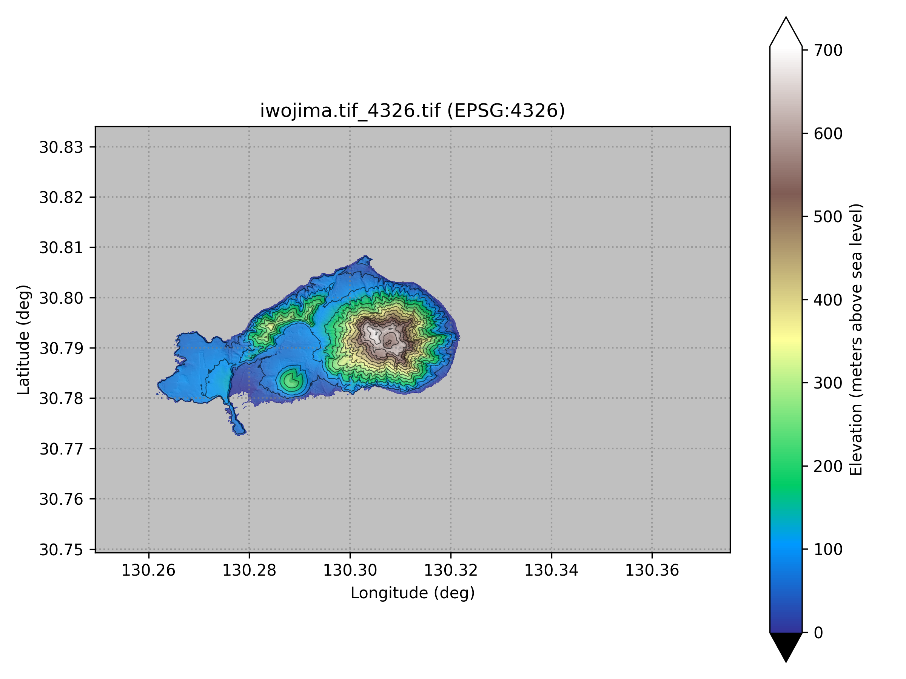
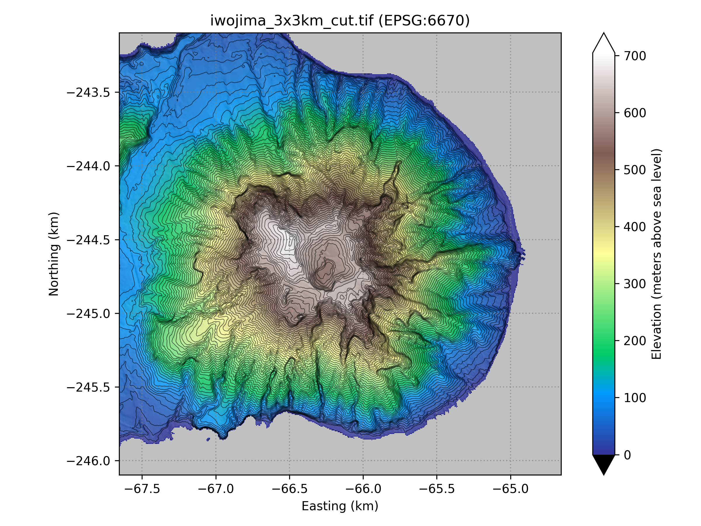

# muonith-gsi-dem

!!! note "External repository"
    muonith-gsi-dem is maintained in a separate repository (developed as `plotGsiZipDEM`, currently private). This page documents its stable interface for use with MUONITH. To obtain the tool, contact the maintainers.

## Overview

muonith-gsi-dem converts DEM (Digital Elevation Model) data from the Geospatial Information Authority of Japan (GSI) into formats usable by MUONITH. It processes ZIP archives of GSI's Fundamental Geospatial Data (基盤地図情報 数値標高モデル) and produces:

- **`.g2zbin`** — Compact uniform-grid binary (direct input to MUONITH)
- **GeoTIFF** — Georeferenced raster (for GIS tools and muonith-path-view)
- **PNG** — Colored elevation maps with contour lines

```
GSI ZIP archives ──→ convertZipDEM.py ──→ g2zbin (→ MUONITH)
                                   ──→ GeoTIFF (→ GIS / muonith-path-view)
                                   ──→ PNG (→ visual inspection)
```

## Dependencies

| Package | Purpose |
|---------|---------|
| Python 3.x | Runtime |
| numpy | Array computation |
| GDAL (`osgeo.gdal`, `osgeo.osr`) | GeoTIFF I/O and CRS transformation |
| pyproj | Coordinate reference system conversion |
| matplotlib | PNG rendering (colormap, contour lines) |
| json5 (optional) | JSON5 config parser (falls back to standard `json`) |

The recommended way to install these is the setup script shipped with the tool,
which creates `.venv/` and pins the GDAL Python bindings to the system GDAL:

```bash
bash setup-venv.sh
```

It requires `uv` and the system libgdal development headers, i.e. `gdal-config`
on `PATH` (Debian/Ubuntu: `sudo apt install libgdal-dev`). The script stops with
an error message if `gdal-config` is missing.

!!! note
    If you instead manage the environment with `uv`, note that numpy, pyproj,
    matplotlib and json5 come from `uv sync` (`pyproject.toml`), while GDAL does
    not: its Python package must match the system libgdal, so install it on top
    of the synced `.venv` with `uv pip install GDAL`. A later plain `uv sync`
    removes GDAL again; re-run that command, or use `uv sync --inexact` to keep
    manually added packages.

## Obtaining GSI DEM Data

1. Visit the GSI download service: <https://service.gsi.go.jp/kiban/app/map/?search=dem>
2. Select **数値標高モデル** (Digital Elevation Model)
3. Choose mesh resolution:
    - **DEM5A** — 5 m mesh (high resolution, limited coverage)
    - **DEM10** — 10 m mesh (nationwide coverage)
4. Download **every ZIP whose mesh tile overlaps your area of interest**. GSI
   distributes DEM data per secondary mesh tile (about 10 km x 10 km), and the
   tile code is embedded in the ZIP file name (`FG-GML-<mesh>-DEM5A-<date>.zip`).
   Zoom to your target area on the map and the service shows which tiles cover
   it. Examples:
    - Satsuma-Iwojima: a single tile, mesh 4630-12 —
      `FG-GML-463012-DEM5A-20250620.zip` (the trailing date differs per release)
    - Mount Asama: nine tiles, mesh 5438-43 ... 5438-65

List the downloaded files in `zip_files` of the JSON5 configuration; the
pipeline merges all tiles into one grid.

Before running, open the JSON5 file and check that each name in `zip_files`
matches the ZIP you actually downloaded: GSI appends a release date to the file
name (`FG-GML-<mesh>-DEM5A-<date>.zip`), so a fresh download differs from the
bundled example and must be rewritten to match, otherwise the conversion stops
at the first step.

For regions outside Japan, obtain DEM data from other sources (e.g., SRTM, ALOS, national surveys) and convert it to GeoTIFF. The muonith-gsi-dem README documents how to convert that GeoTIFF to `.g2zbin` and how to inspect a cropped area.

## Configuration (JSON5)

Configuration files are stored in the `params/` directory. Below is the bundled
example `params/showa.json5` for the
[Showa-shinzan](https://en.wikipedia.org/wiki/Sh%C5%8Dwa-shinzan) area:

??? example "params/showa.json5 (click to expand)"

    ```json5
    {
      "project_name": "showa",                 // Output goes to projects/showa/
      "zip_files": [                           // All GSI DEM ZIPs covering the area (two tiles)
        "../../dem/showa/FG-GML-634066-DEM5A-20250620.zip",
        "../../dem/showa/FG-GML-634067-DEM5A-20250620.zip"
      ],
      "xy_units": [ "meters", "DMS" ],         // Axis units; one PNG is rendered per unit
      "cmap" : "terrain",                      // Matplotlib colormap
      "XY_EPSG": 6679,                         // JGD2011 zone XI (southern Hokkaido)

      "tf_save_png" : true,                    // Save colored PNG maps
      "png_basename" : "showa",                // fig/fig_showa_<unit>.png
      "tf_save_g2zbin" : true,                 // Save g2zbin (MUONITH input)
      "g2zbin_basename" : "showa",             // g2zbin/showa.g2zbin
      "tf_save_geotiff": true,                 // Save GeoTIFF raster
      "geotiff_basename": "showa",             // geotiff/showa.tif

      "cont_pitch" : 100,                      // Contour interval [m]

      "cut_params": {                          // Sub-region extraction (2x2 km around Showa-shinzan)
        "zmin" : 0,                            // Colorbar minimum [m]
        "zmax" : 400,                          // Colorbar maximum [m]
        "cmap" : "terrain",                    // Matplotlib colormap for the cut PNGs
        "xy_units": ["km"],                    // Axis units; one PNG is rendered per unit
        "XY_EPSG": 6679,                       // CRS of the cut outputs

        "tf_save_png": true,                   // Save colored PNG maps of the cut
        "png_basename" : "showa_2x2km",        // fig/fig_showa_2x2km_km.png
        "tf_save_g2zbin" : true,               // Save g2zbin of the cut (MUONITH input)
        "g2zbin_basename" : "showa_2x2km",     // g2zbin/showa_2x2km.g2zbin
        "tf_save_geotiff": true,               // Save GeoTIFF of the cut
        "geotiff_basename": "showa_2x2km",     // geotiff/showa_2x2km_cut.tif

        "xy_center_unit" : "degrees",          // Unit of xcnt/ycnt: "degrees" or "meters"
        "xcnt": 140.866702,                    // Center longitude
        "ycnt": 42.542692,                     // Center latitude
        "xy_unit" : "meters",                  // Unit of xsize/ysize
        // xcnt - xsize <= x <= xcnt + xsize, same for y
        "xsize" : 1000,                        // Half-width [m] -> 2x2 km area
        "ysize" : 1000,                        // Half-height [m]

        "cont_pitch": 10,                      // Contour interval [m]
        "contour_text": 20,                    // Contour label interval [m]

        "font_scale_min": 1.5,                 // Label font auto-scaling lower bound
        "font_scale_max": 5.0,                 // Label font auto-scaling upper bound
        "min_side_px": 2000                    // Minimum pixel count of the shorter PNG side
      }
    }
    ```

### Other Parameters

Every key is explained by the inline comments in the examples above (and in
the Walkthrough's `params/iwojima.json5`). A few optional keys do not appear
in the examples:

- `zmin` / `zmax` — colorbar range; when omitted, the 2nd–98th percentile of
  the elevation data is used.
- `shade` (default `true`) / `shade_alpha` (default `0.2`) — hillshade overlay
  on the elevation colormap and its opacity (0.0–1.0).
- `XY_EPSG` defaults to 4612 when omitted.
- `g2zbin_float64` (default `false`) — store g2zbin as float64 instead of
  float32.
- `tf_gapfill` (default `false`) — fill NoData gaps using the GSI elevation
  tile API (see [Gap Filling](#gap-filling-gsi-tile-api)).

### Choosing `XY_EPSG`

For metric output, use the JGD2011 Japan Plane Rectangular Coordinate System
zone that covers your area: zones I–XIX correspond to EPSG codes 6669–6687.
Look up the zone for your prefecture on the GSI reference page
<https://www.gsi.go.jp/sokuchikijun/jpc.html>. Examples used in this project:

| Area | Zone | `XY_EPSG` |
|------|------|-----------|
| Satsuma-Iwojima (Kagoshima) | II | 6670 |
| Showa-shinzan (southern Hokkaido) | XI | 6679 |

### `cut_params` — Sub-Region Extraction

| Parameter | Description |
|-----------|-------------|
| `xcnt`, `ycnt` | Center coordinates of the cut region |
| `xy_center_unit` | Unit of center coordinates: `"degrees"`, `"meters"`, or `"DMS"` |
| `xsize`, `ysize` | Half-width of the cut region |
| `xy_unit` | Unit of size values: `"degrees"` or `"meters"` |

The cut region extends from `(xcnt - xsize)` to `(xcnt + xsize)` in both axes.

## Usage

```bash
python3 scripts/convertZipDEM.py --prm_json params/showa.json5
```

| Option | Required | Description |
|--------|----------|-------------|
| `--prm_json` | Yes | Path to JSON5 configuration file |
| `--zmin` | No | Override colorbar minimum (overrides config and auto) |
| `--zmax` | No | Override colorbar maximum (overrides config and auto) |

A shell script is often used for convenience:

```bash
#!/bin/bash
project_dir_name="showa"
jsonfile="showa.json5"
repo_dir=$(pwd)
dir_name="projects/${project_dir_name}"
mkdir -p ${dir_name}
cd ${dir_name} || exit
python3 ../../scripts/convertZipDEM.py --prm_json ../../params/${jsonfile}
```

## Output Files

Output is written to `projects/<project_name>/`:

```
projects/showa/
├── geotiff/
│   ├── showa.tif                    # Full-area GeoTIFF
│   └── showa_2x2km_cut.tif          # Cut-region GeoTIFF
├── fig/
│   ├── fig_showa_meters.png         # Full-area map (meters)
│   ├── fig_showa_DMS.png            # Full-area map (DMS)
│   └── fig_showa_2x2km_km.png       # Cut-region map (km)
└── g2zbin/
    ├── showa.g2zbin                 # Full-area binary
    └── showa_2x2km.g2zbin           # Cut-region binary (→ MUONITH)
```

The `.g2zbin` format is a little-endian binary file. See [Input Data — DEM](../user-guide/input-data.md#dem-digital-elevation-model) for the format specification.

## Walkthrough: Satsuma-Iwojima

This walkthrough converts a GSI ZIP archive into `.g2zbin` and GeoTIFF files
for [Satsuma-Iwojima](https://en.wikipedia.org/wiki/Satsuma_I%C5%8Dj%C4%ABma)
(a volcanic island in Kagoshima Prefecture; identifier `iwojima` in the
repository — not the Ogasawara Iwo Jima). The whole island fits in a single
mesh tile, so one ZIP is enough. The configuration `params/iwojima.json5` and
the runner `iwojima.sh` are bundled with muonith-gsi-dem.

1. **Download the ZIP.** From the GSI download service (see
   [Obtaining GSI DEM Data](#obtaining-gsi-dem-data)), download the DEM5A
   archive for mesh 4630-12, which covers the whole island:
   `FG-GML-463012-DEM5A-20250620.zip` (the trailing date differs per release).
   Place it under `dem/iwojima/`.
2. **Check the configuration.** `params/iwojima.json5` lists the ZIP in
   `zip_files`, sets `XY_EPSG: 6670` (Plane Rectangular CS zone II), and cuts a
   3 km x 3 km region around the summit (`cut_params`, center
   130.3087735 E / 30.792022 N).

    ??? example "params/iwojima.json5 (click to expand)"

        ```json5
        {
          "project_name": "iwojima",               // Output goes to projects/iwojima/
          "zip_files": [                           // All GSI DEM ZIPs covering the area (one tile)
            "../../dem/iwojima/FG-GML-463012-DEM5A-20250620.zip"
          ],
          "xy_units": [ "meters", "km", "DMS" ],   // Axis units; one PNG is rendered per unit
          "cmap": "terrain",                       // Matplotlib colormap
          "XY_EPSG": 6670,                         // JGD2011 zone II (Kagoshima)

          "tf_save_png": true,                     // Save colored PNG maps
          "png_basename": "iwojima",               // fig/fig_iwojima_<unit>.png
          "tf_save_g2zbin": true,                  // Save g2zbin (MUONITH input)
          "g2zbin_basename": "iwojima",            // g2zbin/iwojima.g2zbin
          "tf_save_geotiff": true,                 // Save GeoTIFF raster
          "geotiff_basename": "iwojima",           // geotiff/iwojima.tif

          "cont_pitch": 50,                        // Contour interval [m]
          "dpi": 300,                              // Output PNG resolution
          "min_side_px": 2000,                     // Minimum pixel count of the shorter PNG side
          "font_scale_min": 1.5,                   // Label font auto-scaling lower bound
          "font_scale_max": 4.0,                   // Label font auto-scaling upper bound

          "cut_params": {                          // Sub-region extraction (3x3 km around the summit)
            "cmap": "terrain",                     // Matplotlib colormap for the cut PNGs
            "xy_units": [ "meters", "km", "DMS" ], // Axis units; one PNG is rendered per unit
            "XY_EPSG": 6670,                       // CRS of the cut outputs

            "tf_save_png": true,                   // Save colored PNG maps of the cut
            "png_basename": "iwojima_3x3km",       // fig/fig_iwojima_3x3km_<unit>.png
            "tf_save_g2zbin": true,                // Save g2zbin of the cut (MUONITH input)
            "g2zbin_basename": "iwojima_3x3km",    // g2zbin/iwojima_3x3km.g2zbin
            "tf_save_geotiff": true,               // Save GeoTIFF of the cut
            "geotiff_basename": "iwojima_3x3km",   // geotiff/iwojima_3x3km_cut.tif

            "xy_center_unit": "degrees",           // Unit of xcnt/ycnt: "degrees" or "meters"
            "xcnt": 130.3087735,                   // Center longitude (summit)
            "ycnt": 30.792022,                     // Center latitude (summit)
            "xy_unit": "meters",                   // Unit of xsize/ysize
            // xcnt - xsize <= x <= xcnt + xsize, same for y
            "xsize": 1500,                         // Half-width [m] → 3x3 km area
            "ysize": 1500,                         // Half-height [m]

            "cont_pitch": 10,                      // Contour interval [m]
            "dpi": 300,                            // Output PNG resolution
            "min_side_px": 2000,                   // Minimum pixel count of the shorter PNG side
            "font_scale_min": 1.5,                 // Label font auto-scaling lower bound
            "font_scale_max": 4.0                  // Label font auto-scaling upper bound
          }
        }
        ```

3. **Run the conversion** at the repository root:

    ```bash
    bash iwojima.sh
    ```

4. **Check the outputs** under `projects/iwojima/`:

    ```
    projects/iwojima/
    ├── geotiff/  iwojima.tif, iwojima_3x3km_cut.tif
    ├── g2zbin/   iwojima.g2zbin, iwojima_3x3km.g2zbin   (→ MUONITH)
    └── fig/      fig_iwojima_{meters,km,DMS}.png, fig_iwojima_3x3km_{...}.png
    ```

{ width="600" }

*Full-area map with latitude/longitude axes (`fig_iwojima_DMS.png`, from `"DMS"` in `xy_units`; the raster is warped to EPSG:4326 for this view). Color: elevation in meters; black lines: 50 m contours; the gray frame is the sea. The sea has no LiDAR return and is stored as NoData — about 90% of mesh tile 4630-12 — which is expected for an island target.*

{ width="600" }

*Cut-region map with axes in kilometers (`fig_iwojima_3x3km_km.png`, from `"km"` in `xy_units`, 10 m contours), with the default hillshade overlay (`shade: true`, `shade_alpha: 0.2`).*

## Utility Scripts

| Script | Description | Usage |
|--------|-------------|-------|
| `geotif2PNG_terrain.py` | Render GeoTIFF as a colored PNG with contours | `python3 scripts/geotif2PNG_terrain.py --input_tif input.tif --output_png out.png` |
| `g2zbin2PNG_terrain.py` | Render g2zbin as colored PNG with contours | `python3 scripts/g2zbin2PNG_terrain.py --input_g2zbin input.g2zbin --output_png out.png --contour 50` |
| `gap_fill.py` | Fill DEM NoData gaps using the GSI elevation tile API | `python3 scripts/gap_fill.py --input_tif input.tif --output_tif filled.tif` |
| `fetch_dem_tiles.py` | Fetch DEM tiles from the GSI tile API | `python3 scripts/fetch_dem_tiles.py --input_tif input.tif --output_tif api.tif` |

## Gap Filling (GSI Tile API)

GSI DEM ZIP archives occasionally contain NoData gaps. muonith-gsi-dem can fill
these gaps automatically using the GSI elevation tile API
(`cyberjapandata.gsi.go.jp`).

### Pipeline integration

Set `"tf_gapfill": true` in the JSON5 configuration. The pipeline calls
`gap_fill.py` internally after merging DEM tiles, filling NoData pixels via
bilinear interpolation from the nearest available GSI tile data.

### Standalone usage

`gap_fill.py` and `fetch_dem_tiles.py` can also be used independently:

| Script | Input | Description |
|--------|-------|-------------|
| `gap_fill.py` | GeoTIFF or g2zbin | Fill NoData gaps in an existing DEM raster |
| `fetch_dem_tiles.py` | GeoTIFF, g2zbin, or JSON5 | Build a DEM raster entirely from the GSI tile API |

Both scripts support tile caching (`--cache_dir`) to avoid redundant HTTP
requests and a configurable request delay (`--request_delay`) to respect
API rate limits.
