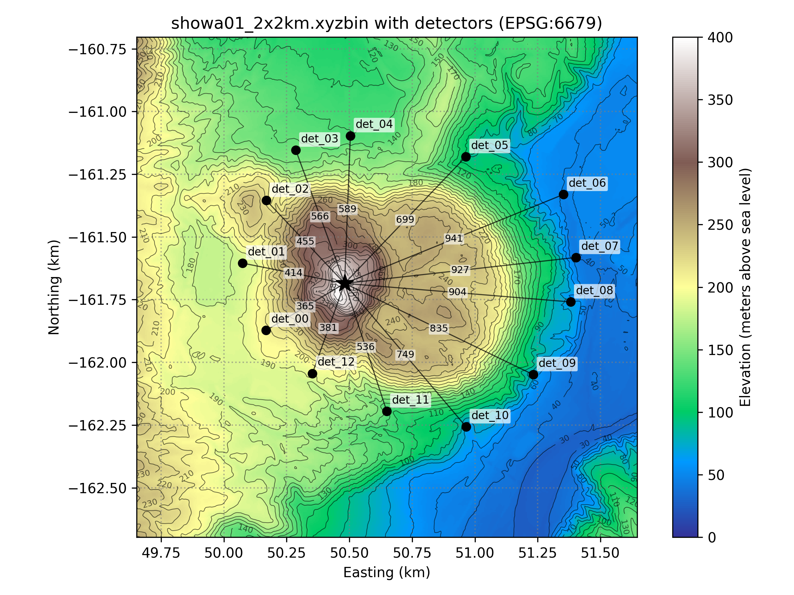
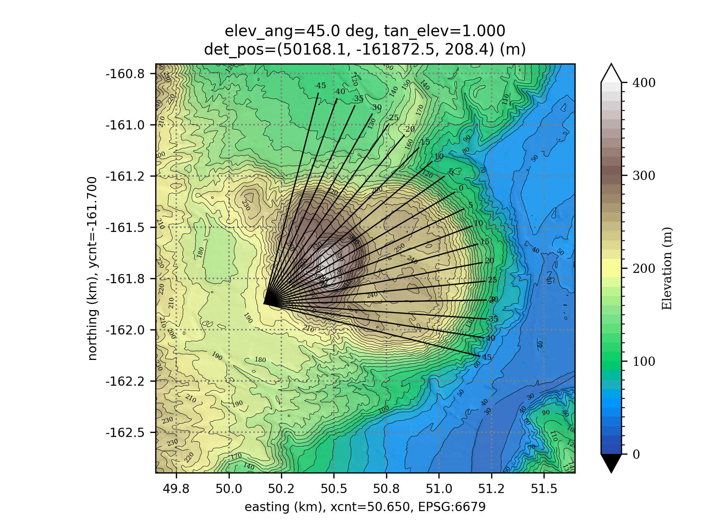
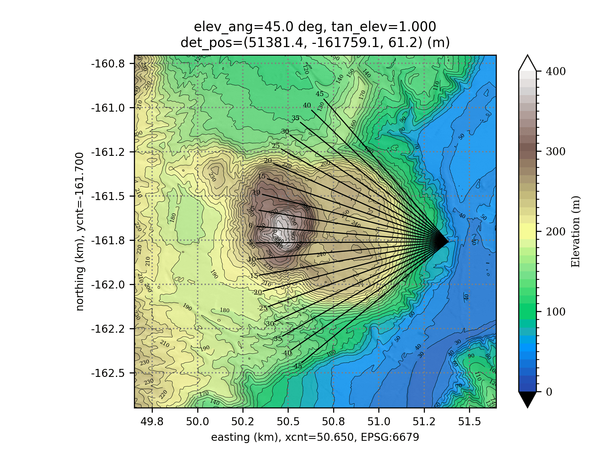

# muonith-path-view

!!! note "External repository"
    muonith-path-view is maintained in a separate repository (developed as `pypathviewer`, currently private). This page documents its stable interface for use with MUONITH.

## Overview

muonith-path-view visualizes muon paths through terrain using DEM (Digital Elevation Model) data. For each elevation angle, it draws ray paths from a detector position, color-coding **air** (above ground) and **rock** (below ground) segments on a topographic map. The output is a set of PNG images assembled into a GIF animation and a multi-page PDF.

This tool helps verify detector placement and angular coverage before running the MUONITH pipeline.

<figure markdown="span">
  { width="600" }
  <figcaption><a href="https://en.wikipedia.org/wiki/Sh%C5%8Dwa-shinzan">Showa-shinzan</a> DEM with 13 detector positions.</figcaption>
</figure>

<figure markdown="span">
  { width="600" }
  <figcaption>Example output for Showa-shinzan (det_00): black lines show muon paths through air, white lines show paths through rock. The animation sweeps through elevation angles.</figcaption>
</figure>

<figure markdown="span">
  { width="600" }
  <figcaption>Example output for Showa-shinzan (det_08): black lines show muon paths through air, white lines show paths through rock. The animation sweeps through elevation angles.</figcaption>
</figure>

!!! note "All beams in one frame share the same elevation angle"
    Each frame fixes one elevation angle $\theta_{\mathrm{elev}}$ and sweeps the azimuth $\phi$, so the drawn beams lie on a cone of constant physical elevation — they are not contained in a single plane. Each beam direction is the unit vector $(v_x, v_y, v_z) = (\cos\theta_{\mathrm{elev}}\cos\phi,\ \cos\theta_{\mathrm{elev}}\sin\phi,\ \sin\theta_{\mathrm{elev}})$. This holds for every `angle_unit` mode (`deg`, `rad`, `tangent`); see [`direction_setup` — Angle Configuration](#direction_setup-angle-configuration) for the exact convention. This differs from MUONITH's `DetectorPanel` in Tangent mode, where the bin coordinates are slopes about the panel's forward axis ($t_x = v_x/v_y$, $t_y = v_z/v_y$): a row of constant $t_y$ is a tilted plane of directions, not a cone of constant elevation; see [From (tx, ty) to a Ray Direction](../concepts/detector-angles.md).

## Dependencies

| Package | Purpose |
|---------|---------|
| Python ≥ 3.10 | Runtime |
| numpy | Array computation |
| matplotlib | Map rendering (pcolormesh, contour, hillshade) |
| pyproj | CRS transformation |
| json5 | JSON5 config parser |
| rasterio | GeoTIFF reading |
| scipy | `RegularGridInterpolator` for DEM queries (a slow fallback is used if absent) |
| ImageMagick | `convert` command for PDF/GIF generation |

The Python packages are declared in `pyproject.toml` and pinned in `uv.lock`. ImageMagick is a system package and is not covered by either.

### Installation

```bash
cd muonith-path-view

# Create .venv and install the pinned dependencies
uv sync

# ImageMagick
sudo apt install imagemagick    # Ubuntu/Debian
brew install imagemagick         # macOS (Homebrew)
```

`uv sync` creates `.venv/` in the repository root. The bundled `.envrc` puts `.venv/bin` on the PATH, so with [direnv](https://direnv.net/) installed (`direnv allow` on first entry) every `python3` call in the repository uses that environment. Without direnv, either activate it (`source .venv/bin/activate`) or prefix commands with `uv run`:

```bash
uv run python3 scripts/mp_pypathviewer_pdf.py params/tutorial.json5
```

## Quick Start

### Run the bundled tutorial (no GeoTIFF to prepare)

muonith-path-view ships a self-contained example under `examples/tutorial/`: a synthetic DEM (`tutorial-5m.g2zbin`, and the identical grid as `tutorial-5m.tif`) together with 11 detector parameter files under `examples/tutorial/detparams/`. Nothing has to be downloaded or converted, so a fresh clone runs as-is:

```bash
cd muonith-path-view
python3 scripts/mp_pypathviewer_pdf.py params/tutorial.json5
```

Eleven detectors × 16 elevation angles are rendered (about one minute with `num_threads: 8`). The PNGs land in `projects/tutorial/<det_name>/` as `fig_elev00.0.png` … `fig_elev45.0.png`, and the per-detector animations and documents are collected in `projects/tutorial/gif/` and `projects/tutorial/pdf/`.

Hillshade (relief shading) can be toggled on the command line. These flags override `rendering.shade` and `rendering.shade_alpha` in the config file:

```bash
python3 scripts/mp_pypathviewer_pdf.py params/tutorial.json5 --shade --shade-alpha 0.4
python3 scripts/mp_pypathviewer_pdf.py params/tutorial.json5 --no-shade
```

!!! note "The tutorial DEM is synthetic"
    The grid is a synthetic primitive shape, not derived from any third-party map data — which is why it can be redistributed. It has no real-world location. EPSG:6677 (JGD2011 Zone 9) is simply borrowed because muonith-path-view only needs path lengths in meters, so any real projected metric CRS will do. A made-up code (e.g. 9999) is rejected.

To exercise the GeoTIFF path with the same terrain, point `input_dem` at `examples/tutorial/tutorial-5m.tif` and delete `input_dem_epsg` — a GeoTIFF embeds its own CRS. Both files read back as the same grid.

### Use your own DEM

Set `file_path.input_dem` to your own file. A GeoTIFF carries its own CRS; a `.g2zbin` grid does not, so `file_path.input_dem_epsg` must be declared explicitly:

```json5
// GeoTIFF — CRS is read from the file
"input_dem": "path/to/my_dem.tif",

// g2zbin — CRS must be given (real projected metric CRS)
"input_dem": "path/to/my_dem.g2zbin",
"input_dem_epsg": 6677,
```

The DEM CRS must match `detector_setup.epsg_system.epsg_code_output`. Then run:

```bash
python3 scripts/mp_pypathviewer_pdf.py params/my_config.json5
```

## Configuration

Configuration files are stored in `params/` as JSON5 (`.json5`) or JSON (`.json`). JSON5 supports comments (`//`, `/* */`) and trailing commas.

### Top-Level Parameters

| Parameter | Default | Description |
|-----------|---------|-------------|
| `num_threads` | — | Number of parallel subprocesses for PNG generation (capped to logical cores − 1) |
| `skip_making_png` | `false` | If `true`, reuse existing PNGs (skip generation) |

### `file_path` — Input/Output Paths

| Parameter | Description |
|-----------|-------------|
| `input_dem` | Path to the input DEM file (GeoTIFF, `.g2zbin`, or text) |
| `input_dem_epsg` | EPSG code of the DEM grid. Required for `.g2zbin` (which stores no CRS); omit for GeoTIFF |
| `input_dem_nodata` | Value marking missing elevation in the input grid (e.g. `-9999.0`) |
| `output_dir` | Output directory for PNG, PDF, GIF |
| `sub_process_python_path` | Path to `sub_pathviewer.py` |
| `out_pdf_header_name` | Filename prefix for PDF output |
| `out_gif_header_name` | Filename prefix for GIF output |
| `outlog` | Path to the general log file |
| `error_log` | Path to the error log file |
| `log_mode` | Log write mode: `"overwrite"`, `"append"`, or `"archive"` |

### `rendering` — Display Settings

| Parameter | Description |
|-----------|-------------|
| `dpi` | Output resolution (dots per inch) |
| `gif_delay_msec` | Frame interval for GIF animation [ms] |
| `colormap` | Matplotlib colormap name (e.g., `"terrain"`) |
| `color_over` / `color_under` / `color_nodata` | Colors for values above max / below min / NaN |
| `n_grad` | Number of discrete color levels |
| `vmin`, `vmax` | Elevation range for colormap [m] |
| `shade` | Overlay hillshade (relief shading) on the elevation colors. Default `true`. Overridden by `--shade` / `--no-shade` |
| `shade_alpha` | Hillshade opacity (0.0 = invisible, 1.0 = opaque). Default `0.2`. Overridden by `--shade-alpha` |
| `shade_azimuth_deg` | Light direction, degrees clockwise from north. Default `315` |
| `shade_altitude_deg` | Light height above the horizon [deg]. Default `45` |
| `shade_vert_exag` | Vertical exaggeration applied to the elevation before shading. Default `1.0` |
| `x_wid`, `y_wid` | Half-width of the display window [m] |
| `xy_unit` | Axis label unit: `"m"` or `"km"` |
| `fit_xy_size` | If `true`, clip axis range to actual data extent |
| `xy_offset_center` | If `true`, shift coordinates so the center becomes (0, 0) |
| `grid` | Show grid lines (`true` / `false`) |
| `grid_color`, `grid_linewidth`, `grid_linestyle` | Grid line appearance |

### `detector_setup` — Detector and Path Settings

#### `epsg_system` — Coordinate Reference System

| Parameter | Description |
|-----------|-------------|
| `epsg_code_input` | EPSG code for input detector coordinates |
| `epsg_code_output` | EPSG code for internal processing (must be a projected/metric CRS) |

All coordinates are transformed to `epsg_code_output` for processing:

```
GeoTIFF        → CRS from file metadata     → must match epsg_code_output
det_info_files → no CRS                     → read as epsg_code_input
x_cnt / y_cnt  → epsg_code_center           → transformed to epsg_code_output
```

Common EPSG codes:

| Code | CRS |
|------|-----|
| 4326 | WGS84 (latitude/longitude) |
| 6676 | JGD2011 Zone 8 |
| 6677 | JGD2011 Zone 9 |
| 6679 | JGD2011 Zone 11 |

#### `det_info_files` — External Detector Files (optional)

When specified, detector coordinates are loaded from external JSON5 files. This allows reusing the same detector parameter files used by MUONITH:

```json5
"det_info_files": [
    "/path/to/det_00.json5",
    "/path/to/det_01.json5"
]
```

Each external file must contain a `DETECTOR_PARAMETERS` key:

```json5
{
  "DETECTOR_PARAMETERS": {
    "name": "det_00",
    "x": 50168.1,      // → x_det
    "y": -161872.5,    // → y_det
    "z": 208.4,        // → z_det
    "yaw_deg": -22.031 // → azimuth_center
  }
}
```

When `det_info_files` is used, the merge behavior is:

| Parameter | Source |
|-----------|--------|
| `x_det`, `y_det`, `z_det` | External file (`det_info_files`) |
| `epsg_code_input`, `epsg_code_output` | Config file (`epsg_system`) |
| `direction_setup`, `line_path` | Config file |

When multiple detector files are specified, each detector is processed sequentially with output in `<output_dir>/<det_name>/`.

#### `direction_setup` — Angle Configuration

| Parameter | Description |
|-----------|-------------|
| `angle_unit` | Unit for angle values: `"deg"`, `"rad"`, or `"tangent"` |
| `azimuth_zero` | Reference direction for azimuth = 0: `"north"` or `"east"` |
| `azimuth_center` | Azimuth offset (overridden by `yaw_deg` from `det_info_files`) |
| `azimuth_mode` | `"interval"` for `[start, end, step]` or `"array"` for explicit list |
| `azimuth_range` | Azimuth sweep range, e.g., `[-45, 45, 5]` |
| `elevation_mode` | `"interval"` or `"array"` |
| `elevation_range` | Elevation sweep range, e.g., `[45, 0, -3]` (high → low) |

Each beam direction is a unit vector built from one elevation angle $\theta_{\mathrm{elev}}$ and one azimuth angle $\phi$:

$$
\begin{aligned}
v_z &= \sin\theta_{\mathrm{elev}} \\
v_x &= \cos\theta_{\mathrm{elev}} \cos\phi \\
v_y &= \cos\theta_{\mathrm{elev}} \sin\phi
\end{aligned}
$$

where $\phi$ is the internal azimuth after the `azimuth_zero` / `azimuth_center` conversions. The elevation $\theta_{\mathrm{elev}}$ is fixed while the azimuth is swept, so the beams for one elevation value lie on a cone of constant physical elevation in every `angle_unit` mode.

`angle_unit` selects how the numbers in `azimuth_range` / `elevation_range` are read, for both azimuth and elevation. Below, $u$ denotes each raw number written in those ranges:

| `angle_unit` | Interpretation of each value $u$ |
|--------------|----------------------------------|
| `deg` | angle in degrees |
| `rad` | angle in radians |
| `tangent` | slope: the angle is $\arctan u$. Equal steps in $u$ give unequal angular steps. |

Note: when `angle_unit` is not `deg`, the `azimuth_center` offset is added as radians.

Comparison with MUONITH's `DetectorPanel` (see [From (tx, ty) to a Ray Direction](../concepts/detector-angles.md)); $u$ denotes each raw number written in `azimuth_range` / `elevation_range` (see the table above):

| Tool / mode | Direction from bin values | Row of constant vertical value |
|---|---|---|
| muonith-path-view, every `angle_unit` | spherical, $v_z = \sin\theta_{\mathrm{elev}}$ (`tangent` only converts the input, $\theta_{\mathrm{elev}} = \arctan u$) | cone of constant elevation |
| MUONITH `DetectorPanel`, Degree / Radian | spherical, $v_z = \sin t_y$ | cone of constant elevation |
| MUONITH `DetectorPanel`, Tangent | slopes, $t_y = v_z / v_y$ | tilted plane |

#### `line_path` — Ray Path Rendering

| Parameter | Description |
|-----------|-------------|
| `min` | Minimum path distance from detector [m] |
| `max` | Maximum path distance from detector [m] |
| `pitch` | Distance step along the path [m] |
| `air_path_width`, `air_path_color`, `air_path_alpha` | Style for above-ground segments |
| `rock_path_width`, `rock_path_color`, `rock_path_alpha` | Style for below-ground segments |

### `charactor_setting` — Typography

| Parameter | Description |
|-----------|-------------|
| `title_fontsize` | Font size for plot title [pt] |
| `azimuth_fontsize`, `azimuth_fontcolor` | Font size and color for azimuth annotations |
| `xaxis_tick_fontsize`, `yaxis_tick_fontsize` | Tick label font sizes |
| `xaxis_title_fontsize`, `yaxis_title_fontsize` | Axis title font sizes |
| `caxis_tick_fontsize`, `caxis_title_fontsize` | Colorbar font sizes |
| `caxis_title` | Colorbar title text (e.g., `"Elevation (m)"`) |

??? example "Full example: Showa-shinzan (`params/showa.json5`)"

    Every key is annotated inline. Paths are placeholders — replace them with your own.

    ```json5
    {
      // ==== Top-level ====
      // Number of parallel subprocesses for PNG generation (capped to logical_cores - 1)
      "num_threads": 25,
      // If true, skip PNG generation and reuse existing PNGs (only if all PNGs already exist)
      "skip_making_png": false,

      "file_path": {
        // Path to the input DEM. GeoTIFF carries its own CRS, so input_dem_epsg is omitted here
        "input_dem": "path/to/showa_2x2km_cut.tif",
        // Output directory for generated PNG, PDF, and GIF files
        "output_dir": "projects/showa",
        // Path to the subprocess script that renders each elevation angle as a PNG
        "sub_process_python_path": "scripts/sub_pathviewer.py",
        // Filename prefix for the output PDF (used in single-detector mode)
        "out_pdf_header_name": "showa",
        // Filename prefix for the output GIF
        "out_gif_header_name": "showa",
        // Path to the general output log file
        "outlog": "projects/showa/tmp.log",
        // Path to the error log file
        "error_log": "projects/showa/ERROR.log",
        // Log file write mode: "overwrite" replaces, "append" adds, "archive" rotates
        "log_mode": "overwrite",
      },

      "rendering": {
        // If true, shift all coordinates so that the center point becomes the origin (0,0)
        "xy_offset_center": false,
        // Resolution in dots per inch for PNG/PDF output
        "dpi": 300,
        // Frame delay in milliseconds for GIF animation
        "gif_delay_msec": 1000,

        // ==== Colormap ====
        // Matplotlib colormap name for elevation visualization
        "colormap": "terrain",
        // Color for values exceeding vmax (matplotlib set_over)
        "color_over": "white",
        // Color for values below vmin (matplotlib set_under)
        "color_under": "black",
        // Color for NoData/NaN pixels (matplotlib set_bad)
        "color_nodata": "silver",
        // Number of discrete color gradient levels between vmin and vmax
        "n_grad": 40,
        // Minimum elevation value (meters) for colormap range
        "vmin": 0,
        // Maximum elevation value (meters) for colormap range. Showa-shinzan spans 0-400 m
        "vmax": 400,

        // ==== Hillshade ====
        // If true, overlay a hillshade (relief shading) on the elevation colors.
        // The command line options --shade / --no-shade override this.
        "shade": true,
        // Opacity of the hillshade overlay (0.0 = invisible, 1.0 = opaque).
        // The command line option --shade-alpha overrides this.
        "shade_alpha": 0.2,
        // Direction the light comes from, in degrees clockwise from north
        "shade_azimuth_deg": 315,
        // Height of the light above the horizon, in degrees
        "shade_altitude_deg": 45,
        // Vertical exaggeration applied to the elevation before shading
        "shade_vert_exag": 1.0,

        // ==== Contour labels ====
        // Contour label interval (meters)
        "contour_label_interval": 10,
        // Contour label font size (pt)
        "contour_label_fontsize": 4,
        // Contour label color
        "contour_label_color": "black",

        // ==== Grid ====
        // Whether to display grid lines on the plot
        "grid": true,
        // Color of grid lines
        "grid_color": "black",
        // Width of grid lines in points
        "grid_linewidth": 0.5,
        // Line style for grid: "solid", "dashed", "dashdot", or "dotted"
        "grid_linestyle": "dotted",

        // ==== Axis ====
        // Unit for axis labels: "m" for meters, "km" for kilometers
        "xy_unit": "km",
        // Font size (pt) for axis tick labels
        "xy_tick_font_size": 8,
        // Font size (pt) for axis title labels (e.g. "X (km)")
        "xy_axis_title_font_size": 10,

        // ==== Window ====
        // Half-width of the plot window in meters (xmin = xcnt - x_wid, xmax = xcnt + x_wid)
        "x_wid": 2000,
        // Half-height of the plot window in meters (ymin = ycnt - y_wid, ymax = ycnt + y_wid)
        "y_wid": 2000,
        // If true, clip the axis range to the actual data extent (remove empty margins)
        "fit_xy_size": true,
      },

      // Detector and path calculation settings
      "detector_setup": {

        // Coordinate reference system (EPSG codes) for coordinate transformation
        "epsg_system": {
          // EPSG code for the input detector coordinates
          "epsg_code_input": "6679",      // JGD2011 Zone 11
          // EPSG code for the output plot coordinates (must be a metric/projected CRS)
          "epsg_code_output": "6679",
        },

        // External detector files: each supplies x, y, z and yaw_deg (-> azimuth_center).
        // 13 detectors around Showa-shinzan; these are the same files MUONITH uses.
        "det_info_files": [
          "path/to/detparams/det_00.json5",
          "path/to/detparams/det_01.json5",
          "path/to/detparams/det_02.json5",
          "path/to/detparams/det_03.json5",
          "path/to/detparams/det_04.json5",
          "path/to/detparams/det_05.json5",
          "path/to/detparams/det_06.json5",
          "path/to/detparams/det_07.json5",
          "path/to/detparams/det_08.json5",
          "path/to/detparams/det_09.json5",
          "path/to/detparams/det_10.json5",
          "path/to/detparams/det_11.json5",
          "path/to/detparams/det_12.json5",
        ],

        // Direction/angle configuration for path calculation
        "direction_setup": {
          // Unit for angle values: "deg", "rad", or "tangent"
          "angle_unit": "deg",
          // Reference direction for azimuth=0: "north" or "east"
          "azimuth_zero": "north",
          // azimuth_center is loaded from each det_info_file (yaw_deg)
          // Azimuth generation mode: "array" for explicit list, "interval" for [start, end, step]
          "azimuth_mode": "interval",
          // Azimuth sweep range as [start, end, step]: +-45 deg in 5 deg steps
          "azimuth_range": [-45, 45, 5],
          // Elevation generation mode: "array" for explicit list, "interval" for [start, end, step]
          "elevation_mode": "interval",
          // Elevation sweep range as [start, end, step]: 45 deg down to 0 deg in 3 deg steps
          "elevation_range": [45, 0, -3],
        },

        // Path line rendering parameters for the ray-tracing visualization
        "line_path": {
          // Minimum path distance (meters) from the detector
          "min": 0.0,
          // Maximum path distance (meters) from the detector
          "max": 1500.0,
          // Distance step/interval (meters) along the path
          "pitch": 5.0,
          // Line width (points) for the air (above-ground) segment of the path
          "air_path_width": 0.8,
          // Color for the air (above-ground) segment of the path
          "air_path_color": "black",
          // Opacity for the air segment (0.0 = transparent, 1.0 = opaque)
          "air_path_alpha": 1.0,
          // Line width (points) for the rock (below-ground) segment of the path
          "rock_path_width": 1.5,
          // Color for the rock (below-ground) segment of the path
          "rock_path_color": "white",
          // Opacity for the rock segment (0.0 = transparent, 1.0 = opaque)
          "rock_path_alpha": 0.5,
        },
      },

      // Typography and text formatting settings for plot elements
      "charactor_setting": {
        // Scaling factor for beam path visualization relative to character size
        "beam_path_factor": 1.03,
        // Font size (pt) for the plot main title
        "title_fontsize": 10,
        // Font size (pt) for azimuth angle text annotations on the plot
        "azimuth_fontsize": 5,
        // Color for azimuth angle text annotations
        "azimuth_fontcolor": "black",
        // Font size (pt) for x-axis tick labels
        "xaxis_tick_fontsize": 8,
        // Font size (pt) for y-axis tick labels
        "yaxis_tick_fontsize": 8,
        // Font size (pt) for colorbar tick labels
        "caxis_tick_fontsize": 8,
        // Font size (pt) for x-axis title
        "xaxis_title_fontsize": 8,
        // Font size (pt) for y-axis title
        "yaxis_title_fontsize": 8,
        // Font size (pt) for colorbar title
        "caxis_title_fontsize": 8,
        // Text displayed as the colorbar title
        "caxis_title": "Elevation (m)",
      },
    }
    ```

## Processing Flow

```
           Config file (JSON5)                       DEM (GeoTIFF / .g2zbin / text)
                    │                                               │
                    └───────────────────────┬───────────────────────┘
                                            │
                                            ▼
                             mp_pypathviewer_pdf.py
                                            │
                  ┌─────────────────────────┼─────────────────────────┐
                  ▼                         ▼                         ▼
         sub_pathviewer.py         sub_pathviewer.py         sub_pathviewer.py
         (elev 45°)                (elev 42°)                (elev 39°) ...
                  │                         │                         │
                  ▼                         ▼                         ▼
               PNG                       PNG                       PNG
                  │                         │                         │
                  └─────────────────────────┼─────────────────────────┘
                                            │
                            ┌───────────────┴───────────────┐
                            ▼                               ▼
                         PDF                              GIF
                      (ImageMagick)                   (ImageMagick)
```

Each `sub_pathviewer.py` invocation:

1. Loads the DEM and builds a 2D elevation grid
2. For each azimuth angle, traces a ray path from the detector
3. Classifies each path segment as **air** (above terrain) or **rock** (below terrain)
4. Draws the segments with distinct colors and line widths
5. Saves the result as a PNG

## Output Files

| Format | Filename pattern | Description |
|--------|-----------------|-------------|
| PNG | `fig_elev45.0.png` | Topographic map with ray paths for one elevation angle |
| GIF | `<det_name>.gif` | Animated sweep through elevation angles |
| PDF | `<det_name>.pdf` | Multi-page document (one page per elevation angle) |

In multi-detector mode, the PNGs are grouped per detector and the animations and documents are collected together:

```
<output_dir>/
├── det_00/
│   ├── fig_elev00.0.png
│   ├── ...
│   └── fig_elev45.0.png
├── det_01/
│   └── ...
├── gif/
│   ├── det_00.gif ...
└── pdf/
    ├── det_00.pdf ...
```

## DEM Input Formats

muonith-path-view automatically detects the input format based on the file extension:

| Format | Extension | Description |
|--------|-----------|-------------|
| GeoTIFF | `.tif`, `.tiff` | Georeferenced raster with embedded CRS. CRS must match `epsg_code_output`. |
| Binary | `.g2zbin` | Compact uniform-grid binary: magic + `Grid2d` header (x/y axes) + row-major `z` array. Stores no CRS, so `input_dem_epsg` must be set in the config. See [Input Data](../user-guide/input-data.md#dem-digital-elevation-model). |
| Text | `.xyz`, `.dem`, etc. | Space-separated `x y z` values, one point per line |

To convert a `.g2zbin` grid into a GeoTIFF, run the bundled converter with the EPSG code of the grid as the third argument. This is how `examples/tutorial/tutorial-5m.tif` was produced:

```bash
python3 scripts/g2zbin_to_geotiff.py examples/tutorial/tutorial-5m.g2zbin examples/tutorial/tutorial-5m.tif 6677
```

The EPSG code must be a real projected metre CRS; a made-up code (e.g. 9999) is rejected because it cannot be resolved.

## Supplementary Tool: azimuth.py

Calculates the azimuth angle between two points:

```bash
python3 scripts/azimuth.py
```

## Troubleshooting

### ImageMagick Policy Error

If PDF or GIF generation fails with a permission error, check the ImageMagick security policy:

```bash
# Policy file location
/etc/ImageMagick-6/policy.xml
# or
/etc/ImageMagick-7/policy.xml
```

Look for `<policy domain="coder" rights="none" pattern="PDF" />` and change `rights` to `"read|write"`.

### Out of Memory

When processing large DEMs, reduce `num_threads` or crop the DEM to a smaller region. Each subprocess loads the full DEM into memory, so total memory usage scales with the number of threads.
