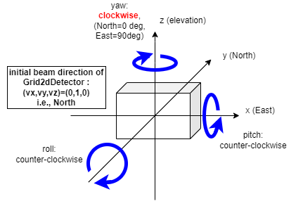
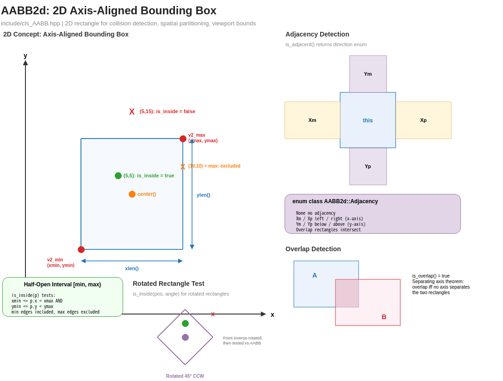
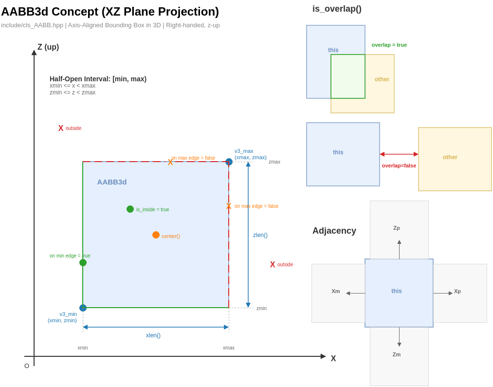

# Coordinate System

This page defines the spatial conventions, units, and angle representations used throughout MUONITH.

## Coordinate Axes

MUONITH uses a **right-handed, z-up** Cartesian coordinate system:

| Axis | Direction | Typical usage |
|------|-----------|---------------|
| **x** | East | Horizontal (easting) |
| **y** | North | Horizontal (northing) |
| **z** | Up | Vertical (elevation) |

All spatial coordinates are expressed in **meters (m)**.

```
        z (elevation)
        |
        |
        |_______ y (northing)
       /
      /
     x (easting)
```

This convention is consistent across all geometric classes:
Grid1d/2d/3d, Ray3d, Pillar, DetectorPanel, and shape primitives.

## Units

| Quantity | Unit | Symbol |
|----------|------|--------|
| Spatial position | meters | m |
| Path length (PL) | meters | m |
| Density length (DL) | kilograms per square meter | kg/m² |
| Density | kilograms per cubic meter | kg/m³ |
| Penetrating muon flux | per (m² sr s) | 1/(m² sr s) |
| Effective area | square meters | m² |
| Solid angle | steradians | sr |
| Exposure time | seconds | s |

!!! note
    Some visualization outputs may display density in g/cm³ for convenience. Internally, all computations use SI units (kg/m³).

## Angle Representation

MUONITH supports three angular representations, selectable per detector panel:

| Mode | Description | Example |
|------|-------------|---------|
| **Tangent** | Slope (rise/run) | tan(θ) |
| **Degree** | Angular degrees | 0°–360° |
| **Radian** | SI angular unit | 0–2π |

The angular unit is configured through the detector parameter file and applies consistently to all detector elements within a panel.

The detector's angular bins are addressed by two coordinates, `tx` (horizontal) and `ty` (vertical), interpreted in this unit. How a `(tx, ty)` bin is turned into a look direction is described in [From (tx, ty) to a Ray Direction](detector-angles.md).

### Yaw Convention



- Yaw angle = **0° points North** (+y direction)
- Yaw angle = **90° points East** (+x direction)
- Yaw is measured **clockwise** when viewed from above (compass bearing): 0° = N, 90° = E, 180° = S, 270° (−90°) = W

## Bin Intervals

Grid bins use **half-open intervals**:

$$[x_{\min},\; x_{\max})$$

The lower bound is inclusive and the upper bound is exclusive. This ensures that every point maps to exactly one bin.

## Key Types

MUONITH defines several index types for grid operations:

| Type | Definition | Description |
|------|-----------|-------------|
| `Ixiy` | `std::array<int, 2>` | 2D grid index `[ix, iy]` |
| `Ixiyiz` | `std::array<int, 3>` | 3D grid index `[ix, iy, iz]` |
| `Uqiv` | `int` | Unique voxel index (linearized) |
| `Uqid` | `int` | Unique detector element index |

## Spatial Objects

### Ray3d

A ray is defined by an **origin** (position) and a **direction** (unit vector):

$$\mathbf{r}(t) = \mathbf{p} + t\,\hat{\mathbf{d}}, \quad t \geq 0$$

The direction vector is automatically normalized to unit length upon construction.

For a detector element, the direction is built from its angular bin `(tx, ty)`; see [From (tx, ty) to a Ray Direction](detector-angles.md).

### AABB (Axis-Aligned Bounding Box)

Bounding boxes are used to accelerate ray-geometry intersection tests:

- **AABB2d**: 2D bounding box in the xy-plane
- **AABB3d**: 3D bounding box

Each grid caches its AABB to avoid per-ray reconstruction overhead.




