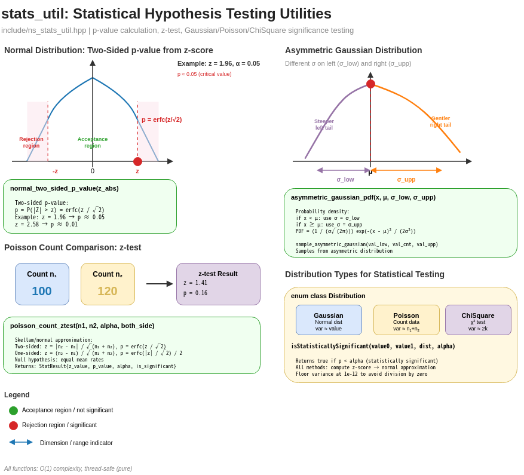
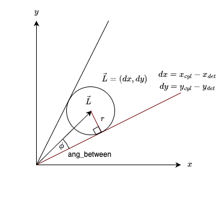
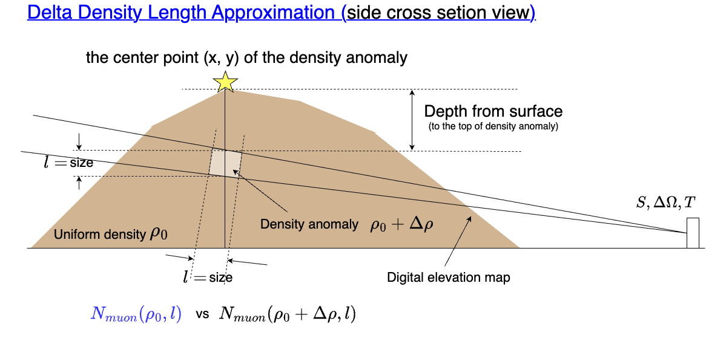
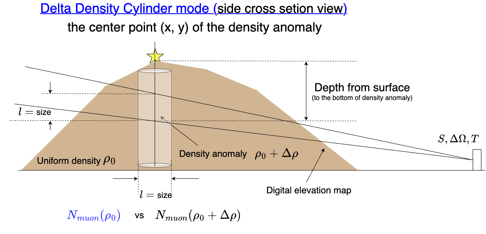
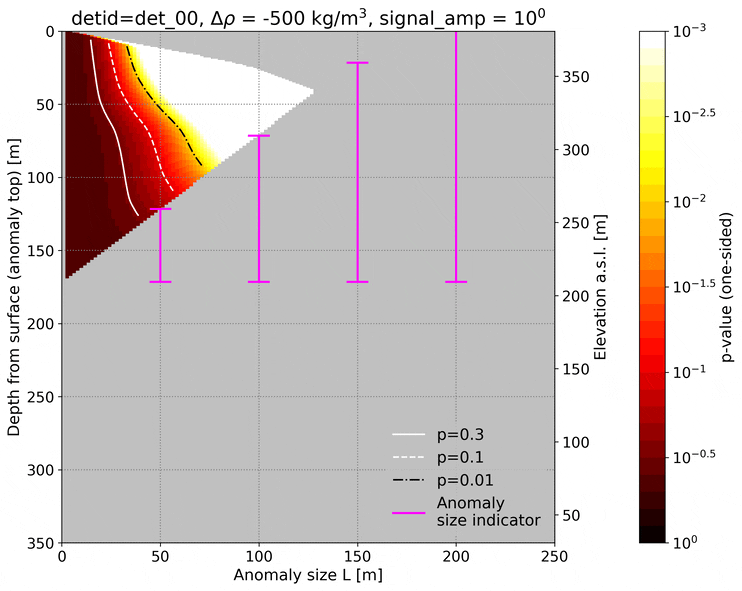
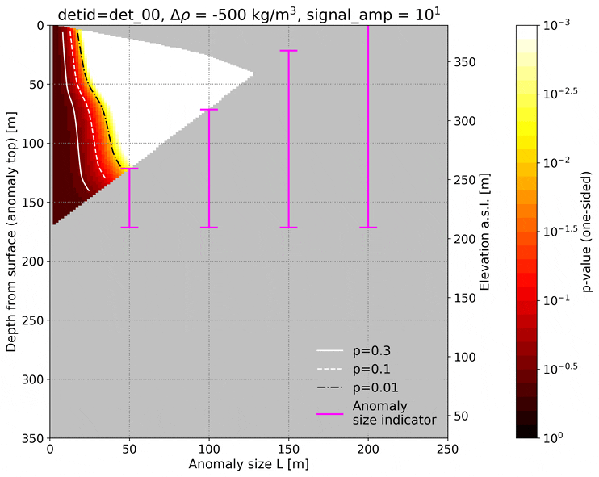
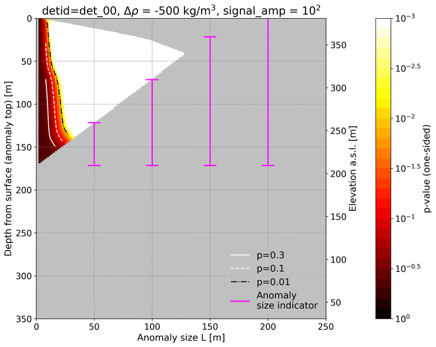

# Depth vs. Spatial Resolution

This page explains how MUONITH evaluates the **minimum detectable anomaly size as a function of depth** — a key capability for planning muon observation campaigns.

## Motivation: Resource Constraints in Muography

Muographic observation operates under **finite resources**. Even with an ideal detector, the cosmic-ray muon flux at a given zenith angle is fixed by nature. The total number of muons collected by a detector element is:

$$N_\mu = F(\theta, X) \times S_{\text{eff}} \times \Delta\Omega \times T$$

where $F$ is the penetrating muon flux (a function of zenith angle $\theta$ and density length $X$), $S_{\text{eff}}$ is the effective detector area, $\Delta\Omega$ is the solid angle of the angular bin, and $T$ is the observation time.

This leads to a **fundamental tradeoff**:

- Widening $\Delta\Omega$ (coarser angular bins) increases $N_\mu$ per bin, improving density precision — but at the cost of **spatial resolution**.
- Narrowing $\Delta\Omega$ (finer angular bins) improves spatial resolution — but reduces $N_\mu$ per bin, degrading statistical power.

In addition:

- **Deeper targets** require muons to traverse more rock ($X$ increases), so $F$ drops exponentially, further reducing $N_\mu$.
- **Detector area** and **observation time** are practically limited by cost, logistics, and site access.

Before committing to an expensive field campaign, one must therefore answer:

> *"Given the available observation resources (detector area, exposure time, number of detectors), what is the smallest density anomaly detectable at a given depth?"*

This is exactly what MUONITH's exclusion plot tool (`depth_reso`) computes.

## Physical Concept

### Simplified Model

Consider a mountain with uniform background density $\rho_0$ and a single anomaly of diameter $l$ embedded at depth $D$ from the surface along the muon path. The anomaly has density $\rho_0 + \Delta\rho$ (where $\Delta\rho < 0$ for a low-density structure such as a cavity or magma conduit).

The density length for a ray passing through the anomaly differs from the background by:

$$\Delta R \approx \Delta\rho \times l$$

This changes the expected muon count. The question is whether this change is **statistically significant** given Poisson counting noise.

### Statistical Test



MUONITH compares two muon counts:

- $N_{\text{base}}$: expected count with uniform density $\rho_0$ (no anomaly)
- $N_{\text{modi}}$: expected count with the anomaly ($\rho_0 + \Delta\rho$, size $l$, at depth $D$)

Both are computed from the flux table, given the density length along the ray. A z-test quantifies the significance:

$$z =\frac{N_{\text{modi}} - N_{\text{base}}}{\sqrt{(\sqrt{N_{\text{modi}}})^2 + (\sqrt{N_{\text{base}}})^2}}= \frac{N_{\text{modi}} - N_{\text{base}}}{\sqrt{N_{\text{modi}} + N_{\text{base}}}}$$

If the p-value from this test is below a chosen significance level $\alpha$ (e.g., $\alpha = 0.05$), the anomaly is considered **statistically detectable** under the given observation conditions.

### Depth Dependence

The relationship between depth and detectability follows directly from Poisson statistics:

- **Shallow anomaly**: short path through rock → high muon count $N_{\text{base}}$ → strong statistical power → small anomalies detectable
- **Deep anomaly**: long path through rock → low muon count $N_{\text{base}}$ → weak statistical power → only large anomalies detectable

## Exclusion Plots

An **exclusion plot** (also called a detection limit diagram) maps the boundary between detectable and undetectable anomalies on the **(depth, anomaly size)** plane.

### How to Read an Exclusion Plot

Each curve on the plot corresponds to a fixed density contrast $\Delta\rho$ and significance level $\alpha$. Points **above** (or to the right of) the curve represent (depth, size) combinations that are detectable; points **below** (or to the left) are undetectable.

Key observations:

- **Curves slope upward to the right**: deeper anomalies require larger sizes to be detected.
- **Stronger density contrast** (larger $|\Delta\rho|$) shifts curves to the left, meaning smaller anomalies become detectable at the same depth.
- **Better observation resources** (larger detector area, longer exposure) also shift curves to the left.

### Heatmap Variant

MUONITH can also produce heatmaps showing $\log_{10}(p)$ on the (depth, anomaly size) plane, with contour lines at specific significance thresholds ($p = 0.3, 0.1, 0.01$, etc.). The region below a contour represents detectable combinations for that threshold.

## Geometry: Angular Resolution and Anomaly Size

The angular size of an anomaly as seen from the detector determines the relevant angular resolution. MUONITH computes this using the geometric relationship between the detector position, the anomaly center, and the anomaly radius:



Given a detector at position $\mathbf{p}_{\text{det}}$ and a cylindrical anomaly centered at $\mathbf{p}_{\text{obj}}$, the radius $r$ at which the anomaly subtends a horizontal angle $\phi$ is:

$$r = |\vec{L}| \sin(\phi)$$

where $\vec{L} = \mathbf{p}_{\text{obj}} - \mathbf{p}_{\text{det}}$ is the vector from detector to anomaly center.

This calculation (`geom_util::calc_cylinder_radius_from_horizontal_angle_size`) maps angular bin sizes to physical anomaly sizes at each depth.

## Computation Modes

### DDL Mode (Fast Approximation)



The **Delta Density-Length Approximation** (DDL, also called "Baumkuchen") approximates the density length perturbation as:

$$\Delta R \approx \Delta\rho \times l$$

where $l$ is the anomaly diameter. This avoids explicit ray-cylinder intersection calculations, making it much faster.

The current DDL implementation precomputes path lengths once per detector and uses **2D prefix sums** for $O(1)$ rectangular range queries.

| Property | Value |
|----------|-------|
| Speed | Fast |
| Accuracy | Approximate |
| Best for | Parameter exploration, initial surveys |

### Cylinder Mode (Precise)



Uses explicit **vertical elliptic cylinder** geometry and ray tracing to compute exact path lengths through the anomaly. More computationally intensive but more accurate, especially for large anomalies or oblique viewing angles.

| Property | Value |
|----------|-------|
| Speed | Slow |
| Accuracy | High |
| Best for | Final evaluation, publication-quality results |


## Signal Amplification

The `signal_noise_amplifiers` parameter simulates the effect of different observation resources (detector area × exposure time) without re-running the full analysis. A signal amplifier of $k$ is equivalent to multiplying $S_{\text{eff}} \times T$ by $k$:

### Diminishing Returns

An important finding from exclusion plot analysis is that **the benefit of increasing observation resources diminishes**. For example, multiplying the effective area × time from ×1 to ×10 may substantially shift the detection boundary, but going from ×10 to ×100 yields progressively smaller improvements. This reflects the $\sqrt{N}$ nature of Poisson statistics — doubling the muon count only improves the signal-to-noise ratio by $\sqrt{2}$.

The three animated heatmaps below show the same Showa-shinzan det_00 exclusion sweep at signal amplifiers ×1, ×10, and ×100. The detection boundary (contour lines) advances markedly from ×1 to ×10, but far less from ×10 to ×100 — the diminishing return described above.

| ×1 | ×10 | ×100 |
|:-:|:-:|:-:|
|  |  |  |
| *Showa-shinzan det_00, S = 0.2 m², T = 120 days, cycling Δρ = −500 … −2000 kg/m³.* |||

This behavior has practical implications for observation planning: users can compare whether adding detectors at different positions, increasing detector area, or extending exposure time gives the better tradeoff for the target and site constraints.

## Reference example: [Showa-shinzan](https://en.wikipedia.org/wiki/Sh%C5%8Dwa-shinzan)

This reference case documents the detection-limit figures shown throughout
this page, produced from a real Showa-shinzan observation campaign. It
demonstrates the method on an actual volcano rather than serving as a
hands-on sample; to run the workflow yourself, follow the license-free
tutorial in the [Quick Start](../getting-started/quickstart.md).

### Configuration

The analysis is configured in `prm_reso.json5`:

```json5
"DEPTH_RESOLUTION_SWEEP": {
  "mode": "ddl",
  "common": {
    "output_ascii_prefix": "depth_res",
    "x_cnt_obj": 50481,         // Target summit x [m] (EPSG:6679)
    "y_cnt_obj": -161685,       // Target summit y [m] (EPSG:6679)
    "base_density": 2000.0,     // Background density [kg/m³]
    "obj_size_upper_limit": 400.0,  // Max anomaly diameter [m]
    "obj_size_lower_limit": 1.0,    // Min anomaly diameter [m]
    "elev_center_step": 0.0025,     // Elevation step [rad]
    "angle_between_cut_factor": 1.0,
    "sweep_range_factor": 1.0,
    "vec_delta_density": [-2000, -1500, -1000, -500],  // [kg/m³]
    "stat_alphas": [0.3, 0.1],
    "both_side": false,
    "signal_noise_amplifiers": [
      [1.0, 0.0], [10.0, 0.0], [100.0, 0.0], [1000.0, 0.0]
    ]
  },
  "cylinder": {},
  "ddl": {
    "obj_size_step": 5.0,   // [m]
    "depth_step": 5.0       // [m]
  }
}
```

Key parameters:

| Parameter | Description | Unit |
|-----------|-------------|------|
| `x_cnt_obj`, `y_cnt_obj` | Anomaly center position | m |
| `base_density` | Background rock density | kg/m³ |
| `vec_delta_density` | Density contrasts to test | kg/m³ |
| `obj_size_upper_limit` / `lower_limit` | Range of anomaly diameters | m |
| `elev_center_step` | Elevation scan step | rad |
| `obj_size_step`, `depth_step` | Parsed and validated, but unused for candidate generation in DDL v1 (real resolution comes from the angle bins via `elev_center_step`) | m |
| `stat_alphas` | Significance levels for detection | — |
| `signal_noise_amplifiers` | Signal amplification factors (simulate longer exposure) | — |

Supported `mode` values are:

| `mode` | Meaning |
|---|---|
| `"ddl"` | Fast Delta Density-Length approximation. The alias `"baumkuchen"` is also accepted. |
| `"cylinder"` | Explicit vertical cylinder ray-tracing mode. |

### Running

The steps below reproduce the workflow on the license-free `tutorial` site, which
ships with the repository. Run them from the repository root:

```bash
# Generate the tutorial working directory (see the Quickstart for details)
bash setup_station.sh tutorial

# Run the depth-vs-resolution sweep
cd work/tutorial/depth-reso/
bash run_prg.sh true
```

This executes:

1. `depth_reso.exe` — Sweep over all (depth, anomaly size) combinations for each detector
2. `plot_detection_limit_heatmap.py` — Generate heatmap visualizations

### Output

The figures below come from a real Showa-shinzan campaign and illustrate what the
sweep produces; running the tutorial command above yields the equivalent plots for
the synthetic tutorial site.

Animated heatmaps for detector 00 cycling through $\Delta\rho = -500, -1000, -1500, -2000$ kg/m³:

| Baseline (×1) | Signal amplified (×10) |
|:-:|:-:|
|  |  |
| *Showa-shinzan det_00, S = 0.2 m², T = 120 days* | |

The colored region shows $\log_{10}(p)$ values; contour lines at $p = 0.3$, $0.1$, and $0.01$ delimit the detection boundary. The diagonal line marks `depth = anomaly size` for reference. Compare the two panels to see the effect of [signal amplification](#signal-amplification) — and its diminishing returns.

The sweep produces CSV files with detection statistics for each detector:

| Column | Description | Unit |
|--------|-------------|------|
| `det` | Detector index | — |
| `txL`, `txU`, `tyL`, `tyU` | Angular-bin bounds | detector angle unit |
| `depth_anom_top`, `depth_anom_btm` | Anomaly depth range | m |
| `obsize` | Anomaly diameter | m |
| `ddens` | Density difference | kg/m³ |
| `signal_base` | Muon count without anomaly | counts |
| `signal_modi` | Muon count with anomaly | counts |
| `delta_signal` | `signal_modi - signal_base` | counts |
| `z_val` | z-test statistic | — |
| `p_val` | Statistical p-value | — |
| `alpha` | Significance threshold | — |
| `signal_amp` | Signal amplification factor | — |
| `is_signi` | Detection flag (0/1) | — |

### Optional: base PL / signal distribution dump

Setting `tf_out_det_PL_signal: true` inside `DEPTH_RESOLUTION_SWEEP` makes Trace Path Lengths (Module 4) also emit, per detector, the base (anomaly-free) path-length and signal distributions that underlie the sweep. This is useful for diagnosing why a specific detector's detection boundary shifts or for overlaying anomaly-free vs. anomaly-present distributions in custom plots.

### Heatmap Configuration

Heatmap appearance is configured in `heatmap_config.json5`:

```json5
{
  "colormap": "hot_r",
  "vmin": -3.0,      // log10(p) = -3 → p = 0.001
  "vmax": 0.0,       // log10(p) = 0  → p = 1.0
  "contours": [
    {"p_value": 0.3,  "color": "white", "linestyle": "-"},
    {"p_value": 0.1,  "color": "white", "linestyle": "--"},
    {"p_value": 0.01, "color": "black", "linestyle": "-."}
  ],
  "show_diagonal": true,  // depth = size reference line
  "size_max": 300,
  "depth_max": 350,
  "depth_axis_mode": "detector"  // "detector"/"top" use depth_anom_top, "bottom" uses depth_anom_btm
}
```

`depth_axis_mode: "detector"` uses `depth_anom_top` like `"top"` and aligns
the optional size bars by detector. Blank or gray areas in the heatmap are
grid cells without valid CSV samples after interpolation.

## Related Pages

- [Detector Model](detector-model.md) — Detector geometry and angular binning
- [Ray Tracing](ray-tracing.md) — Path length computation through terrain
- [3D Inversion](inversion.md) — MAP-based density reconstruction
- [Quick Start](../getting-started/quickstart.md) — First-run workflow using the primitive-shape demos and the `tutorial` station
- [Parameter Reference](../reference/parameter-reference.md) — Complete parameter listing
