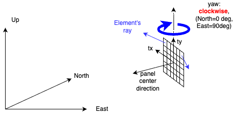
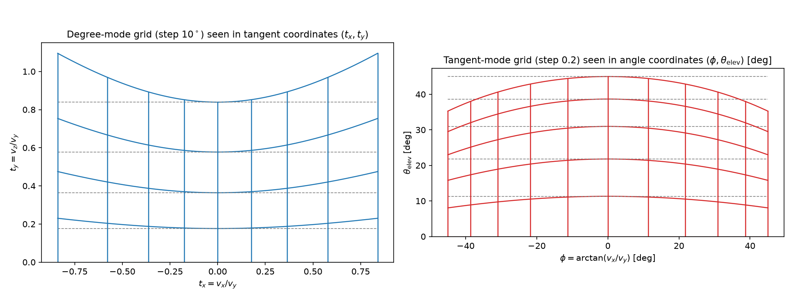

# From (tx, ty) to a Ray Direction

Each detector element observes one angular bin, identified by two bin coordinates, `tx` (horizontal) and `ty` (vertical). This page explains how a `(tx, ty)` bin becomes the element's world-frame look direction, and how that direction feeds the expected signal count.

The panel's position and the yaw convention that orient the ray (0° = North, 90° = East, clockwise from above) are defined in [Detector Model — Detector Orientation](detector-model.md#detector-orientation).

**1. Angle unit.** The meaning of `tx`/`ty` depends on `angle_unit`. In the default **Tangent** mode they are slopes, `tx = tan θx` and `ty = tan θy`; in **Degree** or **Radian** mode they are the angles themselves. All three are reduced to tangents internally.

**2. Bin center.** A bin's representative direction uses the bin **center**, not an edge:

$$c_i = \min + \left(i + \tfrac{1}{2}\right)\,\Delta, \qquad \Delta = \frac{\max - \min}{n_{\text{bin}}}$$

Because the bins are uniform in `angle_unit` space, in Tangent mode they are equal-width in slope — not in degrees.

**3. Local direction.** The center `(tx, ty)` is turned into a unit vector in the detector-local frame, whose forward axis is `+y`. In Tangent mode:

$$\mathbf{v}_{\text{local}} = \frac{(t_x,\; 1,\; t_y)}{\sqrt{1 + t_x^2 + t_y^2}}$$

so the bin coordinates are simply the slopes of the direction about the forward axis:

$$t_x = \frac{v_x}{v_y}, \qquad t_y = \frac{v_z}{v_y}$$

Degree and Radian modes use a spherical form instead, `v = (cos θy · sin θx, cos θy · cos θx, sin θy)`; inverting it gives

$$\tan t_x = \frac{v_x}{v_y}, \qquad \tan t_y = \frac{v_z}{\sqrt{v_x^2 + v_y^2}}$$

The horizontal coordinate obeys the same equation in both modes. The vertical one does not — the denominator is $v_y$ in Tangent mode but the horizontal magnitude $\sqrt{v_x^2 + v_y^2}$ in Degree/Radian mode. The two coincide only on the panel's center column ($v_x = 0$); off the column, even properly converted values ($t_y \leftrightarrow \arctan t_y$) point to different directions.

The two grids are also warped relative to each other: a row of constant $t_y$ is a different surface of directions in each mode,

$$
\begin{aligned}
\text{Tangent:} \quad & v_z = t_y\, v_y && \text{(a tilted plane)} \\
\text{Degree/Radian:} \quad & v_z = \sin t_y && \text{(a cone of constant elevation)}
\end{aligned}
$$

so along a Tangent-mode row the physical elevation is not constant:

$$\mathrm{elev}(t_x, t_y) = \arctan\frac{t_y}{\sqrt{1 + t_x^2}}$$

which drops toward the panel edges — for $t_y = 1$: 45.0° at $t_x = 0$, 35.3° at $t_x = 1$. Overlaying the two grids in angle space therefore shows curved iso-elevation lines; this is by design, not an error.

The same comparison, including the companion tool [muonith-path-view](../auxiliary-tools/path-view.md); $u$ denotes each raw number written in muonith-path-view's angle ranges (`azimuth_range` / `elevation_range`):

| Tool / mode | Direction from bin values | Row of constant vertical value |
|---|---|---|
| muonith-path-view, every `angle_unit` | spherical, $v_z = \sin\theta_{\mathrm{elev}}$ (`tangent` only converts the input, $\theta_{\mathrm{elev}} = \arctan u$) | cone of constant elevation |
| MUONITH `DetectorPanel`, Degree / Radian | spherical, $v_z = \sin t_y$ | cone of constant elevation |
| MUONITH `DetectorPanel`, Tangent | slopes, $t_y = v_z / v_y$ | tilted plane |

The figure below visualizes this distortion — **Tangent Grid2d vs Degree Grid2d** (upper hemisphere, $\theta_{\mathrm{elev}} \geq 0$):

*Left: a Degree-mode grid (10° steps) seen in tangent coordinates $(t_x, t_y)$ — rows bow upward toward the edges ($t_y = \tan\theta_{\mathrm{elev}}/\cos\phi$). Right: a Tangent-mode grid (0.2 steps) seen in angle coordinates $(\phi, \theta_{\mathrm{elev}})$ — rows sag toward the edges ($\theta_{\mathrm{elev}} = \arctan(t_y/\sqrt{1 + t_x^2})$). Solid lines are the mapped grid; dashed gray lines mark the undistorted reference, i.e. each row's value at the center column. Columns stay straight in both directions because the horizontal relation $\tan\phi = v_x/v_y$ is shared by both modes.*

**4. Local → world.** The local vector is rotated into world coordinates by the detector's orientation:

$$\mathbf{v}_{\text{world}} = R\,\mathbf{v}_{\text{local}}, \qquad R = R_z(-\text{yaw})\,R_y(\text{pitch})\,R_x(\text{roll})$$

using the default `LOCAL` rotation type. `yaw` is negated because it is a clockwise bearing (0° = North), while the rotation matrix follows the right-hand convention.

**5. From ray to signal count.** The world direction fixes the zenith cosine `cos θz`, which selects the penetrating-muon flux $F$. The expected count of one element is then

$$N = F \cdot S_{\text{eff}} \cdot \Delta\Omega \cdot T \cdot \varepsilon$$

where $\Delta\Omega$ is the exact four-corner solid angle of the bin (not `Δtx · Δty`), $S_{\text{eff}}$ the effective area, $T$ the exposure time, and $\varepsilon$ the optional detector efficiency. These symbols match the flux notation in [Muography](muography.md) and [Depth vs. Spatial Resolution](depth-resolution.md).
