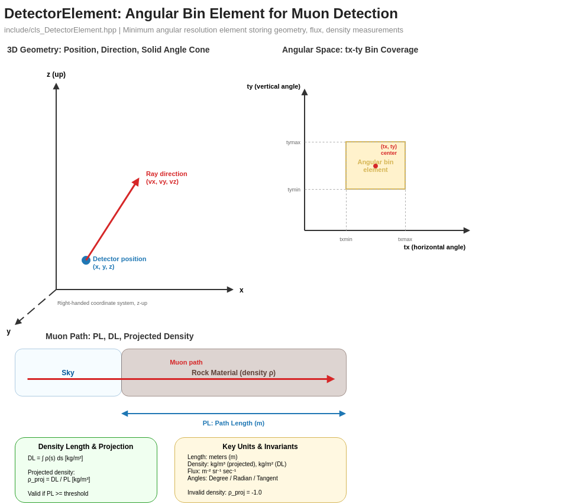
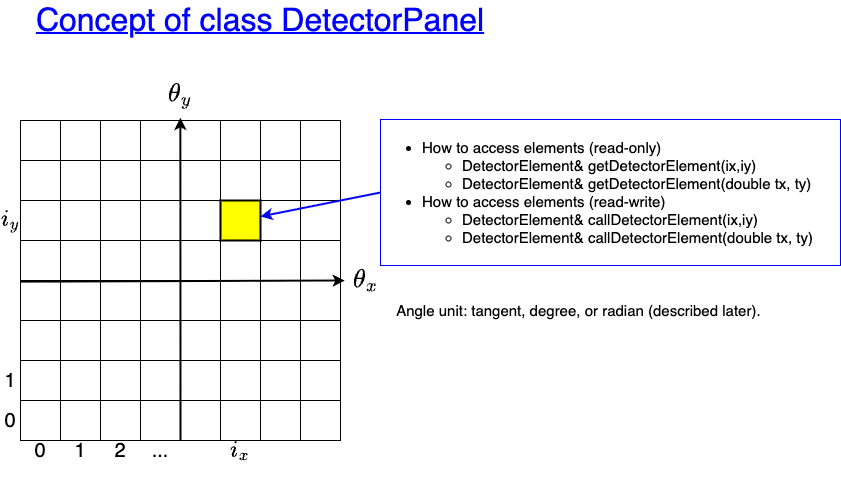
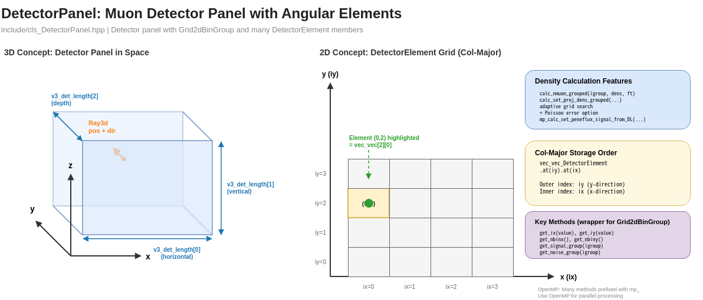
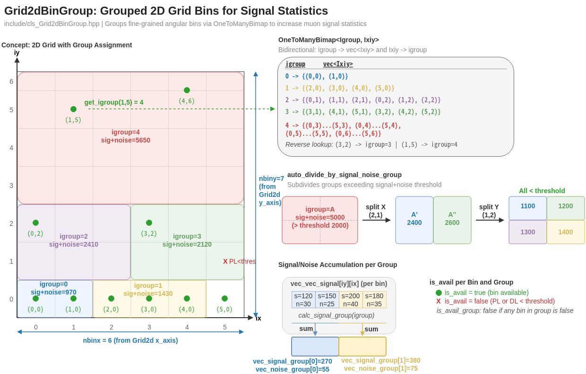
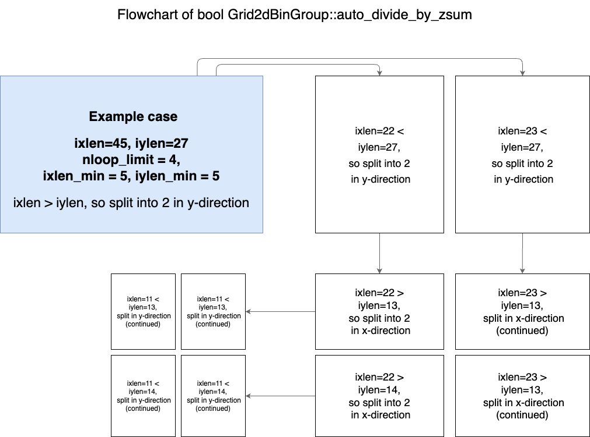
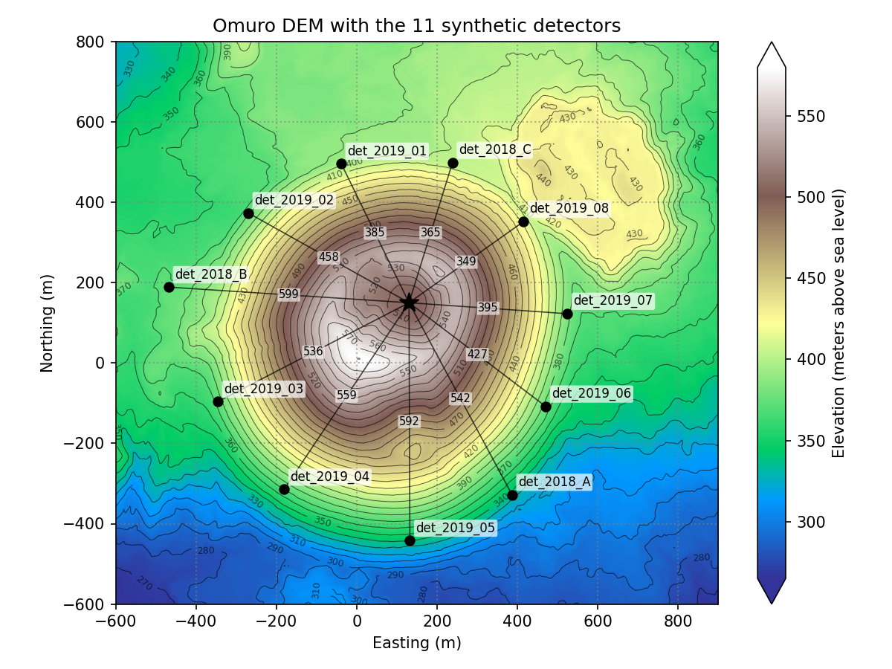
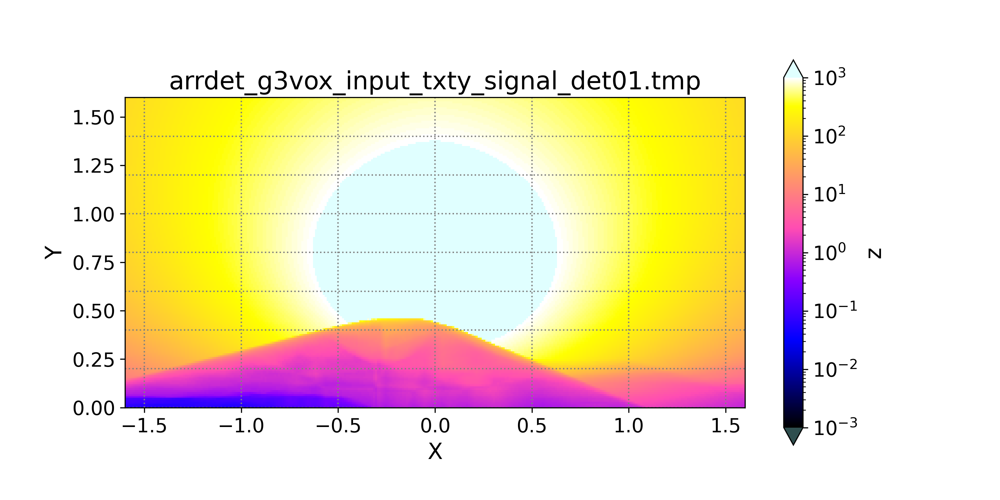
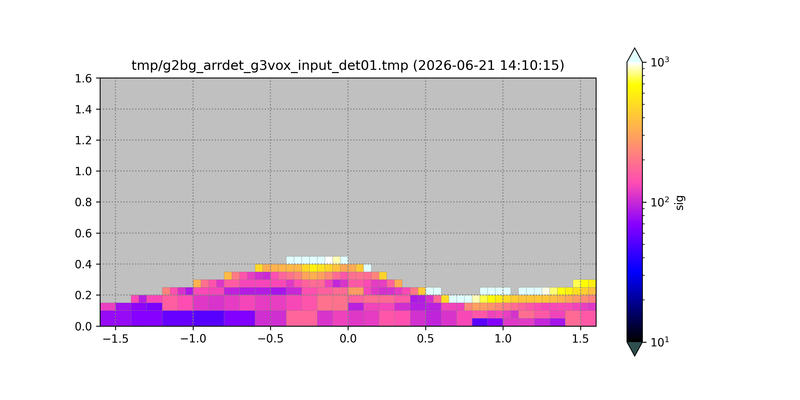
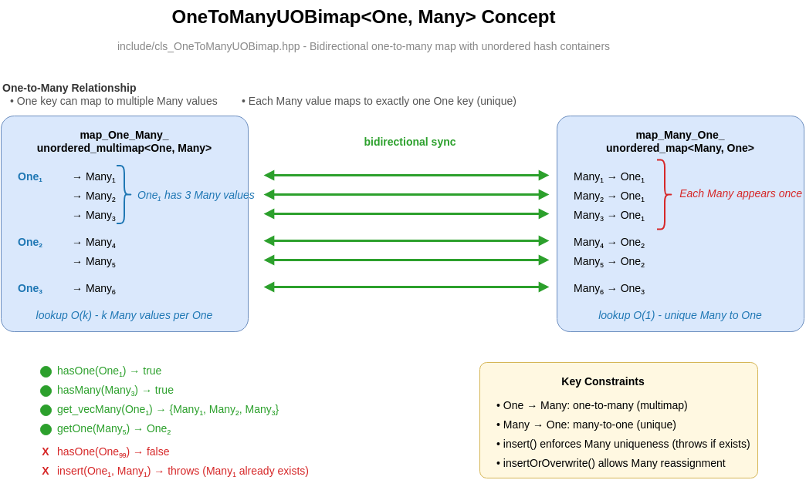
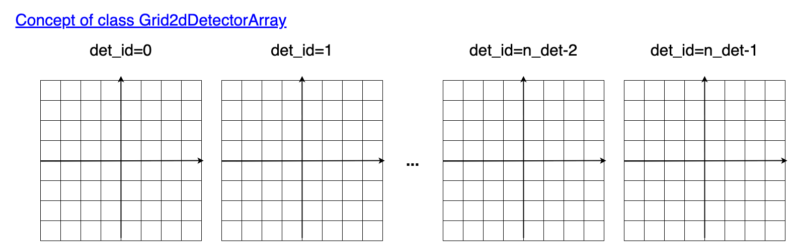

# Detector Model

MUONITH models muon detectors as a hierarchy of geometric elements that define the angular binning and spatial coverage of each observation.

## Class Hierarchy

```
DetectorPanelArray
  └── DetectorPanel          ← one physical detector
        └── DetectorElement  ← one angular bin (path-length computation element)
```

## DetectorElement



A DetectorElement represents the **minimum angular element of the path-length computation** — a single directional bin on which path lengths, fluxes, and efficiencies are evaluated.

!!! warning "Bin size is a computational choice, not the instrument's angular resolution"
    The angular grid (`nbinx`, `nbiny`, `txmin`–`txmax`, `tymin`–`tymax` in the
    [detector parameter file](../user-guide/parameter-files.md#detector-parameter-files))
    only sets how finely the computation samples the terrain. What a bin can *actually*
    resolve is limited by three independent factors:

    - **Count statistics** — finer bins collect fewer muons each, so per-bin Poisson noise
      grows. The [automatic bin grouping](#automatic-bin-grouping) below merges bins where
      the signal is sparse to recover statistical significance.
    - **Detector geometry** — the physical channel size and the separation of the detection
      planes set the hardware angular response; bins finer than this response do not add
      information.
    - **Angular resolution effects** — multiple scattering in the rock and in the detector
      smears the arrival directions.

    Choose the binning fine enough to sample the terrain, and judge what is actually
    resolvable from the statistics and the detectability analysis
    ([Depth vs. Spatial Resolution](depth-resolution.md)) — not from the bin count.

| Property | Type | Description |
|----------|------|-------------|
| `unique_index` | `Uqid` | Globally unique identifier |
| `detid` | `int` | Parent detector panel ID |
| `id_in_this_detector` | `Inthis` | Position within the parent panel |
| `ray3d` | `Ray3d` | Center position and look direction |
| `txmin`, `txmax` | `float` | Angular bounds (horizontal) |
| `tymin`, `tymax` | `float` | Angular bounds (vertical) |
| `effective_area_m2` | `float` | Detector collection area [m²] |
| `solid_angle` | `float` | Angular coverage [sr] |
| `exposure_time_sec` | `float` | Measurement duration [s] |

### Computed Quantities

After ray tracing, each element stores:

| Quantity | Unit | Description |
|----------|------|-------------|
| PL | m | Path length through rock |
| DL | kg/m² | Density length (integrated density along path) |
| Penetrating muon flux | 1/(m² sr s) | Expected muon intensity at the given DL |
| Signal / Noise | counts | Expected muon counts and statistical uncertainty |
| `proj_density` | kg/m³ | Projected (line-averaged) density; set to -1.0 if invalid |

!!! note "Efficiency uncertainty in the projected-density error band"
    The 2D projected-density error band (its upper/lower bounds per angular bin) widens when the detector efficiency uncertainty is enabled via `tf_eff_cn_diag`. The same efficiency-uncertainty variance added to the observation covariance diagonal $\mathbf{C}_N$ (see [Inversion](inversion.md#observation-covariance-mathbfc_n)) also feeds the grouped projected-density bounds. With the flag off, the band reflects count statistics only.

### Workflow

A typical DetectorElement lifecycle:

1. **Construct** — Set position, angular bounds, and exposure parameters
2. **Ray trace** — Compute PL and DL through Grid2dPillar (terrain)
3. **Flux lookup** — Determine expected muon flux from flux table using DL and zenith angle
4. **Signal estimation** — Calculate expected muon counts: flux × area × solid angle × time
5. **Inversion** — Use in the observation equation for density reconstruction

## DetectorPanel





A DetectorPanel represents a **complete physical muon detector** consisting of a 2D grid of angular elements.

| Property | Description |
|----------|-------------|
| `name` | Detector identifier |
| `ray3d` | Detector center position and orientation |
| `v3_det_length` | Physical dimensions [horizontal, vertical, depth] in meters |
| `n_unit` | Number of detector unit copies |
| `days` | Exposure time in days |
| `angle_unit` | Angular unit for this panel (Tangent / Degree / Radian) |

Internally, a DetectorPanel contains a **Grid2dBinGroup** — a 2D grid that discretizes the detector's angular field of view into bins. Each bin corresponds to one DetectorElement.

```
DetectorPanel
├── Grid2dBinGroup (angular bin grid)
│     ├── x-axis: horizontal angle bins
│     └── y-axis: vertical angle bins
└── vec_vec_DetectorElement[iy][ix]
      └── one element per angular bin
```



#### Automatic Bin Grouping

When `auto_divide_by_zsum` is enabled, the angular bins are recursively subdivided based on signal distribution:



The example below shows the effect on forward-modeled signal data (synthetic 11-detector example, detector 01). The left panel is the per-element signal field in angular (tangent) coordinates with a logarithmic color scale; the right panel is the same signal after grouping, where each cell is one Grid2dBinGroup group — coarse where the signal is sparse, fine where the signal is dense.



*Geographic setting of the synthetic example: the Omuro DEM (5 m resolution, elevation in meters above sea level) with the 11 detectors placed around the dome. Numbers along the lines indicate each detector's horizontal distance to the summit. The two panels below show the per-element and grouped signal for detector 01 (`det_2018_B`), located on the western foot of the dome.*

| Per-element signal (before grouping) | Grouped bins (after grouping) |
|:-:|:-:|
|  |  |

#### OneToManyUOBimap — Bin Index Mapping



Grid2dBinGroup uses **OneToManyUOBimap** to maintain bidirectional mappings between grouped bins and individual bins. This data structure provides:

| Direction | Lookup | Complexity |
|-----------|--------|------------|
| One → Many | `get_vec_Many(One)` — retrieve all individual bins belonging to a group | O(k) where k = group size |
| Many → One | `getOne(Many)` — find which group an individual bin belongs to | O(1) |

**Key constraints:**

- Each `Many` value maps to exactly **one** `One` key (uniqueness enforced on insert)
- Each `One` key can map to **multiple** `Many` values
- `insertOrOverwrite()` allows reassignment of a `Many` value to a different `One` key

### Detector Orientation

The detector's viewing direction is defined by its Ray3d:

- **Position**: The physical location of the detector [m]
- **Direction**: The central look direction (unit vector)
- **Yaw**: 0° = North (+y), 90° = East (+x), measured clockwise when viewed from above

### From (tx, ty) to a ray direction

Each detector element observes one angular bin, identified by two bin coordinates, `tx` (horizontal) and `ty` (vertical). This section explains how a `(tx, ty)` bin becomes the element's world-frame look direction, and how that direction feeds the expected signal count.


**1. Angle unit.** The meaning of `tx`/`ty` depends on `angle_unit`. In the default **Tangent** mode they are slopes, `tx = tan θx` and `ty = tan θy`; in **Degree** or **Radian** mode they are the angles themselves. All three are reduced to tangents internally.

**2. Bin center.** A bin's representative direction uses the bin **center**, not an edge:

$$c_i = \min + \left(i + \tfrac{1}{2}\right)\,\Delta, \qquad \Delta = \frac{\max - \min}{n_{\text{bin}}}$$

Because the bins are uniform in `angle_unit` space, in Tangent mode they are equal-width in slope — not in degrees.

**3. Local direction.** The center `(tx, ty)` is turned into a unit vector in the detector-local frame, whose forward axis is `+y`. In Tangent mode:

$$\mathbf{v}_{\text{local}} = \frac{(t_x,\; 1,\; t_y)}{\sqrt{1 + t_x^2 + t_y^2}}$$

Degree and Radian modes use a spherical form instead, `v = (cos θy · sin θx, cos θy · cos θx, sin θy)`. The two forms agree only near zero angle, so the same `(tx, ty)` value does not mean the same direction across units.

**4. Local → world.** The local vector is rotated into world coordinates by the detector's orientation:

$$\mathbf{v}_{\text{world}} = R\,\mathbf{v}_{\text{local}}, \qquad R = R_z(-\text{yaw})\,R_y(\text{pitch})\,R_x(\text{roll})$$

using the default `LOCAL` rotation type. `yaw` is negated because it is a clockwise bearing (0° = North), while the rotation matrix follows the right-hand convention.

**5. From ray to signal count.** The world direction fixes the zenith cosine `cos θz`, which selects the penetrating-muon flux $F$. The expected count of one element is then

$$N = F \cdot S_{\text{eff}} \cdot \Delta\Omega \cdot T \cdot \varepsilon$$

where $\Delta\Omega$ is the exact four-corner solid angle of the bin (not `Δtx · Δty`), $S_{\text{eff}}$ the effective area, $T$ the exposure time, and $\varepsilon$ the optional detector efficiency. These symbols match the flux notation in [Muography](muography.md) and [Depth vs. Spatial Resolution](depth-resolution.md).

## DetectorPanelArray



A container for **multiple detector panels**, providing unified access to all DetectorElement instances across all panels.

In a multi-view observation (used for 3D density reconstruction), each panel observes the target from a different position and angle. The DetectorPanelArray maintains:

- Global detector element indexing (Uqid)
- Coordinate transformations between detector-local and global frames
- Aggregated path length and observation data

### Shell path lengths (`ShellPL`)

In addition to path lengths through the voxel grid, Trace Path Lengths (Module 4) computes **density-independent** geometric path lengths through the terrain shells that surround the grid. These are bundled in a `ShellPL` struct:

| Field | Type | Description |
|-------|------|-------------|
| `upper` | `Eigen::VectorXf` | Path length through terrain above the voxel grid |
| `lower` | `Eigen::VectorXf` | Path length through terrain below the voxel grid |
| `lateral` | `Eigen::VectorXf` | Path length through terrain to the sides of the voxel grid |

Each vector is laid out **flat** across all detector elements of a `DetectorPanelArray`; per-panel slices are obtained with `segment(offset, n_ele)`. Because the values are density-independent, they are computed once in Trace Path Lengths (Module 4) and reused across every prior-density combination in Compute Prior (Module 5) (`density_quad = [prior, shell_upper, shell_lower, shell_lateral]`).

## Configuration

Detector parameters are specified in a JSON parameter file. Key settings include:

| Parameter | Description |
|-----------|-------------|
| Detector position | (x, y, z) coordinates in meters |
| Look direction | Yaw and elevation angles |
| Angular range | Min/max angles for horizontal and vertical axes |
| Angular bin size | Resolution of angular discretization |
| Physical size | Detector dimensions |
| Exposure time | Observation duration |
| Number of units | Detector copies (affects effective area) |

See [Parameter Files](../user-guide/parameter-files.md) for the complete parameter file format.
