# Grid System

MUONITH discretizes the study volume into regular grids for ray tracing and density reconstruction. The grid system is built from composable 1D, 2D, and 3D components.

## Grid Hierarchy

```
Grid1d          ← 1D uniform grid (base building block)
  │
  ├── Grid1dXZ  ← 1D grid in XZ plane
  │
  ├── Grid2d    ← 2D grid = x-axis × y-axis
  │     │
  │     ├── Grid2dPillar   ← 2D grid + vertical pillar per cell (terrain/DEM)
  │     ├── Grid2dVoxel    ← 2D grid + vertical voxel data
  │     ├── Grid2dBinGroup ← 2D grid for angular bins (detector angles)
  │     └── Grid2dXYZ      ← 2D grid + scalar Z per (x,y) bin
  │
  └── Grid3d    ← 3D grid = x-axis × y-axis × z-axis
        │
        └── Grid3dVoxel    ← 3D grid + Voxel payload per cell
```

## Grid1d

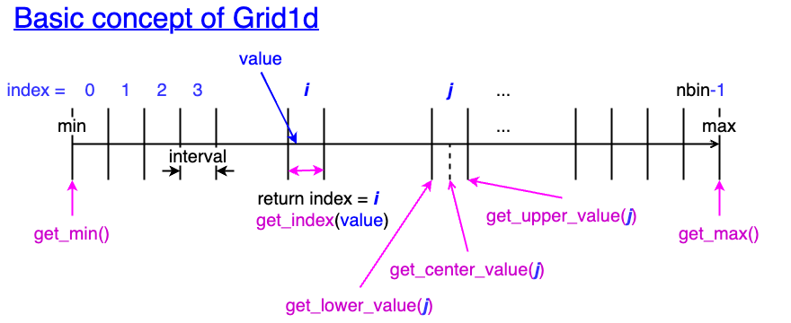

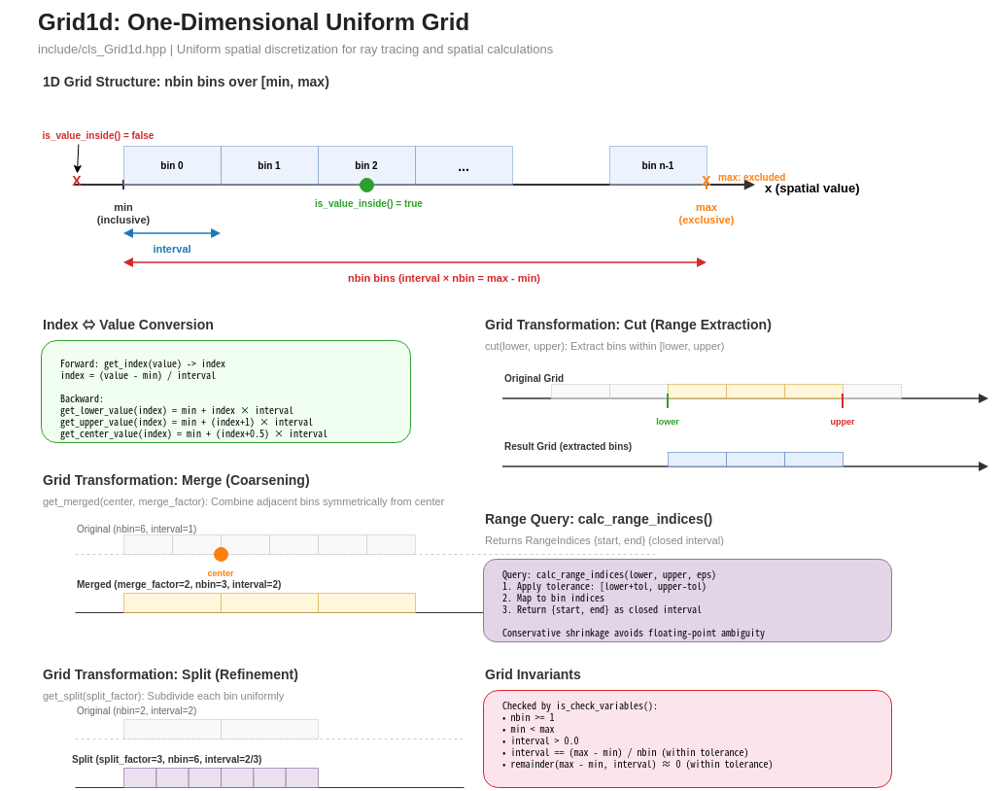

The fundamental building block. A uniform 1D grid defined by:

| Property | Description |
|----------|-------------|
| `name` | Identifier string |
| `nbin` | Number of bins |
| `min` | Lower bound (inclusive) |
| `max` | Upper bound (exclusive) |
| `interval` | Bin width: `(max - min) / nbin` |

**Key operations:**

- `get_index(value)` — Convert a spatial coordinate to a bin index
- `get_lower_value(i)`, `get_upper_value(i)`, `get_center_value(i)` — Bin boundary and center queries
- `get_merged(factor)` — Coarsen grid by merging adjacent bins
- `get_split(factor)` — Refine grid by subdividing bins
- `cut(new_min, new_max)` — Extract a sub-range

### Merge Operation

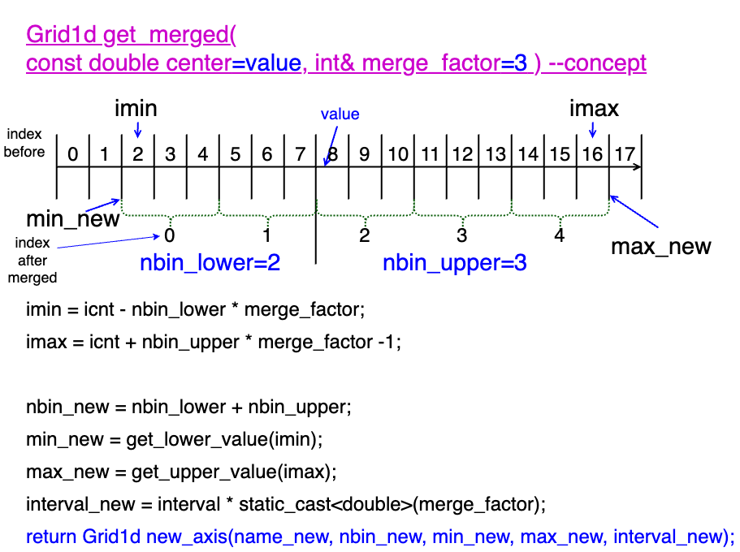

A validation check ensures `interval == (max - min) / nbin` within a tolerance of 1.0e-4.

## Grid1dXZ

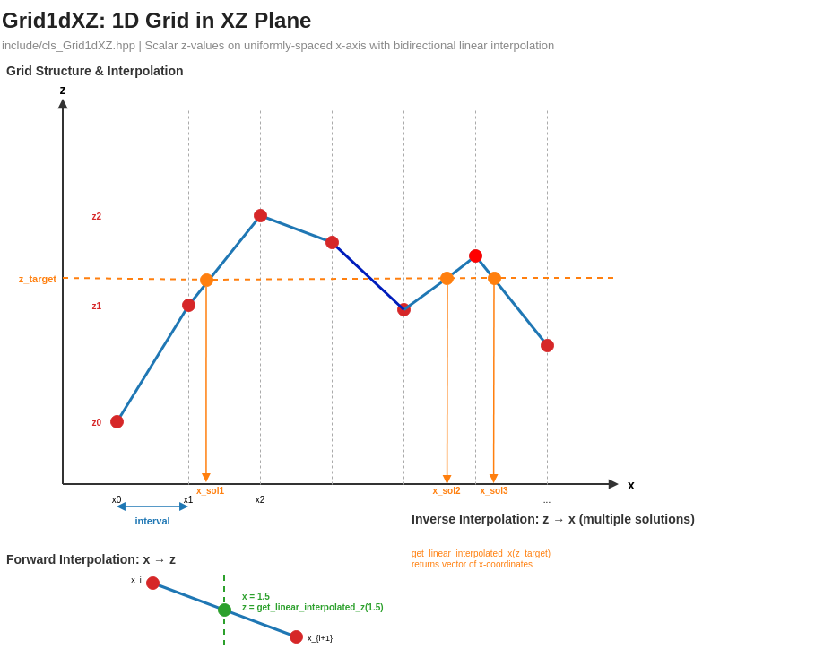

A specialized 1D grid storing scalar z-values on a uniformly-spaced x-axis in the XZ plane. Provides **bidirectional linear interpolation**:

| Direction | Function | Description |
|-----------|----------|-------------|
| Forward (x → z) | `get_linear_interpolated_z(x)` | Returns the linearly interpolated z-value at a given x-coordinate |
| Inverse (z → x) | `get_linear_interpolated_x(z_target)` | Returns a vector of x-coordinates where the profile crosses `z_target` (multiple solutions possible) |

**Use case:** Terrain cross-section profiles. A Grid1dXZ can represent the elevation profile along a line, allowing queries such as "what is the ground elevation at this x?" (forward) or "at what x-positions does the terrain reach this elevation?" (inverse).

## Grid2d

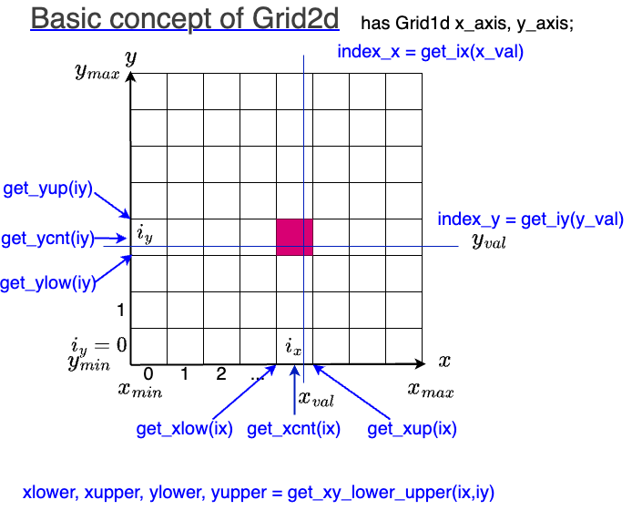

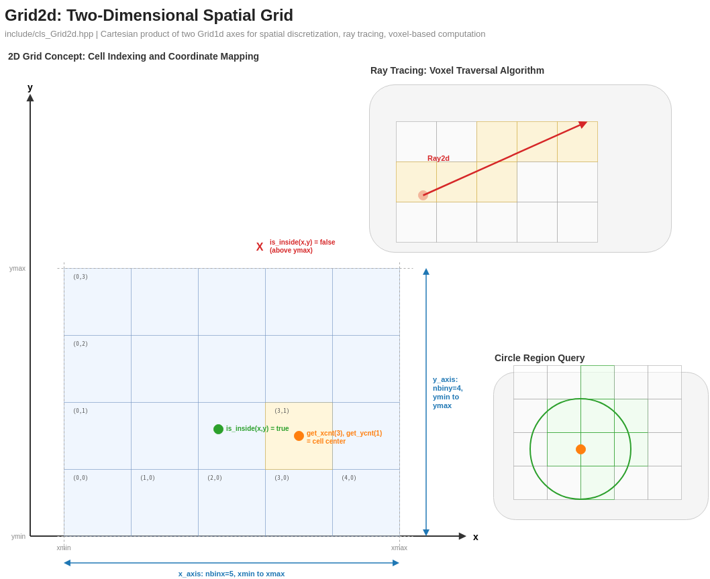

A 2D grid composed of two Grid1d axes (x and y):

| Property | Description |
|----------|-------------|
| `nbinx`, `nbiny` | Number of bins per axis |
| `xmin`, `xmax` | x-axis bounds |
| `ymin`, `ymax` | y-axis bounds |
| `x_interval`, `y_interval` | Bin widths |

Grid2d supports 2D ray traversal using the **DDA (Digital Differential Analyzer)** algorithm via `get_hit_boxes_index()`, which returns an ordered list of cells intersected by a ray.

## Grid2dPillar — Terrain Representation

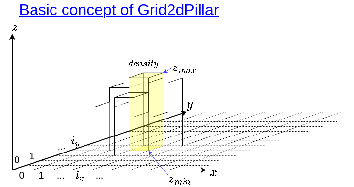


Each cell `(ix, iy)` in a Grid2dPillar stores a **Pillar**:

| Pillar property | Description |
|-----------------|-------------|
| `zmin` | Bottom elevation [m] |
| `zmax` | Top elevation [m] |
| `density` | Material density [kg/m³] |

The z-interval is half-open: $[z_{\min},\; z_{\max})$.

**Use case:** Grid2dPillar stores the Digital Elevation Model (DEM). Each column `(ix, iy)` represents the vertical extent of terrain at that horizontal position. Ray tracing through this grid yields the path length (PL) and density length (DL) for each muon trajectory.

## Grid2dXYZ

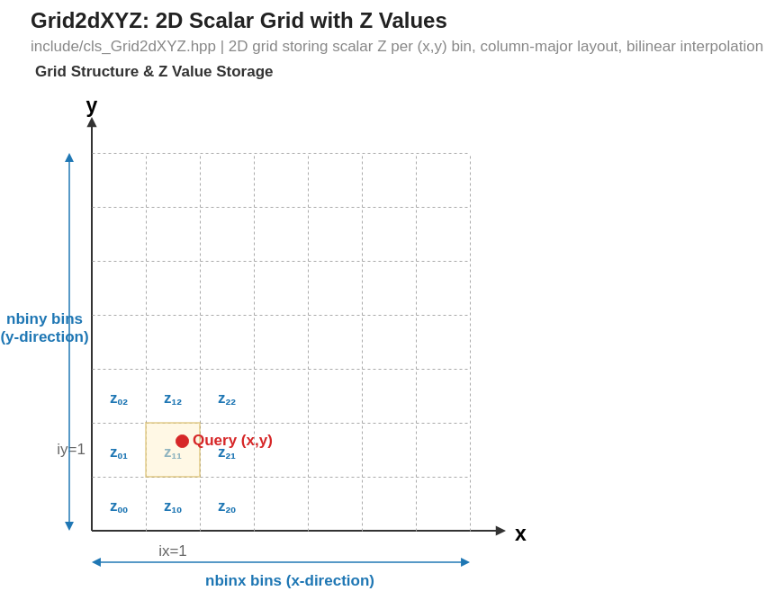

A 2D grid that stores a **scalar Z value** for each `(ix, iy)` bin. Uses **column-major layout** and supports **bilinear interpolation** for querying Z at arbitrary (x, y) coordinates.

| Property | Description |
|----------|-------------|
| `nbinx`, `nbiny` | Number of bins per axis |
| `z_ij` | Scalar Z value at bin `(ix, iy)` |

**Interpolation:** Given a query point (x, y), Grid2dXYZ identifies the enclosing cell and performs bilinear interpolation using the four surrounding Z values ($z_{00}$, $z_{10}$, $z_{01}$, $z_{11}$).

## Grid3d

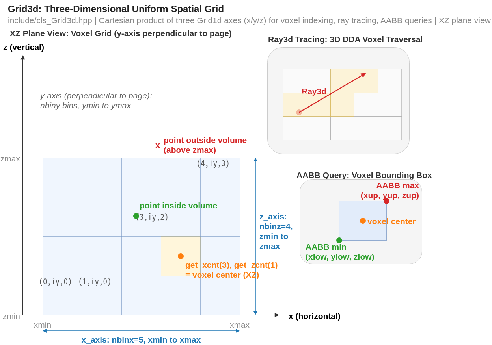

A 3D grid composed of three Grid1d axes (x, y, z):

| Property | Description |
|----------|-------------|
| `Ixiyiz` | 3D index type: `std::array<int, 3>` = `[ix, iy, iz]` |
| `Uqiv` | Unique voxel index (linearized) |
| AABB3d | Cached bounding box for intersection tests |

Grid3d supports 3D ray traversal via `get_hit_voxel_index()`, also using the DDA algorithm.

## Grid3dVoxel — 3D Density Grid

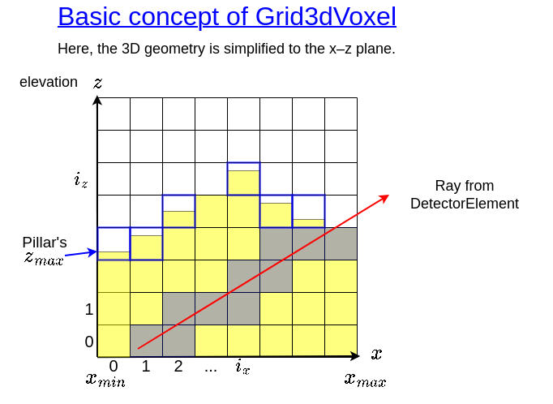

The primary data structure for density reconstruction. Each cell stores a **Voxel**:

| Voxel property | Type | Description |
|----------------|------|-------------|
| `tf_exist` | `bool` | `true` if material (rock) exists at this location |
| `density` | `double` | Material density [kg/m³] |

Per-cell hit information used during ray tracing is stored on `Grid3dVoxel` itself (keyed by the unique voxel index `Uqiv`), not on each `Voxel`:

| Grid3dVoxel member | Type | Description |
|--------------------|------|-------------|
| `vec_n_hit_ele_` | `vector<Nhit>` (`unsigned short`) | Number of detector elements whose ray passes through each voxel |
| `vec_hit_det_` | `vector<uint64_t>` | Bitmask of which detectors hit each voxel |

### Memory Layout

Voxels are stored in **z-major order**:

```
vec_vec_vec_Voxel[iz][iy][ix]
```

The outermost index is `iz` (vertical), the innermost is `ix` (easting). This layout is consistent with the z-up coordinate convention.

### Reconstruction sub-volume (`reconst_voxels`)

A subset of the full voxel grid can be selected for reconstruction via the `reconst_voxels` block in `GRID3D_VOXEL_PARAMETERS`. Dimensions are specified in **meters** (not voxel counts):

| Parameter | Type | Description |
|-----------|------|-------------|
| `tf_aabb` | bool | Enable an AABB-shaped reconstruction region |
| `x_aabb_cnt`, `y_aabb_cnt` | float | Horizontal center of the AABB [m] |
| `x_aabb_meters`, `y_aabb_meters` | float | Half-widths of the AABB in x / y [m] |
| `aabb_zmin_mode` | string | How to derive the lower z bound (`auto` / `value` / …) |
| `aabb_zmin_value`, `aabb_zmax` | float | Explicit z bounds [m] (used when `aabb_zmin_mode = "value"`) |
| `tf_cylinder` | bool | Enable a cylindrical reconstruction region |
| `x_cyl_cnt`, `y_cyl_cnt` | float | Cylinder axis center [m] |
| `cylinder_radius_x_meters`, `cylinder_radius_y_meters` | float | Elliptical-cylinder half-axes [m] |

For the full parameter reference see [Parameter Reference — GRID3D_VOXEL_PARAMETERS](../reference/parameter-reference.md#grid3d_voxel_parameters).

### What is reconstructed vs. what only attenuates

Only the voxels inside the reconstruction sub-volume are solved as unknowns. Every other part of the mountain a ray crosses still attenuates the muon flux, but its density is held **fixed** instead of being reconstructed:

- **Voxels inside the grid but outside the sub-volume** keep their prior density and add a fixed density length to each ray.
- **Terrain surrounding the voxel grid** is captured as density-independent **shell** path lengths — upper, lower, and lateral — computed once and reused (see [Detector Model — Shell path lengths](detector-model.md#shell-path-lengths-shellpl)).

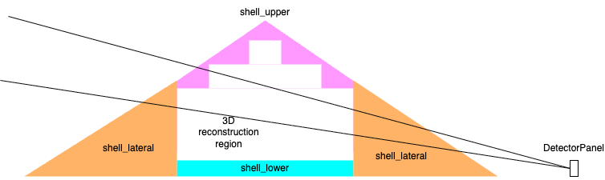

*A ray from the DetectorPanel passes through the surrounding shells (upper / lateral / lower) and the central 3D reconstruction region. All of them attenuate the ray, but only the reconstruction region is solved; the shells and the out-of-sub-volume voxels contribute to the observed counts at a fixed density.*

### Construction from DEM

A Grid3dVoxel is typically built from a Grid2dPillar:

1. Load DEM data into Grid2dPillar (terrain elevations)
2. Define vertical grid extent and resolution
3. Convert via `convert_from_Grid2dPillar()` — voxels inside the terrain get `tf_exist = true`
4. Optionally embed density anomalies (checkerboard, ellipsoid, cylinder) for synthetic tests

### Resolution Control

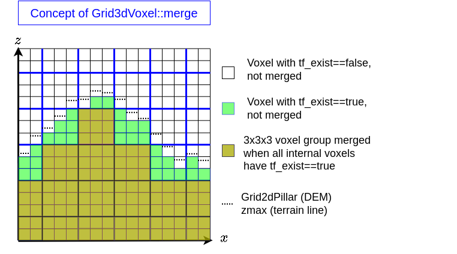

- `merge(factor)` — Reduce resolution by combining adjacent voxels
- Useful for managing computational cost: fewer voxels → smaller matrices → faster inversion

## DDA Ray Traversal

Both Grid2d and Grid3d use the **Digital Differential Analyzer (DDA)** algorithm for ray traversal. This algorithm efficiently enumerates all grid cells intersected by a ray, in order from near to far:

```
Ray enters grid → Step through cells along ray direction → Collect hit cells
```

The DDA operates in grid-index space, stepping one cell at a time along the axis with the smallest parametric increment. This avoids the need for exhaustive intersection testing against all cells.

**Key outputs:**
- Ordered list of hit cell indices
- Path length through each cell (computed from the ray's parametric interval within the cell)

For Grid2d, a zero-allocation visitor pattern is also available via `traverse_ray_2d()`.

## Grid1d Coordinate Model

Grid1d internally represents bin edges. After construction, the members satisfy:

| Member | Meaning |
|--------|---------|
| `min` | Lower edge of bin 0 (inclusive) |
| `max` | Upper edge of bin `nbin-1` (exclusive) |
| `interval` | `(max - min) / nbin` |
| Index range | `[0, nbin)` |

These values are the *final* coordinates used by all query functions
(`get_index()`, `get_lower_value()`, etc.) and by the cached AABB.
They are **canonical**: any half-interval shift needed to interpret raw
input points is applied exactly once, at construction time, and is
already baked into `min`/`max`.

## Half-Interval Shift (tf_shift_x / tf_shift_y)

The JSON5 flags `tf_shift_x` / `tf_shift_y` state whether the raw data
points of an ASCII xyz file represent **bin centers** (`true`) or
**bin lower edges** (`false`).  They are consumed only by the ASCII
construction path; once the Grid1d is built, no shift information is
retained or needed.

> Historical note: Grid1d used to carry a RAM-only `tf_half_shift`
> flag, and `save()`/`load()` reverse/forward transformed `min`/`max`
> around it.  The two authorities (RAM flag on save, JSON5 on load)
> could disagree — e.g. axes produced by `get_merged()` never inherited
> the flag — which caused a half-bin (half-interval) offset after
> checkpoint resume.  The flag was removed; serialization is now
> pass-through (see below).

When a raw axis with data-point range `[raw_min, raw_max]` and spacing
`interval` is constructed, the canonical bin edges are computed as:

| Flag | Interpretation | `min` | `max` |
|:-:|---|---|---|
| `true` | Data points are bin centers | `raw_min - 0.5 * interval` | `raw_max + 0.5 * interval` |
| `false` | Data points are bin lower edges | `raw_min` | `raw_max + interval` |

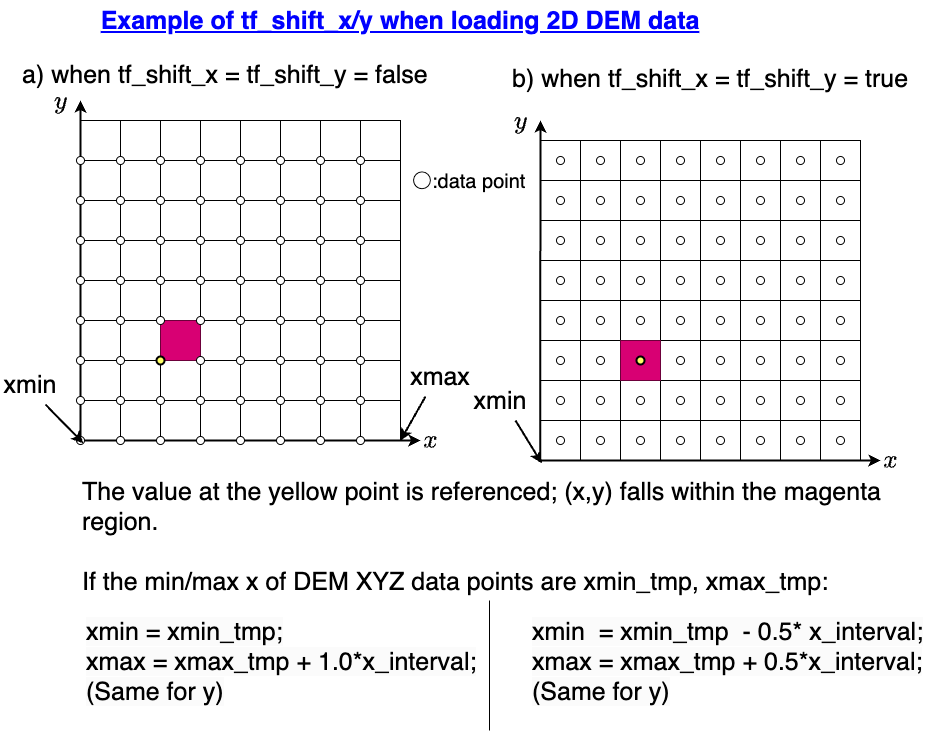

The two cases differ by half an interval on each side.  Choosing the wrong
flag shifts the whole grid by half a cell without changing any z value, and
no consistency check can detect it: the shifted axis still satisfies
`max - min == nbin * interval`.  Only the metadata of the source data (for a
GeoTIFF, `AREA_OR_POINT`) tells which case applies.

## Data Sources and Grid1d min/max

Four situations produce a Grid1d with valid `min`/`max`:

### 1. ASCII xyz (raw point data)

The file contains flat `(x, y, z)` triplets as whitespace-separated
text.  During `set_xy_axis_from_vec_xyz()`, the code detects `raw_min`,
`raw_max`, and `interval` from the sorted points, then applies the
tf_shift adjustment (from JSON5) once to compute the canonical bin edges.

```
read ASCII xyz  -->  sort  -->  detect raw axis  -->  tf_shift (JSON5, once)  -->  Grid1d min/max
```

### 2. g2zbin (compact grid binary, version 2)

The file header contains **canonical** axis ranges in Grid1d binary
format (name + nbin + min + max + interval), written by `Grid1d::save()`
and read back pass-through.  Version 1 files stored raw (pre-shift)
ranges and are rejected with an error; regenerate them from their
source data with the generating script.

```
read g2zbin v2 header (canonical)  -->  Grid1d min/max   (no shift applied)
```

### 3. JSON5 (configuration)

JSON5 supplies the `tf_shift_x` / `tf_shift_y` flags used by the ASCII
xyz construction path, and determines which raw data to load.  The
flags have no effect on binary (g2zbin / checkpoint) reads.

### 4. Checkpoint (Grid1d::save / load)

Checkpoint binaries store **canonical coordinates** and are read back
pass-through, so a save/load roundtrip is bit-exact.  No shift
information is exchanged; `exemdl::pipeline::load()` calls every
Grid2dPillar / Grid3dVoxel / build_prior::PriorInfoAll load without
tf arguments.  `PIPELINE_VERSION` 6 marks this format; v5 checkpoints
(raw coordinates) are rejected at load.

## save() / load() Pass-Through Pair

| Direction | Method | Action |
|---|---|---|
| Write | `save(ofs)` | Writes `name`, `nbin`, `min`, `max`, `interval` as-is |
| Read | `load(ifs, tol)` | Reads the same fields, calls `assign()` (consistency check only, no transform) |

## File Format Comparison: ASCII xyz vs g2zbin

| Aspect | ASCII xyz | g2zbin (v2) |
|---|---|---|
| Encoding | Plain text, one `x y z` row per point | Binary, little-endian |
| Header | None | 16 B fixed + ~200 B Grid2d header |
| Data | N rows of `x y z` text | N x P B (z only; P = 8 or 4) |
| Coordinate info | Implicit in point values | Explicit canonical Grid1d metadata in header |
| tf_shift handling | Applied once at construction (JSON5 flags) | Not needed (edges already canonical) |
| Read path | parse text + sort + axis detection + tf_shift | Direct header read (pass-through) |
| Typical size (5M pts) | Large (text encoding; depends on precision) | 38 MB (f64) / 19 MB (f32) |
