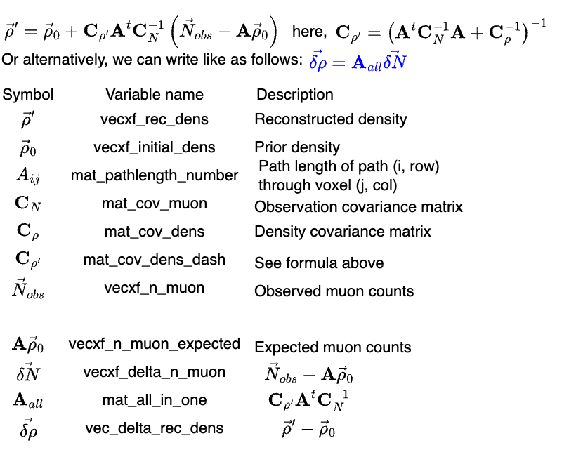

# 3D Inversion

3D density inversion is the process of estimating the internal 3D density distribution of a target volume from observed muon counts. MUONITH implements a **Maximum A Posteriori (MAP) estimation** approach with Bayesian regularization over a voxelized density model.

!!! note "Full equation reference"
    For the linearized observation-matrix derivation, the complete notation
    table with input/intermediate/output roles, and the dense-covariance memory
    limit, see [Appendix: 3D Density Reconstruction](../reference/appendix.md#3d-density-reconstruction).

## Problem Statement

Given:

- A set of muon count observations $\vec{N}_{\text{obs}}$ from one or more detectors
- A forward model that predicts expected counts $\vec{N}_0$ based on a prior density $\vec{\rho}_0$
- An observation matrix $\mathbf{A}$ relating density changes to count changes (constructed in the next section)

Estimate the density perturbation $\delta\vec{\rho}$ such that:

$$\vec{\rho}' = \vec{\rho}_0 + \delta\vec{\rho}$$

best explains the observed data while remaining consistent with prior knowledge.

*Example observation geometry at Showa-shinzan volcano. Thirteen detectors are placed around the dome, each viewing the target from a different azimuth. Numbers along the lines indicate the distance from each detector to the summit in meters. This multi-directional coverage is the basis for 3D density reconstruction.*

## Observation Matrix Construction

The observation matrix $\mathbf{A}$ is built from the geometric path-length matrix $\mathbf{L}$ computed in [Ray Tracing](ray-tracing.md#path-length-matrix). Each element $L_{ij}$ is the path length of ray $i$ through voxel $j$ [m].

Following the derivation in [Nagahara et al. (2022)](ray-tracing.md#nagahara2022) (Eqs. 12–18), the density length along ray $i$ is the weighted sum of voxel densities

$$X_i \;=\; \sum_j L_{ij}\,\rho_j \qquad [\text{kg/m}^2]$$

and the nonlinear map from density length to muon count is given by the flux table

$$N_i \;=\; g_i(X_i)$$

Linearizing around a prior density length $X_{0,i}$ yields the **muon count sensitivity matrix** $\mathbf{A}_N$:

$$A_{N,ij} \;=\; \frac{\partial N_i}{\partial \rho_j} \;=\; L_{ij}\, \frac{dN_i}{dX_i}\!\left(X_{0,i}\right)$$

which is Eq. (18) of [Nagahara et al. (2022)](ray-tracing.md#nagahara2022). Each element of $\mathbf{A}_N$ is the geometric path length $L_{ij}$ multiplied by the derivative of the muon-count response with respect to density length, evaluated at the prior density length $X_{0,i}$ of ray $i$. The derivative factor $dN_i/dX_i$ is computed from the muon flux table and combines:

- The derivative of muon flux with respect to density length ($dF/dR$)
- The cosine of the zenith angle
- The detector's effective area, solid angle, and exposure time

In the MAP formulas below, $\mathbf{A} \equiv \mathbf{A}_N$.

!!! note "Why linearize at the count level"
    Building $\mathbf{A}_N$ directly — rather than treating the path-length relation $X_i = \sum_j L_{ij}\rho_j$ as the observation equation and linearizing the flux response around it as a whole-bin operation — has two practical benefits:

    1. **Bin merging is linear in $\mathbf{A}_N$.** If angular bins $\{i\}$ are merged into a single super-bin $k$ with $N'_k = \sum_i N_i$, then $A'_{N,kj} = \sum_i A_{N,ij}$ — i.e. merging is just summation, the same as for the observed counts. This is what enables the adaptive bin grouping in [Grid2dBinGroup](detector-model.md#detectorpanel). When a ridge line crosses a coarse bin, the sum is taken only over sub-bins below the ridge.
    2. **Higher numerical accuracy.** The muon flux varies nonlinearly with path and elevation angle, so a single linearization at the coarse-bin level degrades as bins become coarser. The $\mathbf{A}_N$ form keeps the derivative $dN_i/dX_i$ evaluated at the correct $X_{0,i}$ for each underlying small bin, then sums — preserving accuracy even for merged bins.

## MAP Estimation

First, define the **posterior covariance** and the **count residual**:

$$\mathbf{C}_{\rho'} = \left(\mathbf{A}^T \mathbf{C}_N^{-1} \mathbf{A} + \mathbf{C}_\rho^{-1}\right)^{-1}$$

$$\delta\vec{N} = \vec{N}_{\text{obs}} - \vec{N}_0$$

The reconstruction formula then becomes:

$$\delta\vec{\rho} = \mathbf{C}_{\rho'} \, \mathbf{A}^T \mathbf{C}_N^{-1} \, \delta\vec{N}$$

| Symbol | Name | Dimensions | Description |
|--------|------|-----------|-------------|
| $\delta\vec{\rho}$ | Density perturbation | $n_v \times 1$ | Estimated change from prior density [kg/m³] |
| $\vec{\rho}_0$ | Prior density | $n_v \times 1$ | Initial density assumption [kg/m³] |
| $\mathbf{A}$ | Observation matrix | $n_d \times n_v$ | $\partial N / \partial \rho$ (muon count sensitivity) |
| $\mathbf{C}_N$ | Observation covariance | $n_d \times n_d$ | Uncertainty in muon counts |
| $\mathbf{C}_\rho$ | Prior density covariance | $n_v \times n_v$ | Prior uncertainty and spatial correlation |
| $\mathbf{C}_{\rho'}$ | Posterior covariance | $n_v \times n_v$ | Posterior uncertainty of reconstructed density |
| $\vec{N}_{\text{obs}}$ | Observed counts | $n_d \times 1$ | Measured muon counts |
| $\vec{N}_0$ | Prior expected counts | $n_d \times 1$ | Forward-modeled counts at $\vec{\rho}_0$ |
| $\delta\vec{N}$ | Count residual | $n_d \times 1$ | Difference between observed and prior counts |

Where $n_d$ = number of detector elements (observations) and $n_v$ = number of voxels (unknowns). Here $n_v$ counts only the voxels in the reconstruction sub-volume, not the whole mountain; the surrounding terrain attenuates each ray at a fixed density and is not part of the unknowns (see [Grid System](grid-system.md#what-is-reconstructed-vs-what-only-attenuates)).

## Computation Steps

The inversion proceeds in the following order:

1. **Compute** $\mathbf{C}_N^{-1}$ — Inverse of observation covariance
2. **Compute** $\mathbf{C}_\rho^{-1}$ — Inverse of prior density covariance
3. **Compute posterior covariance inverse:** $\mathbf{C}_{\rho'}^{-1} = \mathbf{A}^T \mathbf{C}_N^{-1} \mathbf{A} + \mathbf{C}_\rho^{-1}$
4. **Invert** to obtain posterior covariance $\mathbf{C}_{\rho'}$ (using LAPACK LU decomposition)
5. **Compute count residual:** $\delta\vec{N} = \vec{N}_{\text{obs}} - \vec{N}_0$
6. **Compute density perturbation:** $\delta\vec{\rho} = \mathbf{C}_{\rho'} \, \mathbf{A}^T \mathbf{C}_N^{-1} \, \delta\vec{N}$
7. **Reconstruct density:** $\vec{\rho}' = \vec{\rho}_0 + \delta\vec{\rho}$

## Covariance Matrices

### Observation Covariance ($\mathbf{C}_N$)

A diagonal matrix representing the statistical uncertainty of muon counts:

| Variance of element $i$ | Description |
|------------------------|-------------|
| $N_i$ | Poisson statistics in linear space |
| $N_i + \sigma_{\varepsilon,i}^{2}$ | When `tf_eff_cn_diag` is enabled (efficiency uncertainty added) |

When `tf_eff_cn_diag` is on, an efficiency-uncertainty variance $\sigma_{\varepsilon,i}^{2}$ is added to each diagonal entry, so the standard deviation of grouped observation $i$ becomes

$$\sigma_i = \sqrt{N_i + \sigma_{\varepsilon,i}^{2}}.$$

Let $\varepsilon_k$ be the detector efficiency of angular element $k$ and $\delta\varepsilon_k = \tfrac{1}{2}\left(\varepsilon_{\mathrm{upp},k} - \varepsilon_{\mathrm{low},k}\right)$ its uncertainty (the half-width of the lower/upper band in the efficiency table). With $b_k$ the efficiency-free base count of element $k$, the variance summed over the angular elements $k$ merged into grouped bin $i$ is

$$
\sigma_{\varepsilon,i}^{2} =
\begin{cases}
\left(\displaystyle\sum_{k \in i} \delta\varepsilon_k \, b_k\right)^{2} & \text{(correlated; default)} \\[6pt]
\displaystyle\sum_{k \in i} \left(\delta\varepsilon_k \, b_k\right)^{2} & \text{(independent)}
\end{cases}
$$

The correlated form is the same as the grouped-relative expression
$(s_iN_i)^2$ used in the design notes. With central element counts
$N_k=\varepsilon_k b_k$, grouped count $N_i=\sum_{k\in i}N_k$, and relative
uncertainty $s_k=\delta\varepsilon_k/\varepsilon_k$, the grouped relative
uncertainty is
$s_i=\left(\sum_{k\in i}s_kN_k\right)/N_i$. Therefore
$(s_iN_i)^2=\left(\sum_{k\in i}\delta\varepsilon_k b_k\right)^2$.

The independent form is selected by `tf_eff_cn_diag_independent`. The same flag also widens the 2D projected-density error band (see [Detector Model](detector-model.md)). See [Parameter Reference](../reference/parameter-reference.md#nagainv_parameters-array) for both flags, and [Appendix](../reference/appendix.md#efficiency-uncertainty-in-mathbfc_n) for the implementation mapping.

This remains a diagonal $\mathbf{C}_N$ model because the efficiency table defines
per-element uncertainty widths, but does not define correlations between angular
bins, detectors, or calibration-source groups. MUONITH assumes any common
efficiency component is closed inside the grouped angular bin, so that component
can be folded into the grouped diagonal variance above. Cross-bin or
cross-detector common calibration errors would be off-diagonal in principle, but
are outside the current fast evaluation path used for layout and relative
contrast comparison.

### Prior Density Covariance ($\mathbf{C}_\rho$)

Encodes prior knowledge about density uncertainty and spatial correlation:

$$C_{\rho,ij} = \sigma_\rho^2 \exp\left(-\frac{d_{ij}}{l_c}\right)$$

| Parameter | Symbol | Unit | Description |
|-----------|--------|------|-------------|
| `sigma_rho` | $\sigma_\rho$ | kg/m³ | Standard deviation of density uncertainty |
| `corr_length` | $l_c$ | m | Spatial correlation length |
| $d_{ij}$ | — | m | Distance between voxels $i$ and $j$ |

- **Large $\sigma_\rho$**: Trusts the data more (less regularization)
- **Small $\sigma_\rho$**: Trusts the prior more (more regularization)
- **Large $l_c$**: Smooth reconstruction (nearby voxels correlated)
- **Small $l_c$**: Allows sharper features (less smoothing)

!!! tip
    The choice of $\sigma_\rho$ and $l_c$ significantly affects reconstruction quality. See [Parameter Reference](../reference/parameter-reference.md) for recommended ranges.

### Anisotropic Correlation

The isotropic form above applies a single correlation length $l_c$ in every direction. MUONITH can instead use direction-dependent correlation lengths, enabled by `tf_aniso` (or automatically when `corr_length_xy` or `corr_length_z` is set to a positive value). Two anisotropic forms are available, selected by `aniso_cov_type`:

Separable (`aniso_cov_type: "separable"`, the default):

$$C_{\rho,ij} = \sigma_\rho^2 \exp\left(-\frac{d^{xy}_{ij}}{l_{xy}} - \frac{d^{z}_{ij}}{l_{z}}\right)$$

Ellipsoidal (`aniso_cov_type: "ellipsoidal"`):

$$C_{\rho,ij} = \sigma_\rho^2 \exp\left(-\sqrt{\left(\frac{d^{xy}_{ij}}{l_{xy}}\right)^2 + \left(\frac{d^{z}_{ij}}{l_{z}}\right)^2}\right)$$

| Parameter | Symbol | Unit | Description |
|-----------|--------|------|-------------|
| `corr_length_xy` | $l_{xy}$ | m | Horizontal (xy-plane) correlation length |
| `corr_length_z` | $l_z$ | m | Vertical (z) correlation length |
| $d^{xy}_{ij}$ | — | m | Horizontal distance between voxels $i$ and $j$ |
| $d^{z}_{ij}$ | — | m | Vertical distance between voxels $i$ and $j$ |

If `corr_length_xy` or `corr_length_z` is left unset (non-positive), it falls back to the isotropic `corr_length`.

## Numerical Implementation

MUONITH uses platform-specific BLAS/LAPACK implementations for matrix operations:

| Platform | BLAS/LAPACK backend | Notes |
|----------|---------------------|-------|
| macOS | Apple Accelerate | Default; uses vecLib internally |
| Linux | OpenBLAS + LAPACKE | Installed via system packages or Nix |

On macOS, the Accelerate framework does not provide the LAPACKE C interface
directly. MUONITH includes thin wrapper functions (`blas_backend.hpp`) that
bridge Fortran-style `sgetrf_`/`sgetri_` calls to a LAPACKE-compatible API.

| Function | Precision | Description |
|----------|-----------|-------------|
| `mp_reconst_density_float()` | float | Default; faster, sufficient for most cases |
| `mp_reconst_density_double()` | double | More numerically stable for ill-conditioned problems |

Matrix inversion uses **LU decomposition** (`LAPACKE_sgetrf` + `LAPACKE_sgetri`).
All Eigen matrices are stored in **column-major** format for BLAS/LAPACK compatibility.

!!! info "Cross-platform numerical reproducibility"
    Different BLAS implementations (Accelerate, OpenBLAS) use different internal
    algorithms for matrix multiplication and decomposition. This produces tiny
    numerical differences in the reconstruction output — typically a symmetric
    relative error of ~10⁻⁷ for density values. Both results are equally valid.
    If bit-exact reproducibility across platforms is required, ensure the same
    BLAS implementation is used on all machines.

!!! warning
    The dense covariance matrix scales as $O(n_v^2)$ in memory. The limit `MAX_VOXEL_FOR_DENSE_COV = 50000` corresponds to approximately 9.3 GB for a float matrix.

## Reconstruction Output

The inversion produces a `ReconstResult` containing:

| Field | Description |
|-------|-------------|
| `vecxf_dens_rec` | Reconstructed density $\vec{\rho}'$ [kg/m³] |
| `vecxf_diag_sqrt_cov_dens` | Diagonal of $\sqrt{\mathbf{C}_{\rho'}}$ (posterior uncertainty) |
| `vecxf_delta_dens_prior` | $\vec{\rho}' - \vec{\rho}_0$ (change from prior) |
| `vecxf_diff_from_real` | $\vec{\rho}' - \vec{\rho}_{\text{true}}$ (error, if true density is known) |
| `is_valid` | Whether the reconstruction succeeded |

## Reconstruction Example

| Input (ground truth) | Reconstruction |
|:-:|:-:|
|  |  |

*Animated horizontal cross-sections at successive elevations for the Showa-shinzan synthetic test case. Left: true density model with an embedded low-density anomaly. Right: MAP-reconstructed density from 13 detectors. The inversion successfully recovers the location and magnitude of the anomaly.*

## Pipeline Context

In the MUONITH execution pipeline, inversion corresponds to **Invert Density (Module 7)**:

1. Build Geometry (Module 3) → Grid3dVoxel
2. Trace Path Lengths (Module 4) → **Density-independent** path-length matrices `vec_spmat_PL` and shell path lengths `shell_pl`
3. Compute Prior (Module 5) → Prior density-length (`DL_prior`) and expected counts (density-dependent)
4. Build Observation Matrix (Module 6) → Observation matrix $\mathbf{A}$ via the `calc_dNdD` namespace (historically under `pathcalc::matrix`, now a top-level namespace)
5. **Invert Density (Module 7)** → Density reconstruction
6. Analyze Errors and Output (Module 8) → Error analysis and output

See [Pipeline](../user-guide/pipeline.md) for the complete execution flow.

## References

- S. Nagahara, S. Miyamoto, et al. (2022). *Bulletin of Volcanology*. [DOI:10.1007/s00445-022-01596-y](https://doi.org/10.1007/s00445-022-01596-y)
- M. Rosas-Carbajal, K. Jourde, J. Marteau, et al. (2017). *Geophysical Research Letters*. [DOI:10.1002/2017GL074285](https://doi.org/10.1002/2017GL074285)
- R. Nishiyama, S. Miyamoto, N. Naganawa (2014). [DOI:10.5194/gi-3-29-2014](https://doi.org/10.5194/gi-3-29-2014)
- A. Tarantola (2005). *Inverse Problem Theory and Methods for Model Parameter Estimation*. SIAM. [DOI:10.1137/1.9780898717921](https://doi.org/10.1137/1.9780898717921)
- D. E. Groom, N. V. Mokhov, S. I. Striganov (2001). *Atomic Data and Nuclear Data Tables*, 78(2), 183–356. [DOI:10.1006/adnd.2001.0861](https://doi.org/10.1006/adnd.2001.0861)
