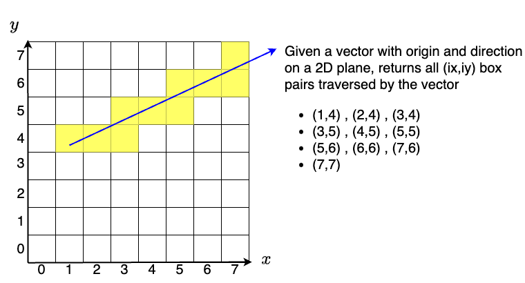
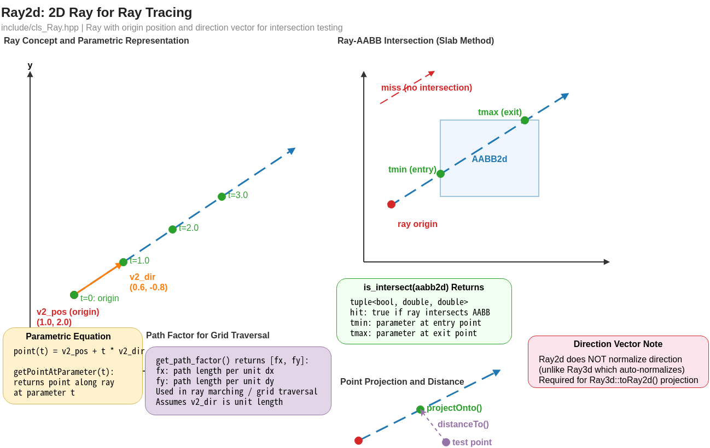
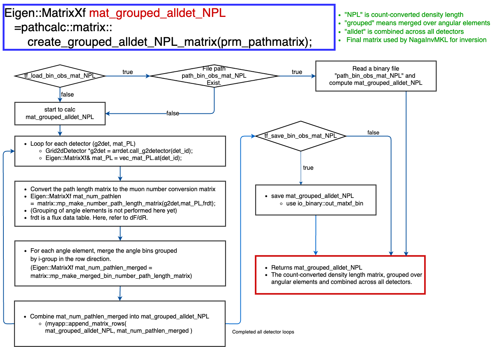

# Ray Tracing

Ray tracing is the process of computing the path of each muon ray through the terrain and voxel grids. It determines the **path length (PL)** and **density length (DL)** for each detector element, which are essential inputs for both forward modeling and density reconstruction.

## Overview

For each DetectorElement, a ray is cast from the detector position along the look direction. MUONITH traces this ray through:

1. **Grid2dPillar** (terrain/DEM) — to compute the total path length and density length through rock
2. **Grid3dVoxel** (3D voxel grid) — to determine which voxels the ray passes through and the path length within each voxel

```
Detector ──── Ray ──── Terrain (DEM) ──── Target volume
   │                      │                    │
   │                      ├─ PL (path length)  │
   │                      └─ DL (density×path) │
   │                                           │
   └── voxel-by-voxel path lengths ────────────┘
       → path length matrix for inversion
```

## Physical Quantities

| Quantity | Symbol | Unit | Definition |
|----------|--------|------|------------|
| Path Length | PL | m | Geometric length of the ray through rock |
| Density Length | DL | kg/m² | $\int \rho \, ds$ along the ray path |

The density length determines the muon flux attenuation: a larger DL means more material for muons to penetrate, resulting in fewer transmitted muons.

## DDA Algorithm

MUONITH uses the **Digital Differential Analyzer (DDA)** algorithm for efficient ray-grid traversal (Amanatides & Woo, 1987). Rather than testing every grid cell for intersection, the DDA steps through cells sequentially along the ray direction.

### How it works

1. **Entry point**: Find where the ray enters the grid (ray-AABB intersection test)
2. **Initialize**: Determine the starting cell and the parametric distances to the next cell boundary along each axis
3. **Step**: Advance to the next cell boundary — always choosing the axis with the smallest parametric increment
4. **Record**: Log the cell index and path length segment
5. **Repeat** until the ray exits the grid

This approach is $O(n)$ in the number of traversed cells, rather than $O(N)$ in the total number of grid cells.

### 2D Traversal

`Grid2d::get_hit_boxes_index()` traces a ray through a 2D grid and returns the list of hit cells:





A zero-allocation visitor pattern (`traverse_ray_2d()`) is also available for performance-critical paths.

### 3D Traversal

`Grid3d::get_hit_voxel_index()` extends the DDA to three dimensions, stepping through voxels in the Grid3dVoxel.

## Path Length Computation

The `pathcalc` namespace provides the core path calculation functions:

### Through Terrain (Grid2dPillar)

```cpp
pathcalc::g2pil::add_PLDL(element, grid2d_pillar)
```

For a single DetectorElement:

1. Cast ray through Grid2dPillar using 2D DDA
2. For each hit column `(ix, iy)`:
   - Compute the vertical intersection of the ray with the pillar $[z_{\min}, z_{\max})$
   - Calculate the geometric path length through the material
   - Accumulate PL and DL ($= \rho \times \text{path length}$)
3. Store PL and DL in the DetectorElement

The parallelized version `mp_add_PLDL()` processes all elements in a DetectorPanel or DetectorPanelArray using OpenMP.

### Through Voxels (Grid3dVoxel)

```cpp
pathcalc::g3vox::add_PLDL(element, grid3d_voxel)
```

For the 3D voxel grid, path lengths are computed per-voxel. The resulting data forms the **path length matrix** — a key input for density reconstruction.

## Path Length Matrix



The path length matrix $\mathbf{L}$ relates detector elements to voxels:

$$L_{ij} = \text{path length of ray } i \text{ through voxel } j \quad [\text{m}]$$

Where:

- Row $i$ = detector element index (observation)
- Column $j$ = voxel index (unknown)

This matrix is typically **sparse** because each ray only passes through a small fraction of the total voxels.

Only voxels in the reconstruction sub-volume become unknown columns of $\mathbf{L}$. Path length through the terrain outside the sub-volume — the surrounding [shells](detector-model.md#shell-path-lengths-shellpl) and any voxels held at their prior density — enters as a fixed, density-independent term rather than as columns to be solved (see [Grid System](grid-system.md#what-is-reconstructed-vs-what-only-attenuates)).

### Dense vs Sparse

| Format | Function | Use case |
|--------|----------|----------|
| Dense | `mp_make_mat_PL()` | Small grids (few voxels) |
| Sparse | `mp_make_spmat_PL()` | Large grids (default) |

Sparse matrix elements below a threshold (`reference × epsilon`) are dropped to zero to improve storage and computation efficiency.

### Shell path lengths (`mp_calc_PL`)

For density-independent path lengths through terrain **outside** the voxel grid (upper, lower, and lateral shells), `pathcalc::g2pil::mp_calc_PL()` is used. Unlike `add_PLDL`, which co-computes DL (and therefore needs a density), `mp_calc_PL` returns only PL and is called once in Trace Path Lengths (Module 4) — the result is cached and reused across every prior-density combination in Compute Prior (Module 5).

The function operates on an entire `DetectorPanelArray` and returns a **flat `Eigen::VectorXf`** laid out by detector element index. Callers slice it per panel via `segment(offset, n_ele)`. This flat layout (introduced when `mp_calc_PL` was refactored from `std::vector<VectorXf>` to a single `VectorXf`) matches the flat storage used by the `ShellPL` bundle (`upper`, `lower`, `lateral`) that Trace Path Lengths (Module 4) hands off to Compute Prior (Module 5).

## From Path Length to Observation Equation

The path length matrix $\mathbf{L}$ (with elements $L_{ij}$ defined above) is the geometric input to 3D density inversion. In the [3D Inversion chapter](inversion.md#observation-matrix-construction), $L_{ij}$ is linearized into the **muon count sensitivity matrix** $\mathbf{A}_N$ (dN/dρ) via

$$A_{N,ij} \;=\; L_{ij}\, \frac{dN_i}{dX_i}\!\left(X_{0,i}\right)$$

which is Eq. (18) of [Nagahara et al. (2022)](#nagahara2022). See [3D Inversion — Observation Matrix Construction](inversion.md#observation-matrix-construction) for the full derivation, why linearization is done at the count level, and the bin-merging property used by [Grid2dBinGroup](detector-model.md#detectorpanel).

## References

- J. Amanatides and A. Woo (1987). "A Fast Voxel Traversal Algorithm for Ray Tracing." *Proceedings of EuroGraphics '87*, pp. 3–10. [DOI:10.2312/egtp.19871000](https://doi.org/10.2312/egtp.19871000)
- <a id="nagahara2022"></a>S. Nagahara, S. Miyamoto, et al. (2022). "Three-dimensional density tomography determined from multi-directional muography of the Omuro-yama scoria cone, Higashi-Izu monogenetic volcano field, Japan." *Bulletin of Volcanology*. Eqs. (12)–(18) give the derivation of the count-sensitivity matrix $\mathbf{A}_N$ used on this page. [DOI:10.1007/s00445-022-01596-y](https://doi.org/10.1007/s00445-022-01596-y)
