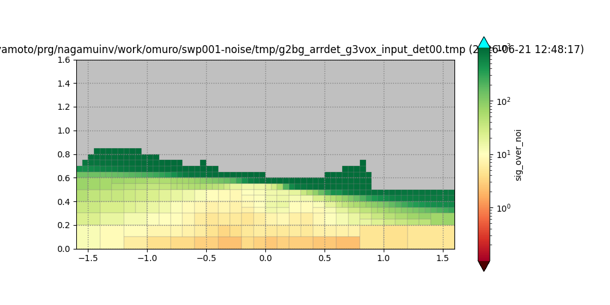
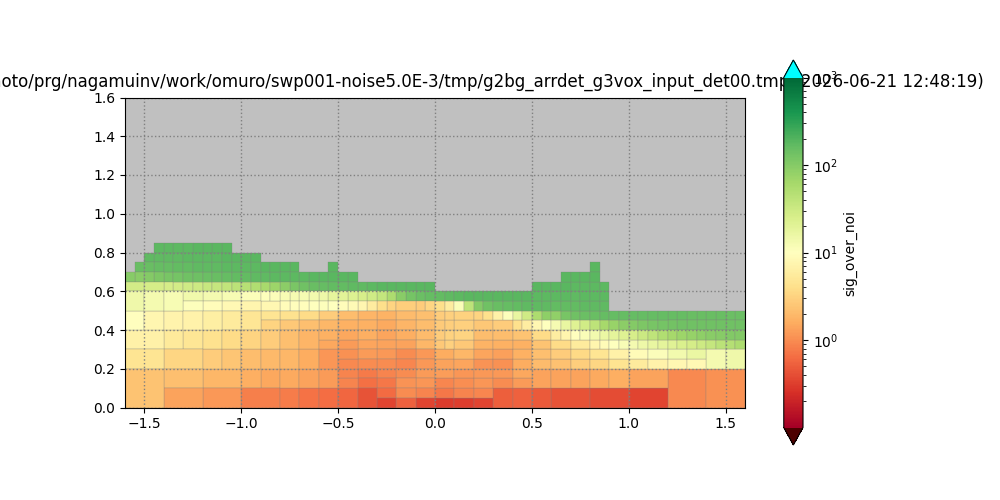
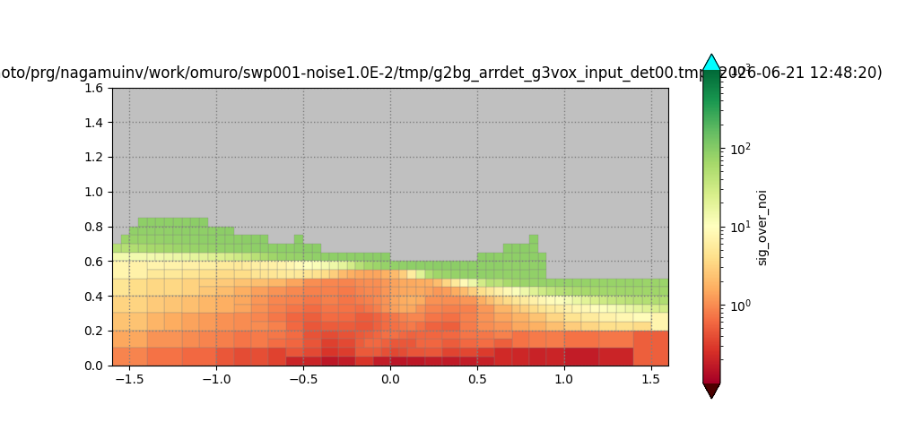

# Parameter Reference

Complete reference of all JSON5 configuration parameters. For usage examples and inline comments, see [Parameter Files](../user-guide/parameter-files.md).

## Global

| Key | Type | Default | Description |
|-----|------|---------|-------------|
| `seed` | uint | `42` | Random seed for reproducibility. CLI `-s` overrides. |
| `end_stage` | int | `8` | Maximum module to execute. Valid values: 3, 4, 5, 6, 7, 8. CLI `--end-stage` takes precedence. When less than 8, modules after the specified number are skipped. Not compatible with sweep mode (`tf_exec=true`) when value is less than 7. |

## `LOG_FILE`

| Key | Type | Default | Description |
|-----|------|---------|-------------|
| `path_log_dir` | string | `"logs"` | Output directory for log files |
| `give_new_number` | bool | `false` | Auto-number log files |
| `log_level.stdout_level` | string | `"info"` | Console log level |
| `log_level.stderr_level` | string | `"error"` | Error stream log level |
| `log_level.file_level` | string | `"trace"` | File log level |
| `default_max_count` | int | `50` | Max log files to keep |
| `archive_existing` | bool | `false` | Archive existing logs |

Log levels: `trace` > `debug` > `info` > `warn` > `error` > `critical`.

## `RUN_INVERSION`

| Key | Type | Default | Description |
|-----|------|---------|-------------|
| `tf_prior_error` | bool | `true` | Compute lower/upper prior bounds (3x slower). Default is `true` (omitting the key, or the whole `RUN_INVERSION` section, enables the prior-error pass); `omuro.json5` sets it `false` explicitly to skip it |

## `DETECTOR_PARAMETER_LISTS`

| Key | Type | Default | Description |
|-----|------|---------|-------------|
| `name` | string | — | Instance name |
| `det_files` | array | — | Paths to per-detector JSON5 files |
| `tf_apply_eff` | bool | `false` | Apply detector efficiency table |
| `tf_out_txty_ascii` | bool | `true` | Write the `tmp/<name>_txty_<PL\|dens\|signal>_det<NN>.tmp` ASCII dumps. `false` only stops these dumps: with the current swp001 settings the per-element PL / density / signal figures are plotted from the saved binary, so no figure is lost. |
| `tf_out_g2bg_ascii` | bool | `true` | Write the `tmp/g2bg_<name>_det<NN>.tmp` ASCII dumps. `false` only stops these dumps: with the current swp001 settings the efficiency figures are plotted from the saved binary, so no figure is lost. |
| `tf_save_arrdet_prior` | bool | `false` | Save the prior detector array as `det/arrdet_g3vox_prior<suffix>.bin`. About 160 MB per file, and three files when `tf_prior_error` is `true`. Required to plot the prior array from the binary. |

## `DETECTOR_PARAMETERS` (per-detector file)

| Key | Type | Default | Unit | Description |
|-----|------|---------|------|-------------|
| `name` | string | — | — | Detector panel name |
| `angle_unit` | string | — | — | `"tangent"`, `"degree"`, or `"radian"` |
| `nbinx` | int | — | — | Number of horizontal angular bins |
| `txmin` | float | — | (angle_unit) | Horizontal angle minimum |
| `txmax` | float | — | (angle_unit) | Horizontal angle maximum |
| `nbiny` | int | — | — | Number of vertical angular bins |
| `tymin` | float | — | (angle_unit) | Vertical angle minimum |
| `tymax` | float | — | (angle_unit) | Vertical angle maximum |
| `length_hori` | float | — | m | Detector width |
| `length_vert` | float | — | m | Detector height |
| `length_dept` | float | — | m | Detector depth |
| `n_unit` | int | — | — | Number of detector copies |
| `rotation_type` | string | — | — | `"LOCAL"` or `"GLOBAL"` |
| `yaw_deg` | float | — | degrees | Yaw angle (0°=East, 90°=North, clockwise) |
| `roll_deg` | float | `0` | degrees | Roll angle (counterclockwise positive) |
| `pitch_deg` | float | `0` | degrees | Pitch angle (counterclockwise positive) |
| `x` | float | — | m | Detector x position |
| `y` | float | — | m | Detector y position |
| `z` | float | — | m | Detector z position |
| `days` | float | — | days | Exposure time |
| `tf_read_bin_list` | bool | `false` | — | Read angular bin list from file |

## `GRID2D_PILLAR_PARAMETERS`

| Key | Type | Default | Unit | Description |
|-----|------|---------|------|-------------|
| `name` | string | — | — | Instance name |
| `initial_uniform_density` | float | `1000` | kg/m³ | Initial uniform rock density |
| `path_dem` | string | — | — | Path to DEM file (`.g2zbin`) |
| `zmin` | float | `0.0` | m | Pillar base elevation |
| `tf_shift_x` | bool | `false` | — | Shift x-origin to xmin |
| `tf_shift_y` | bool | `false` | — | Shift y-origin to ymin |
| `tolerance_ratio` | float | `0.001` | — | DEM grid spacing tolerance |
| `vertical_dike_params` | array | `[]` | — | Vertical dike structures |
| `vertical_cylinder_params` | array | `[]` | — | Vertical cylinder structures |
| `vertical_checkerboard_params` | array | `[]` | — | Vertical checkerboard structures |

## `GRID3D_VOXEL_PARAMETERS`

| Key | Type | Default | Unit | Description |
|-----|------|---------|------|-------------|
| `tf_build_g3vox` | bool | `true` | — | Build 3D grid (false = 2D only) |
| `name` | string | — | — | Instance name |
| `use_grid2d_of_g2pil` | bool | `true` | — | Reuse DEM x/y axes |
| `zmin` | float | — | m | Bottom of voxel grid |
| `zmax` | float | — | m | Top of voxel grid |
| `z_pitch` | float | — | m | Vertical voxel spacing |
| `n_hit_det_min` | int | `0` | — | Min detectors per voxel for inversion |
| `n_hit_det_max` | int | `INT_MAX` | — | Max detectors per voxel |
| `n_hit_ele_min` | int | `0` | — | Min elements per voxel |
| `n_hit_ele_max` | int | `INT_MAX` | — | Max elements per voxel |
| `tf_end_after_merged` | bool | `false` | — | Stop after merge |

### `reconst_voxels` (nested in `GRID3D_VOXEL_PARAMETERS`, optional)

Selects a sub-volume of the voxel grid that participates in reconstruction. Dimensions are expressed in **meters** (previously `_nvox` voxel-count fields — now removed). Either AABB or cylinder (or both) may be enabled; when neither is enabled the entire voxel grid is used.

| Key | Type | Default | Unit | Description |
|-----|------|---------|------|-------------|
| `tf_aabb` | bool | `false` | — | Enable an axis-aligned bounding box |
| `x_aabb_cnt` | float | `0.0` | m | AABB center x |
| `y_aabb_cnt` | float | `0.0` | m | AABB center y |
| `x_aabb_meters` | float | `0.0` | m | AABB full width in x (half-extent = `x_aabb_meters * 0.5`) |
| `y_aabb_meters` | float | `0.0` | m | AABB full width in y (half-extent = `y_aabb_meters * 0.5`) |
| `aabb_zmin_mode` | string | `"g3vox_zmin"` | — | How to derive lower z: `"g3vox_zmin"` or `"manual"` |
| `aabb_zmin_value` | float | `0.0` | m | Explicit z-min (used only when `aabb_zmin_mode == "manual"`) |
| `aabb_zmax` | float | `DBL_MAX` | m | Upper z bound; terrain surface clips it when the surface is lower |
| `tf_cylinder` | bool | `false` | — | Enable an elliptical-cylinder region |
| `x_cyl_cnt` | float | `0.0` | m | Cylinder axis center x |
| `y_cyl_cnt` | float | `0.0` | m | Cylinder axis center y |
| `cylinder_radius_x_meters` | float | `0.0` | m | Elliptical-cylinder semi-axis in x (must be > 0 when `tf_cylinder=true`) |
| `cylinder_radius_y_meters` | float | `0.0` | m | Elliptical-cylinder semi-axis in y (must be > 0 when `tf_cylinder=true`) |

### `merge_params` (nested in `GRID3D_VOXEL_PARAMETERS`)

| Key | Type | Default | Unit | Description |
|-----|------|---------|------|-------------|
| `tf_exec` | bool | `false` | — | Execute voxel merge |
| `name` | string | — | — | Merge config label |
| `x_merge_factor` | int | `1` | — | Bins to merge in x |
| `y_merge_factor` | int | `1` | — | Bins to merge in y |
| `z_merge_factor` | int | `1` | — | Bins to merge in z |
| `x_merge_center` | float | `0.0` | m | Merge alignment center x |
| `y_merge_center` | float | `0.0` | m | Merge alignment center y |
| `z_merge_center` | float | `0.0` | m | Merge alignment center z |

### `checkerboard_3d_params` (nested array, optional)

| Key | Type | Default | Unit | Description |
|-----|------|---------|------|-------------|
| `tf_exec` | bool | — | — | Enable this checkerboard |
| `name` | string | — | — | Label |
| `delta_density` | float | — | kg/m³ | Density perturbation |
| `delta_density_offset` | float | `0.0` | kg/m³ | Density offset |
| `xlen_cells` | int | — | — | Total checkerboard cells in x |
| `ylen_cells` | int | — | — | Total checkerboard cells in y |
| `zlen_cells` | int | — | — | Total checkerboard cells in z |
| `xcnt`, `ycnt`, `zcnt` | float | — | m | Pattern center |
| `xlen_interval_mult` | int | — | — | Block size = x_interval × this |
| `ylen_interval_mult` | int | — | — | Block size = y_interval × this |
| `zlen_interval_mult` | int | — | — | Block size = z_interval × this |
| `tf_snap_to_grid` | bool | `true` | — | Snap boundaries to grid lines |
| `region_type` | string | `"aabb"` | — | `"aabb"` or `"cylinder"` — shape of the region within which cells are checkerboarded |
| `radius_x_meters` | float | `0.0` | m | Cylinder semi-axis in x (used when `region_type == "cylinder"`) |
| `radius_y_meters` | float | `0.0` | m | Cylinder semi-axis in y (used when `region_type == "cylinder"`) |

**AABB specification**: The checkerboard AABB is computed symmetrically from the (snapped) center using total cell counts. For each axis: `min = cnt_snapped - len_cells * 0.5 * cell_size`, `max = cnt_snapped + len_cells * 0.5 * cell_size`, where `cell_size = interval * len_interval_mult`. Total cells per axis = `len_cells`. Odd values are supported (e.g. `xlen_cells=5` gives a half-extent of 2.5 cells). All three `*len_cells` values are required and must be positive integers. Direct specification of xmin/xmax/ymin/ymax/zmin/zmax is deprecated and no longer supported; use `xlen_cells`/`ylen_cells`/`zlen_cells` instead.

### `ellipsoid_params` (nested array, optional)

| Key | Type | Default | Unit | Description |
|-----|------|---------|------|-------------|
| `tf_exec` | bool | `false` | — | Enable this ellipsoid |
| `name` | string | `"none"` | — | Label |
| `delta_density` | float | `0.0` | kg/m³ | Density perturbation (added to interior voxels) |
| `xcnt`, `ycnt`, `zcnt` | float | `0.0` | m | Ellipsoid center position |
| `xlen`, `ylen`, `zlen` | float | `0.0` | m | Semi-axis lengths (before rotation) |
| `theta_x_deg` | float | `0.0` | degrees | Rotation around x-axis |
| `theta_y_deg` | float | `0.0` | degrees | Rotation around y-axis |
| `theta_z_deg` | float | `0.0` | degrees | Rotation around z-axis |
| `rotation_type` | string | `"LOCAL"` | — | `"LOCAL"` (intrinsic) or `"GLOBAL"` (extrinsic) |

### `cylinder_params` (nested array, optional)

| Key | Type | Default | Unit | Description |
|-----|------|---------|------|-------------|
| `tf_exec` | bool | `false` | — | Enable this cylinder |
| `name` | string | `"none"` | — | Label |
| `delta_density` | float | `0.0` | kg/m³ | Density perturbation (added to interior voxels) |
| `xcnt`, `ycnt`, `zcnt` | float | `0.0` | m | Cylinder center position |
| `xlen` | float | — | m | Elliptical cross-section semi-axis in x (must be > 0) |
| `ylen` | float | — | m | Elliptical cross-section semi-axis in y (must be > 0) |
| `zlen` | float | — | m | Cylinder height (must be > 0) |
| `theta_x_deg` | float | `0.0` | degrees | Rotation around x-axis |
| `theta_y_deg` | float | `0.0` | degrees | Rotation around y-axis |
| `theta_z_deg` | float | `0.0` | degrees | Rotation around z-axis |
| `rotation_type` | string | `"LOCAL"` | — | `"LOCAL"` (intrinsic) or `"GLOBAL"` (extrinsic) |

## `FLUX_RANGE_DATA_TABLE_PRIOR` / `FLUX_RANGE_DATA_TABLE_REAL`

Both sections have identical format.

| Key | Type | Default | Description |
|-----|------|---------|-------------|
| `pathin_log_peneflux` | string | — | Path to log10(flux) table (`.g2zbin`) |
| `tf_xcnt_peneflux` | bool | — | Use bin center for cos(θz) |
| `tf_ycnt_peneflux` | bool | — | Use bin center for density-length |
| `pathin_dFdR_R_costhz` | string | — | Path to dF/dR table (`.g2zbin`) |
| `tf_xcnt_dFdR` | bool | — | Use bin center for cos(θz) |
| `tf_ycnt_dFdR` | bool | — | Use bin center for range |

## `PATH_LENGTH_PARAMETERS`

| Key | Type | Default | Unit | Description |
|-----|------|---------|------|-------------|
| `name` | string | — | — | Instance name |
| `tf_add_PLDL` | bool | `true` | — | Compute PL and DL |
| `tf_incr_nhit_det` | bool | `true` | — | Count detector hits per voxel |
| `tf_incr_nhit_ele` | bool | `true` | — | Count element hits per voxel |
| `tf_add_shell` | bool | `true` | — | Include shell geometry |
| `BL_max` | float | `5000` | m | Max beam length threshold [m]; `<= 0` disables the warning |
| `PL_min` | float | required | m | Lower bound of the path-length range |
| `PL_max` | float | required | m | Upper bound of the path-length range |
| `PL_pit` | float | required | m | Bin pitch along the path-length axis |
| `reference_matPL_sparse` | float | `1.0` | — | Sparse matrix reference value |
| `epsilon_matPL_sparse` | float | `1.0e-9` | — | Sparse matrix epsilon. Values below `reference_matPL_sparse * epsilon_matPL_sparse` are zeroed |
| `tf_load_arrdet_g2pil` | bool | `false` | — | Load 2D detector array binary |
| `tf_save_arrdet_g2pil` | bool | `false` | — | Save 2D detector array binary |
| `path_arrdet_g2pil_bin` | string | — | — | File path for 2D array binary |
| `tf_load_arrdet_g3vox` | bool | `false` | — | Load 3D detector array binary |
| `tf_save_arrdet_g3vox` | bool | `false` | — | Save 3D detector array binary |
| `path_arrdet_g3vox_bin` | string | — | — | File path for 3D array binary |
| `path_vec_spmat_PL_bin` | string | — | — | File path for sparse PL matrices |
| `tf_load_bin_obs_mat_dNdD` | bool | `false` | — | Load observation matrix binary |
| `tf_save_bin_obs_mat_dNdD` | bool | `false` | — | Save observation matrix binary |
| `path_bin_obs_mat_dNdD` | string | — | — | File path for dN/dD matrix |

## `BIN_GROUP_PARAMETERS`

| Key | Type | Default | Unit | Description |
|-----|------|---------|------|-------------|
| `name` | string | — | — | Instance name |
| `signal_init` | float | `0` | — | Initial signal value |
| `noise_init` | float | `0` | — | Initial noise value |
| `is_avail_init` | bool | `true` | — | Initial availability |
| `PL_thres` | float | `20` | m | Min path length threshold |
| `DL_thres` | float | `10000` | kg/m² | Max density length threshold |
| `is_avail_under_thres` | bool | `false` | — | Availability for sub-threshold bins |
| `signal_under_thres` | float | `-1.0` | — | Signal for disabled bins |
| `noise_under_thres` | float | `-1.0` | — | Noise for disabled bins |
| `tf_run_1st_grouping` | bool | `true` | — | Run initial grouping |
| `tf_run_auto_grouping` | bool | `true` | — | Run adaptive subdivision |
| `igroup_start` | int | `0` | — | Starting group ID |
| `nx_div_init` | int | `1` | — | Initial horizontal divisions |
| `ny_div_init` | int | `1` | — | Initial vertical divisions |
| `signal_noise_group_trig` | float | `20` | — | S/N threshold for subdivision |
| `ixlen_min` | int | — | — | Min group width (bins) |
| `iylen_min` | int | — | — | Min group height (bins) |
| `tf_prefer_split_x` | bool | `false` | — | Prefer horizontal splits |
| `nloop_limit` | int | `10000` | — | Max subdivision iterations |

## `NOISE_PARAMETERS`

Measurement noise added to the expected muon counts before inversion. Noise has
two independent sources (flux-proportional and SOT-proportional), and each source
is split into a deterministic floor part and a Poisson-fluctuated part. The total
noise is `(flux_floor + SOT_floor) + Poisson(flux_poisson + SOT_poisson)`.

| Key | Type | Default | Unit | Description |
|-----|------|---------|------|-------------|
| `name` | string | `"noise_tmp"` | — | Instance name (free-form) |
| `tf_exec` | bool | `false` | — | Apply noise modeling (false = skip the block) |
| `flux_proport_ratio_floor` | float | `0` | — | Flux-proportional noise, deterministic floor (no fluctuation) |
| `flux_proport_ratio_poisson` | float | `0` | — | Flux-proportional noise, Poisson-fluctuated component |
| `SOT_proport_noise_ratio_floor` | float | `0` | — | SOT-proportional (angle-independent) noise, deterministic floor |
| `SOT_proport_noise_ratio_poisson` | float | `0` | — | SOT-proportional (angle-independent) noise, Poisson-fluctuated component |
| `user_defined_noise_flux_ratio` | float | `0` | — | User-defined noise flux ratio |
| `pathin_user_defined_noise_distribution` | array | — | — | File paths to user-defined noise flux tables |

### Choosing the Poisson noise ratio

The Poisson-fluctuated ratios (`flux_proport_ratio_poisson`,
`SOT_proport_noise_ratio_poisson`) set how strongly noise scales with the
expected counts. Too large a ratio drives the deep (high-path-length) bins below
a signal-to-noise ratio of one, where noise dominates the signal and the
reconstruction breaks down.

The panels below show the per-element signal-to-noise ratio (`sig/noi`) for
detector `det_2018_A` of the Omuro synthetic array (green = high SNR,
yellow ≈ 1, orange/red = low SNR). For where `det_2018_A` and the other
detectors sit on the dome, see the
[Omuro detector layout](../concepts/detector-model.md#automatic-bin-grouping).
This comparison is the direct basis for preferring `1.0E-3` over `1.0E-2` in the
Omuro synthetic study.

*Noise ratio `1.0E-3` (0.1%): the deep bins (low `ty`) stay near or above SNR = 1.*

*Noise ratio `5.0E-3` (0.5%): the low-SNR region (orange) begins to spread into the deep bins.*

*Noise ratio `1.0E-2` (1%): the deep bins turn red — noise exceeds signal over a wide region.*

## `NAGAINV_PARAMETERS` (array)

| Key | Type | Default | Unit | Description |
|-----|------|---------|------|-------------|
| `name` | string | — | — | Instance name |
| `tf_exec` | bool | `true` | — | Execute this configuration |
| `tf_signal_poisson` | bool | `false` | — | Apply Poisson error to signal counts (noise counts fluctuate via the `*_poisson` ratios under `NOISE_PARAMETERS`) |
| `nmuon_thres` | float | `0.0` | — | Min muon count threshold |
| `nmuon_under_thres` | float | `0.0` | — | Replacement for sub-threshold counts |
| `uniform_prior_density` | float | `2000` | kg/m³ | Prior density assumption |
| `shell_density_upper` | float | `uniform_prior_density` | kg/m³ | Prior density for the upper shell (falls back to `uniform_prior_density` if omitted) |
| `shell_density_lower` | float | `uniform_prior_density` | kg/m³ | Prior density for the lower shell (falls back to `uniform_prior_density`) |
| `shell_density_lateral` | float | `uniform_prior_density` | kg/m³ | Prior density for the lateral shell (falls back to `uniform_prior_density`) |
| `tf_logN` | bool | `false` | — | Use log-count formulation in the likelihood |
| `corr_length` | float | — | m | Isotropic correlation length |
| `sigma_rho` | float | — | kg/m³ | Density prior standard deviation |
| `sigma_rho_diag` | float | — | kg/m³ | Diagonal covariance std dev |
| `tf_aniso` | bool | `false` | — | Enable anisotropic covariance |
| `corr_length_xy` | float | — | m | Horizontal correlation length |
| `corr_length_z` | float | — | m | Vertical correlation length |
| `aniso_cov_type` | string | `"separable"` | — | `"separable"` or `"ellipsoidal"` |
| `tf_eff_cn_diag` | bool | `false` | — | Add efficiency uncertainty to the observation covariance diagonal $\mathbf{C}_N$. Also gates the central efficiency (`eff_cnt`) applied to the forward count, so the count and its error band turn on together. Widens the 2D projected-density error band (see [Inversion](../concepts/inversion.md#observation-covariance-mathbfc_n)) |
| `tf_eff_cn_diag_independent` | bool | `false` | — | Treat the efficiency uncertainty as independent per element. Only effective when `tf_eff_cn_diag` is `true` |

## `PROJ_DENS_EVAL_GROUPED`

| Key | Type | Default | Unit | Description |
|-----|------|---------|------|-------------|
| `tf_exec` | bool | `false` | — | Run projected density evaluation |
| `tf_signal_poisson` | bool | `true` | — | Apply Poisson error to signal counts (noise counts fluctuate via the `*_poisson` ratios under `NOISE_PARAMETERS`) |
| `dens_min` | float | `0` | kg/m³ | Min density to scan |
| `dens_max` | float | `10000` | kg/m³ | Max density to scan |
| `dens_steps` | array | — | kg/m³ | Multi-pass step sizes (coarse to fine) |
| `range_factor` | float | `2.0` | — | Search range factor for refinement |
| `sigma` | float | `1.5` | σ | Significance threshold |

## `Z_CROSS_SECTION`

| Key | Type | Default | Unit | Description |
|-----|------|---------|------|-------------|
| `min` | float | — | m | Lowest z-elevation for output |
| `max` | float | — | m | Highest z-elevation for output |
| `zstep` | double | `0` | m | Direct z-step size. If 0 or omitted, z_interval is used |
| `output_binary` | bool | `false` | — | Also emit the cross-section data in binary form |

## `NAGAINV_PARAM_SWEEP`

| Key | Type | Default | Description |
|-----|------|---------|-------------|
| `tf_exec` | bool | `false` | Run parameter sweep |
| `base_index` | int | `0` | Index in `NAGAINV_PARAMETERS` to use as template |
| `vec_sigma_rho` | array | — | sigma_rho values to sweep [kg/m³] |
| `vec_corr_length` | array | — | corr_length values to sweep [m] |
| `vec_uniform_prior_density` | array | — | Prior density values to sweep [kg/m³]. Each element: scalar (all shells equal) or `[prior, upper, lower, lateral]`. Mixable. |
| `link_diag_to_sigma` | bool | `true` | Set sigma_rho_diag = sigma_rho |
| `vec_sigma_rho_diag` | array | — | sigma_rho_diag values to sweep [kg/m³]. Required when `link_diag_to_sigma=false` |
| `module8_mode` | string | `"none"` | `"none"`, `"all"`, `"last"`, `"selected"` |
| `module8_indices` | array | `[]` | Sweep indices for `module8_mode="selected"` (e.g. `[0, 2, 5]`) |
