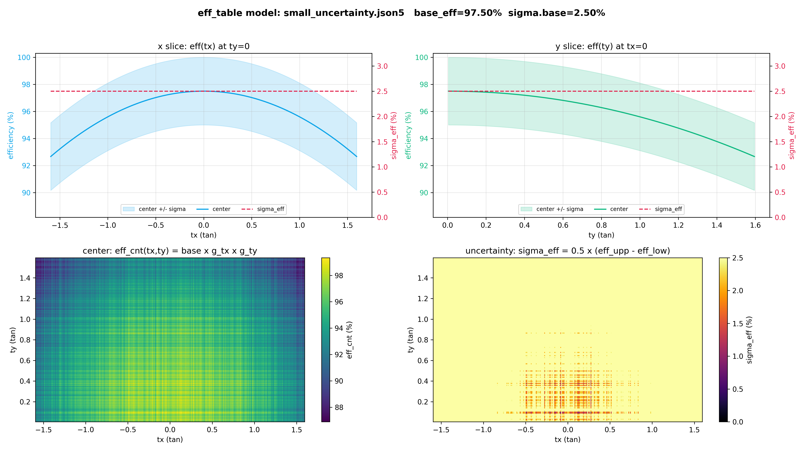
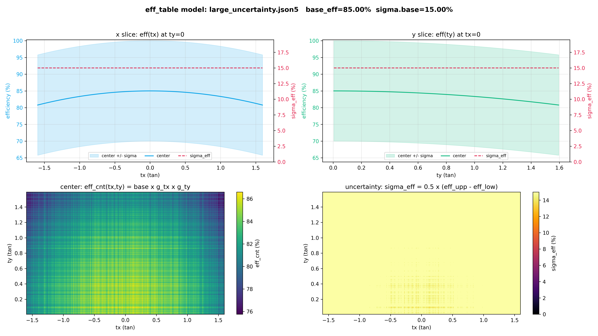
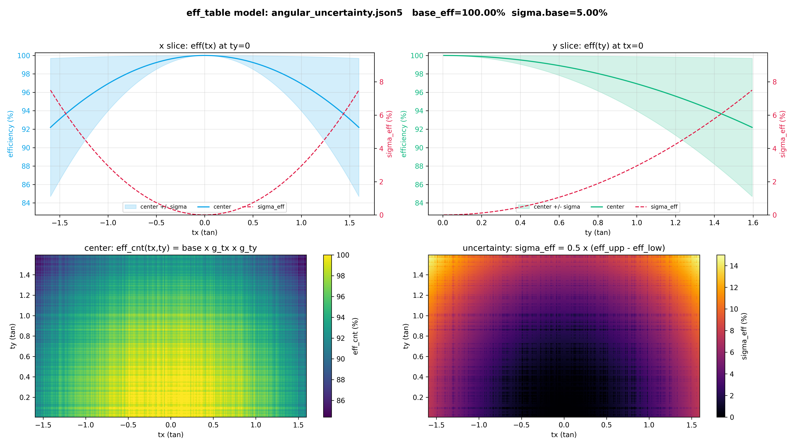

# Efficiency Model (JSON5)

The efficiency model is the preferred route (see [Overview](index.md#two-ways-to-provide-the-efficiency)). It is selected by the `path_eff_model` key of the detector parameter file.

## How the Model Is Structured

The model treats the efficiency as a product of three factors: an overall scale `base_eff`, a shape along `tx`, and a shape along `ty`. The uncertainty is described the same way: a scale `sigma.base` and one shape per axis. Each shape is one of six simple functions (flat, polynomial, Gaussian, ...) chosen by name.

Because the model is a formula rather than a grid of numbers, MUONITH evaluates it directly at the center of every angular bin of the detector's own grid. The model is therefore independent of the binning: one file serves detectors with different `nbinx`/`nbiny`/angular ranges.

## Full Example

`data/tutorial/detparams/eff_model/small_uncertainty.json5` (used by the tutorial):

```json5
{
  "base_eff": 0.975,                    // overall scale
  "tx": {                               // efficiency shape along tx
    "fn": "poly",
    "params": { "coef": [1.0, 0.0, -0.0195] }   // 1 - 0.0195*tx^2
  },
  "ty": {                               // efficiency shape along ty
    "fn": "poly",
    "params": { "coef": [1.0, 0.0, -0.0195] }
  },
  "sigma": {                            // uncertainty block
    "base": 0.025,                      // uncertainty scale
    "tx": { "fn": "flat" },             // uncertainty shape along tx (constant)
    "ty": { "fn": "flat" }              // uncertainty shape along ty (constant)
  }
}
```

Every key is optional. Omitted `tx`/`ty`/`sigma.tx`/`sigma.ty` blocks default to `flat` (factor 1); an omitted `base_eff` defaults to 1.0; an omitted `sigma` block gives a zero-width band (`sigma.base` = 0).

## Evaluation Formulas

Writing the `tx`/`ty` shapes as `g_tx`, `g_ty` and the `sigma.tx`/`sigma.ty` shapes as `h_tx`, `h_ty`, each bin center `(tx, ty)` is evaluated as:

```
eff_cnt   = clip( base_eff * g_tx(tx) * g_ty(ty), 0, 1 )
sigma_eff = max( 0, sigma.base * ( h_tx(tx) + h_ty(ty) ) / 2 )
half      = min( sigma_eff, eff_cnt, 1 - eff_cnt )    // band stays inside [0, 1]
eff_low   = eff_cnt - half
eff_upp   = eff_cnt + half
```

In words: the central efficiency is the product of the scale and the two axis shapes, clipped to [0, 1]; the uncertainty is the scale times the average of its two axis shapes; and the band is shrunk if needed so it never leaves [0, 1].

`eff_cnt` scales the expected muon count of the bin; the half-width `half` is what propagates into the observation covariance $\mathbf{C}_N$ when `tf_eff_cn_diag` is enabled. See [Efficiency Uncertainty in $\mathbf{C}_N$](../../reference/appendix.md#efficiency-uncertainty-in-mathbfc_n) for that derivation, and [Why $\mathbf{C}_N$ Stays Diagonal](../../reference/appendix.md#why-mathbfc_n-stays-diagonal) for why the bins stay uncorrelated. A model with `sigma.base` = 0 gives a zero-width band and therefore adds nothing to $\mathbf{C}_N$.

## Fit Functions

Each shape block is `{ "fn": <name>, "params": { ... } }` with one of six functions (`t` stands for `tx` or `ty`):

| `fn` | `params` | Formula |
|------|----------|---------|
| `flat` | — | `1` |
| `poly` | `coef` (array, low order first) | `coef[0] + coef[1]*t + coef[2]*t^2 + ...` |
| `gauss` | `mu`, `sigma` (non-zero) | `exp( -(t - mu)^2 / (2 * sigma^2) )` |
| `cos_power` | `n`, optional `cutoff_deg` | `cos(theta)^n` with `theta = atan(abs(t))`; `0` beyond `cutoff_deg` |
| `sigmoid` | `x0`, `w` (non-zero) | `1 / (1 + exp( (abs(t) - x0) / w ))` |
| `step` | `x0`, `w` (non-zero), `inner`, `outer` | `outer + (inner - outer) / (1 + exp( (abs(t) - x0) / w ))` |

The same formulas are implemented in `scripts/make_eff_table.py` (Python) and `src/cls_EfficiencyModel.cpp` (C++), so a table generated by the Python script from a given model matches what the C++ side assigns from the same model.

Because `eff_cnt` is a product of one function of `tx` and one function of `ty`, the model can only express separable shapes. An efficiency map that is not such a product needs the [Efficiency Table](efficiency-table.md).

## Constraints

- **JSON dialect**: the C++ parser accepts `//` comments but requires **quoted keys** and **no trailing commas**. Files under `eff_table_lab/configs/` use a looser dialect (unquoted keys) that Python's `json5` module reads but C++ does not; shared model files must use quoted keys.
- **`randomize`**: ignored with a warning. The C++ side is deterministic by design; the band comes from the `sigma` block only.
- **`layers`** (k-of-n coincidence model): not supported on the C++ side; loading such a file raises an error.

## Example Model Shapes

Each panel below shows the `tx` slice `eff(tx)` (top-left), the `ty` slice `eff(ty)` (top-right), the central efficiency `eff_cnt(tx, ty)` (bottom-left), and the uncertainty `sigma_eff` (bottom-right).



*Small uncertainty (±2.5%): a nearly flat central efficiency `eff_cnt` with a narrow `sigma_eff` band.*



*Large uncertainty (±15%): the same central efficiency as the small case but a much wider `sigma_eff` band.*



*Angle-dependent uncertainty: `sigma_eff` grows from zero at the origin to ±15% toward the corners.*
