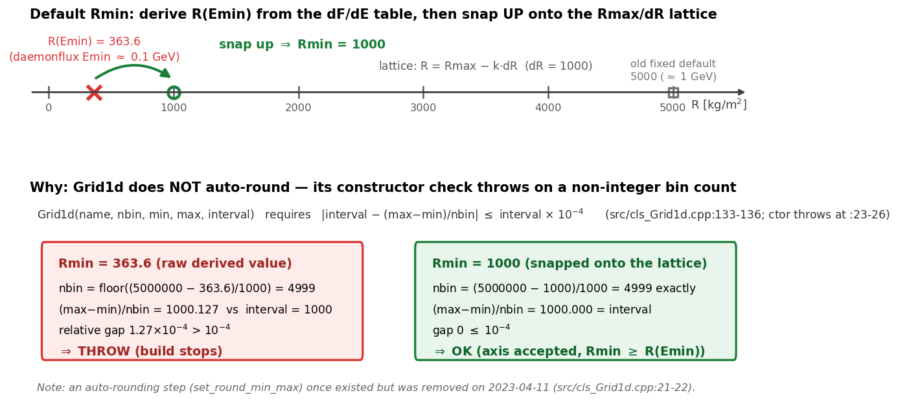

# Build and Install

This page joins the two prepared inputs ([Range Table](range-table.md) and
[Flux Model](flux-model.md)) into the final F and dF/dR tables and installs them.

## Prerequisites

- A Release build: `bash brelease.sh` produces `build-release/exec/make_peneflux_dFdR.exe`.
- Python 3 with `numpy`, `scipy`, and `matplotlib` (used only by the pre-processing steps).

## Build

Run the builder with the sample config committed in `fluxtable_build/daemon_groom/`:

```bash
cd fluxtable_build/daemon_groom
../../build-release/exec/make_peneflux_dFdR.exe make_peneflux_daemon.json5 FLUX_BUILDER
```

The second argument selects the config section to read. The config must also contain a
`LOG_FILE` section (see `make_peneflux_daemon.json5` for a working example).

### Config Keys (`FLUX_BUILDER` section)

| Key | Meaning |
|-----|---------|
| `pathin_logR` | Range table (column 1: log10 KE [GeV], column 2: log10 range [kg/m²]; the builder inverts it internally to obtain E_cut(R)) |
| `tf_xcnt_logR` | If true, interpret the range-table x values as bin centers |
| `pathin_log_dFdE` | dF/dE table (ASCII x y z or `.g2zbin`) |
| `tf_xcnt_dFdE`, `tf_ycnt_dFdE` | Bin-center flags for the dF/dE grid axes |
| `pathout_log_penef_R_costhz` | Output path for the log10 F table (`.g2zbin`; a `.txt` dump is written alongside) |
| `pathout_dFdR_R_costhz` | Output path for the dF/dR table |
| `dlogE` | Integration step in log10 E |
| `Rmin`, `Rmax`, `dR` | Density-length axis [kg/m²]. `Rmin` may be omitted: the builder then derives it from the dF/dE table's lowest energy (R at E_min via the range table) and snaps it up onto the `Rmax`/`dR` lattice, logging the adopted value. The shipped configs set `Rmin: 5.0E+3` explicitly |
| `tf_costhz_cnt`, `tf_range_cnt` | Bin-center flags for the output axes |
| `tf_check_dFdR_divergence` | Enable the post-build dF/dR sign check (a healthy table is finite and all-negative) |
| `dFdR_divergence_threshold` | Maximum tolerated sign-flip ratio per cosθ slice |
| `tf_dFdR_divergence_fatal` | If true, abort the build on divergence; if false, warn only |

### Default `Rmin` (when omitted)



Without an explicit `Rmin`, the builder converts the dF/dE table's lowest energy to a
range (363.6 kg/m² for the shipped daemonflux input) and snaps it **up** onto the
`Rmax`/`dR` lattice (1000 kg/m² here), because the axis constructor rejects a
non-integer bin count instead of rounding. The log prints both the derived and the
adopted value:

```
[FluxTableBuilder::FluxTableBuilder] FluxTableBuilder: Rmin not given in JSON; derived R(Emin)=3.6360E+02 kg/m^2, snapped up to Rmin=1.0000E+03 on the Rmax/dR lattice.
```

!!! warning "Multiple Coulomb scattering below ~1 GeV"
    A derived `Rmin` can fall well below 5×10³ kg/m² (the range of a ~1 GeV muon in
    standard rock). For muons of about 1 GeV and below, multiple Coulomb scattering
    grows rapidly, so their trajectories deviate substantially from the straight
    lines the reconstruction assumes. Treat the thin-absorber rows of the table
    (R below the ~1 GeV range) with caution.

### Expected Log Milestones

A successful run (about half a minute on a multi-core machine; uses OpenMP) prints:

```
[FluxTableBuilder::build_log10Ecut_table] Completed build_log10Ecut_table.
[FluxTableBuilder::build_log_peneflux] Completed build_log_peneflux.
[check_dFdR_divergence] ... dF/dR divergence check passed. pos_ratio=0.000e+00, ...
[FluxTableBuilder::build_dFdR_from_peneflux] Completed build_dFdR_from_peneflux.
[FluxTableBuilder::out_built_tables] All tables written.
```

Outputs (paths from the sample config):

- `peneflux/daemon-costhz-kgm2-log10peneflux-allinone.g2zbin` + `.txt` — log10 F
- `peneflux/daemon-g2_dFdR_R_costhz.g2zbin` + `.txt` — dF/dR

## Install

The pipeline reads flux tables from `fluxtable/<flux_groom>/` under canonical names
(without the model prefix). `daemon_groom` is the default `flux_groom` in generated
station configs (`scripts/init_work_site.py`). Copy and rename:

| Generated file | Install as |
|----------------|-----------|
| `peneflux/daemon-costhz-kgm2-log10peneflux-allinone.g2zbin` | `fluxtable/daemon_groom/costhz-kgm2-log10peneflux-allinone.g2zbin` |
| `peneflux/daemon-g2_dFdR_R_costhz.g2zbin` | `fluxtable/daemon_groom/g2_dFdR_R_costhz.g2zbin` |

For your own model, install under `fluxtable/<your_model_name>/` with the same
canonical names and set `"flux_groom": "<your_model_name>"` in
`param_sites/<site>.json5` (see [Parameter Files](../parameter-files.md)).

At run time, density-length lookups into the F table are clamped to the table's own
R axis by default (a `PARAM_CONSTANTS` section with `DL_min`/`DL_max` in the run
config overrides this). Each run states the adopted bounds and their origin in one
startup log line:

```
[FluxTable::load_tables] FluxTable::load_tables: DL clamp bounds [5.0000E+03, 5.0000E+06] kg/m^2 (min: table, max: table)
```

## Verifying the Result

- The run exits with code 0 and logs `All tables written`; the divergence check reports
  `passed` with `pos_ratio=0.000e+00` (dF/dR must be negative everywhere).
- The `.txt` dumps contain no `nan`/`inf`; values cover the full grid
  (with the shipped config: cosθ 0.000–1.000 in 1001 columns, R = 5×10³ to 5×10⁶ kg/m²
  in 10³ steps — these bounds come from `Rmin`/`Rmax`/`dR` in the config, not from the
  code).

### If the divergence check fails

The check aborts with `dF/dR table looks divergent. pos_ratio=... worst_sign_flip_ratio=...`
(at build time, and again whenever the pipeline loads the table). A healthy dF/dR
table is negative everywhere — F can only decrease with more absorber — so any
significant fraction of positive values or of sign flips along R means the table is
numerical noise, not physics.

The known cause is a **grid axis misread of the dF/dE input**: if `tf_xcnt_dFdE` /
`tf_ycnt_dFdE` declare bin *edges* while the table's axis values are bin *centers*
(or vice versa), every lookup is shifted by half a bin. The resulting small error in
F changes sign from point to point, and differentiating along R turns it into a
sign-oscillating dF/dR. This exact mistake (`tf_ycnt_dFdE: false` for the
bin-centered daemonflux grid) produced a divergent table during development, and the
reconstruction downstream degraded into salt-and-pepper noise before the check
existed.

Remedy:

1. Set `tf_xcnt_dFdE` / `tf_ycnt_dFdE` to match your dF/dE grid — `true` (centers)
   for tables built as described in [Flux Model](flux-model.md), including the
   shipped daemonflux input.
2. Rebuild and confirm the log prints `dF/dR divergence check passed` with
   `pos_ratio=0.000e+00`.

`tf_dFdR_divergence_fatal: false` downgrades the abort to a warning; use it only
while tuning `dFdR_divergence_threshold`, never to push a divergent table through.

## Units and Conventions

- Flux F is stored as log10 of particles/(m² sr s); dF/dR is linear.
- Density-length R (density × path length) is in kg/m².
- The zenith axis is cos(θ_zenith): 1.0 = vertical, 0.0 = horizontal.

## Licensing Notes

- **daemonflux** data and code are BSD-3-Clause: redistribution (including the modified,
  unit-corrected tables) is permitted provided the copyright notice, license terms, and
  disclaimer are retained. See `LICENSES/README.md`. Please cite
  Yáñez & Fedynitch, *Phys. Rev. D* **107**, 123037 (2023), arXiv:2303.00022.
- **Honda-model** tables (`fluxtable/honda_groom/`) have no confirmed redistribution
  permission and must not be redistributed; they remain for internal comparison only.
- The **Groom range-energy table** derives from Groom et al. / PDG data: attribute the
  source when redistributing (see `LICENSES/README.md` and
  [Range Table](range-table.md#source-data)).
