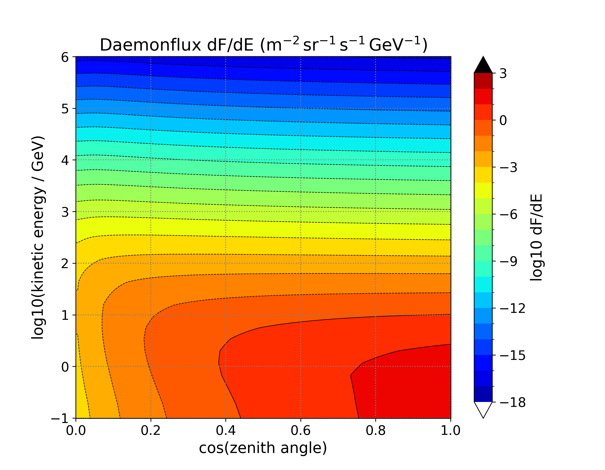

# Flux Model (dF/dE)

The flux-model branch of the [build pipeline](index.md) provides the sea-level
differential muon flux dF/dE. The shipped tables use **daemonflux**; this page defines
the input contract so that you can also bring your own model.



*Shipped daemonflux dF/dE. Colour is log10(dF/dE) in 1/(m² sr s GeV) over cos(zenith angle)
and log10(kinetic energy). The flux peaks near the vertical (cosθ = 1) at low energy and
falls steeply with both increasing energy and increasing inclination.*

## Input contract for `make_peneflux_dFdR.exe`

The builder reads the dF/dE table through the `pathin_log_dFdE` config key
(ASCII `x y z` rows, or a `.g2zbin` grid). The shipped daemonflux input uses:

| Property | Requirement |
|----------|-------------|
| Format | 3-column ASCII: cosθ_zenith, log10(KE [GeV]), log10(dF/dE) |
| Grid | **Uniform** in both axes. Shipped grid: cosθ = 0.000..1.000 step 0.001 (1001 values) × log10 KE = −1.00..7.00 step 0.01 (801 values) |
| Units | dF/dE in 1/(m² sr s GeV) — **per m², not per cm²** |
| Energy range | Must cover the E_cut values implied by your R axis (for the shipped R axis, up to well above 1 TeV) |

!!! warning "Uniform grid required"
    The grid reader validates that both axes are uniformly spaced. A non-uniform grid
    aborts the run with an `is_check_variables` error rather than producing a table.

**Sanity anchor**: at the vertical (cosθ = 1.0) and 1 GeV, the value must be
log10(dF/dE) ≈ +1.37 in per-m² units (the Honda model gives ≈ +1.36 at the same
point). If your table reads ≈ −2.6 there, it is in per-cm² units — convert by adding
log10(10⁴) = 4. Unit errors do not crash the build; this anchor is the cheap way to
catch them.

## Worked example: daemonflux

All commands run from `fluxtable_build/daemon_groom/`:

```bash
bash process.sh
```

`process.sh` extracts `daemonflux.txt` from the committed `org/daemonflux.txt.zip` and
calls `dFdE_interp.py`, which converts the momentum spectrum dF/dP to a
kinetic-energy spectrum dF/dE (KE = √(P² + m²) − m, m = 0.105658 GeV), applies the
cm⁻² → m⁻² correction, and re-grids by 2D spline interpolation onto the uniform grid
above. Output: `daemonflux_ke_m2.tmp` plus cross-section figures under `figs/`.

`make_figures.sh` wraps this step and additionally draws the 2D overview shown at the
top of this page:

```bash
bash make_figures.sh
```

!!! warning "Source unit mislabel"
    The daemonflux source header labels the flux as `(m^2 sr s GeV/c)^-1`, but the
    values are actually per **cm²** (the vertical ~1 GeV/c value 2.5×10⁻³ matches the
    PDG per-cm² spectrum). `dFdE_interp.py` applies a ×10⁴ correction (`CM2_TO_M2`).
    When you bring another model, check your source's units against the sanity anchor
    above rather than trusting its header.

## Bringing your own model

The walkthrough below uses `mymodel` as the model name — replace it with yours.

### Step 1 — write your flux as a 3-column text file

Produce `mymodel_dFdE.txt` with one row per grid point:

```
# cos(theta_zenith)   log10(KE [GeV])   log10(dF/dE [1/(m^2 sr s GeV)])
0.000  -1.00  <value>
0.000  -0.99  <value>
...
1.000   7.00  <value>
```

Both axes must be uniformly spaced (see the input contract above).
If your model comes on a different grid or in different units,
`fluxtable_build/daemon_groom/dFdE_interp.py` shows working code for the
re-gridding and the unit conversion.

**Check before moving on**: the row `1.000 0.00` (vertical, 1 GeV) must read
≈ +1.37. If it reads ≈ −2.6, your values are per cm² — add 4.

### Step 2 — build the F and dF/dR tables

Copy `fluxtable_build/daemon_groom/make_peneflux_daemon.json5`, point
`pathin_log_dFdE` at `mymodel_dFdE.txt`, and run the builder as described in
[Build and Install](build-and-install.md). Keep `pathin_logR` as it is: the range
table does not depend on the flux model. (Change it only when you change the
absorber material — see [Range Table](range-table.md).)

### Step 3 — install under a new model directory

The pipeline looks the tables up as `fluxtable/<flux_groom>/<fixed file name>`,
so the directory name is your model name and the file names must be exactly:

```
fluxtable/mymodel/costhz-kgm2-log10peneflux-allinone.g2zbin   # log10 F
fluxtable/mymodel/g2_dFdR_R_costhz.g2zbin                     # dF/dR
```

Copy the two builder outputs to these paths (dropping the model prefix the
sample config puts on the output file names).

### Step 4 — select the model per site and validate

In `param_sites/<site>.json5` set `"flux_groom": "mymodel"`; the generated station
configs then resolve to `fluxtable/mymodel/`
(see [Parameter Files](../parameter-files.md#flux_range_data_table_prior-flux_range_data_table_real)).

Two checks:

- the builder's divergence check reported `passed` (dF/dR ≤ 0 everywhere) — if it
  fails, see [If the divergence check fails](build-and-install.md#if-the-divergence-check-fails);
- pick a few (cosθ, R) points in the `.txt` dump of your F table and compare with
  the shipped `fluxtable/daemon_groom/` one: flux models disagree by tens of
  percent at most, so a difference of orders of magnitude means a unit or grid
  error, not a model difference.

## Model validity note

daemonflux is calibrated against surface muon spectrometer data; its constraints
weaken above ~1 TeV muon energy. For standard muography depths this is not a
practical limitation, but keep it in mind for very long density-length studies.
