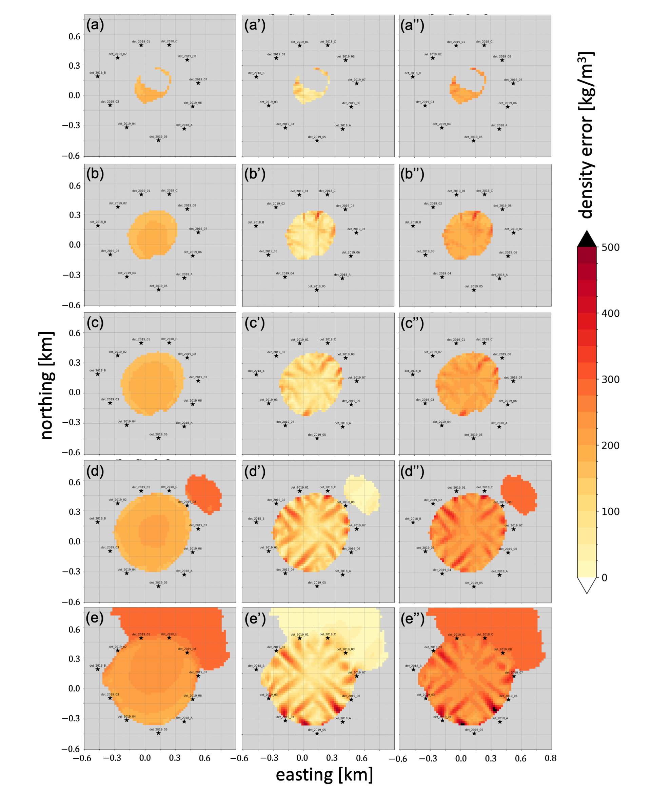
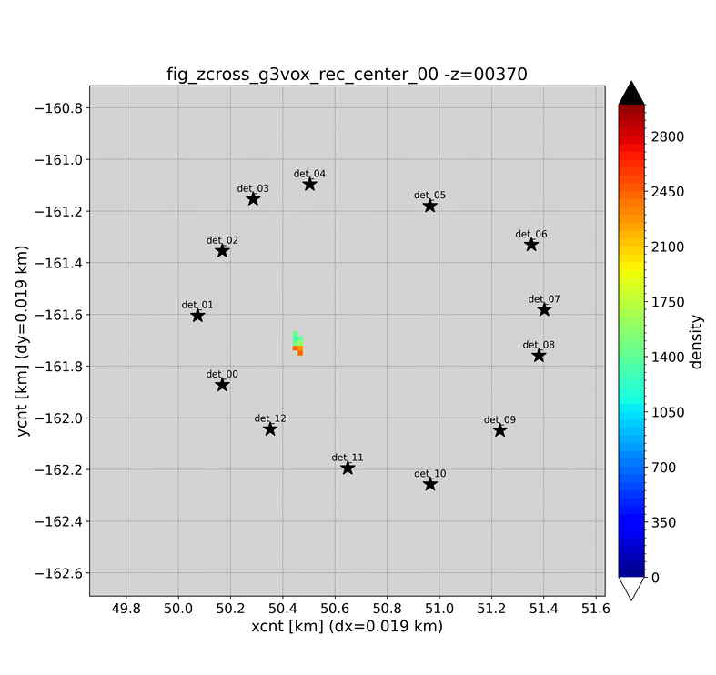

# Output

MUONITH produces several types of output files: cross-section density maps, log files, and optional binary checkpoints.

## Cross-Section Files

The primary output consists of 2D density maps at specified z-elevations. These represent horizontal slices through the reconstructed 3D density volume.

### Z-Range Configuration

The output z-range is set in the `Z_CROSS_SECTION` section:

```json5
"Z_CROSS_SECTION": {
  "min": 160.0,           // Lowest z-elevation [m]
  "max": 400.0,           // Highest z-elevation [m]
  "zstep": 40,            // Z-step in meters (0 or omitted = use z_interval)
  "output_binary": false  // false = ASCII text (.tmp), true = binary (.tmpbin)
}
```

Each slice is output at an elevation within this range, stepped by `zstep` meters. If `zstep` is 0 or omitted, the voxel grid's z_interval is used as the step size. All slices for one field are written into a single file. `output_binary` selects the content format and the extension: `false` (default) writes ASCII text as `<field>_zcross_all.tmp`, `true` writes binary as `<field>_zcross_all.tmpbin`. Exactly one file is written per field.

### `auto_plot.json5` (generated by `init_work_site.py`)

`scripts/init_work_site.py` writes an `auto_plot.json5` file in each site's working directory (e.g. `depth001/auto_plot.json5`, `swp001/auto_plot.json5`). The file drives `scripts/auto_plot.py` and controls which families of plots are produced and with what binning. Typical usage:

```bash
python3 ../../scripts/auto_plot.py --config auto_plot.json5
```

Hand-editing `auto_plot.json5` is how you change fixed-bin settings, exclude specific outputs, or disable entire plot families (hist2d / g3vox / g2bg) for a site without touching the reconstruction JSON5. See [`auto_plot.py`](../reference/scripts.md#auto_plotpy) for the full option list.

Setting `det_exec: true` in `auto_plot.json5` enables a fourth, binary-direct plot family: `auto_plot.py` scans `det/arrdet_*.bin` and `checkpoint_*/det/arrdet_*.bin` (in the working directory and under `tmp/`, where the sweep driver writes its checkpoint bundles) and runs [`plot_det_arrdet.py`](../reference/scripts.md#plot_det_arrdetpy) on each, reproducing the standard txty/g2bg figures without the `tmp/*.tmp` text exports. The built-in default is `false`: when the text exports are present, enabling it would produce the same figures twice. The swp001 `auto_plot.json5` generated by `init_work_site.py` sets `det_exec: true`, because the generated swp001 `prm_muonith.json5` disables the text exports (`tf_out_txty_ascii` / `tf_out_g2bg_ascii` false). Since PIPELINE_VERSION 7 the checkpoints also carry the group efficiencies, so the `eff_*` figures are produced on this path as well (checkpoints older than v7 cannot be read — regenerate them with the current code). The `det` section of `auto_plot.json5` controls where the figures go and how they are drawn: `out_dir` (relative paths are anchored at the config's folder; the swp001 template sets `"figs"`, so the figures land in the work dir's `figs/`; unset = `plot_det_arrdet/` next to the binary) and `n_jobs` (drawing workers inside `plot_det_arrdet.py`: positive = that many, 1 = one by one, 0 = all CPU cores, negative = leave that many cores free; default -2).

### Output Types

For each inversion configuration, the following cross-section sets are generated:

| Output | Content | Unit |
|--------|---------|------|
| **Reconstruction density** | Inverted density field $\vec{\rho}'$ | kg/m³ |
| **Delta prior** | $\vec{\rho}' - \vec{\rho}_0$ (change from prior) | kg/m³ |
| **Difference from input** | $\vec{\rho}' - \vec{\rho}_{\text{true}}$ (error, synthetic tests only) | kg/m³ |
| **Density uncertainty** | $\sqrt{\text{diag}(\mathbf{C}_{\rho'})}$ (posterior standard deviation) | kg/m³ |

### File Format

Cross-section files contain (x, y, value) data on the voxel grid:

```
# Header information (grid dimensions, z-elevation, etc.)
x1  y1  density1
x2  y1  density2
...
```

ASCII cross-section files use the `.tmp` extension (e.g. `g3vox_rec_center_00_zcross_all.tmp`); binary ones use `.tmpbin` (e.g. `g3vox_rec_center_00_zcross_all.tmpbin`). The example above shows the ASCII layout (`output_binary: false`).

## Analyze Errors and Output (Module 8)

When Analyze Errors (Module 8) runs, additional outputs are generated:

### Leave-One-Out Results

For each detector in the array, Analyze Errors (Module 8) re-runs the inversion with that detector removed (leave-one-out). Each output file is named `{name}_disable_NN_zcross_all.tmp`, where `{name}` is the inversion run name and `NN` is the iteration index (`00`, `01`, ...; iteration order, not necessarily detector ID order):

| Output | Description |
|--------|-------------|
| `{name}_disable_NN` | Reconstruction with detector NN removed |
| `{name}_disable_NN_delta_prior` | Delta-prior for that leave-one-out configuration |
| `{name}_disable_NN_diff_from_all` | Difference from the all-detector reconstruction (written only when a reference reconstruction is provided) |

### Error Components

| Component | Description |
|-----------|-------------|
| Statistical error | From the posterior covariance diagonal |
| Prior error | Difference between lower/upper prior reconstructions |
| Leave-one-out sensitivity | Maximum deviation when any single detector is removed |
| Combined error | Root-sum-square of all components |

Each error component is written as a cross-section file:

| File | Error component |
|------|-----------------|
| `g3vox_stat_error_zcross_all.tmp` | Statistical |
| `g3vox_prior_error_zcross_all.tmp` | Prior |
| `g3vox_disabled_error_zcross_all.tmp` | Leave-one-out |
| `g3vox_mixed_error_zcross_all.tmp` | Combined |

The figure below shows three of these error maps for a synthetic 11-detector example. Columns are the error type — statistical (left), leave-one-out (center), and combined (right); rows are five elevation slices. The color scale is density error in kg/m³. Error is smallest where viewing directions cross densely (center of the array) and grows toward the sparsely-viewed edges.



## Log Files

Log files are written to the directory specified by `LOG_FILE.path_log_dir` (default: `logs/`).

| Level | Content |
|-------|---------|
| `trace` | Detailed execution flow, matrix sizes, timing |
| `debug` | Parameter values, intermediate results |
| `info` | Progress messages, module start/completion |
| `warn` | Non-critical issues (e.g., low muon counts) |
| `error` | Fatal errors |

Log levels are independently configurable for stdout, stderr, and file output.

## Binary Checkpoints

Intermediate results can be saved for reuse via `tf_save_*` flags in `PATH_LENGTH_PARAMETERS`:

| Checkpoint | Flag | Description |
|------------|------|-------------|
| Detector array (2D) | `tf_save_arrdet_g2pil` | DetectorPanelArray after 2D ray tracing |
| Detector array (3D) | `tf_save_arrdet_g3vox` | DetectorPanelArray after 3D ray tracing |
| Path-length matrices | `path_vec_spmat_PL_bin` | Sparse matrices per detector |
| Observation matrix | `tf_save_bin_obs_mat_dNdD` | dN/dD sensitivity matrix |

On subsequent runs, set the corresponding `tf_load_*` flag to `true` to skip the computation and load from the saved file.

!!! tip
    When sweeping inversion parameters (`sigma_rho`, `corr_length`), save the Trace Path Lengths (Module 4) outputs and load them for each sweep iteration. Only Invert Density (Module 7) needs to be re-executed.

The observation matrix is additionally exported to a self-describing `mat/` directory
(matrix binaries plus `manifest.json`) that an external tool can consume without the C++
code. See [External Reconstruction](external-reconstruction.md).

## Interpreting Results

### Reconstruction Quality Indicators

- **Delta prior near zero**: The reconstruction is close to the prior — this may indicate insufficient data or too-strong regularization
- **Large uncertainty**: The density at that voxel is poorly constrained — consider adding more detectors or increasing exposure time
- **Leave-one-out sensitivity**: Voxels sensitive to a single detector suggest that more viewing angles are needed for robust reconstruction

### Density Values

- Internal computations use **kg/m³**
- Typical rock density: 2000–2700 kg/m³
- Low-density anomalies (cavities, fractures): below 2000 kg/m³
- High-density anomalies (mineralization, magma): above 2700 kg/m³

### Visualization

Cross-section files can be visualized with standard tools:

- **Python**: matplotlib (`pcolormesh`, `contourf`)
- **GMT** (Generic Mapping Tools): `gmt surface`, `gmt grdimage`
- **ParaView**: For 3D volume rendering from stacked cross-sections

#### Showa-shinzan reference reconstruction

The animated GIFs below show horizontal cross-sections sweeping through elevations for a Showa-shinzan reference case (`work/showa/rec001/`). Star markers indicate the 13 detector positions surrounding the lava dome.

| Input (ground truth) | Reconstruction (MAP) |
|:-:|:-:|
|  |  |

The synthetic low-density anomaly embedded at the summit is recovered by the inversion. This is an advanced reference case, not the default first-run sample; the default runnable sample is `tutorial` in the [Quick Start](../getting-started/quickstart.md).
