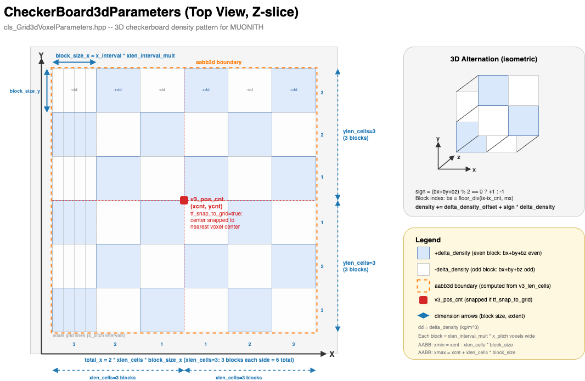

# Parameter Files

MUONITH configuration files use the `.json5` extension and are parsed by nlohmann/json with comment stripping enabled (`ignore_comments`). The parser accepts standard JSON plus `//` line comments and `/* */` block comments. Trailing commas and unquoted keys are **not** supported: every key must be double-quoted, and no comma may follow the last element of an array or object.

## File Format

```json5
// This is a comment
{
  "section_name": {
    "key": "value",     // inline comment
    "number": 42,
    "flag": true        // no comma after the last element
  }
}
```

- **Extension**: `.json5`
- **Comments**: `//` line comments and `/* */` block comments
- **Trailing commas**: Not supported (standard JSON syntax)
- **Keys**: Must be double-quoted (unquoted keys are not supported)

## Configuration Structure

A MUONITH configuration file contains multiple sections. Here is a minimal example:

```json5
{
  "seed": 42,                          // Random seed for reproducibility (CLI -s overrides)

  "LOG_FILE": {
    "path_log_dir": "logs",            // Directory for log file output
    "log_level": {
      "stdout_level": "info",          // Console output: trace/debug/info/warn/error
      "stderr_level": "error",         // Error stream level
      "file_level": "trace"            // Log file level (most verbose)
    }
  },

  "DETECTOR_PARAMETER_LISTS": {
    "name": "my_detectors",            // Instance name (arbitrary label)
    "det_files": [                     // Per-detector JSON5 files (relative paths)
      "detparams/det_00.json5",
      "detparams/det_01.json5"
    ]
  },

  "GRID2D_PILLAR_PARAMETERS": {
    "name": "terrain",                 // Instance name
    "initial_uniform_density": 2000,   // Uniform rock density [kg/m³]
    "path_dem": "dem/my_terrain.g2zbin" // Path to DEM binary file
  },

  "GRID3D_VOXEL_PARAMETERS": {
    "tf_build_g3vox": true,            // true = build 3D grid; false = 2D analysis only
    "name": "voxel_grid",              // Instance name
    "use_grid2d_of_g2pil": true,       // Reuse DEM's x/y axes for voxel grid
    "zmin": 100,                       // Bottom of voxel grid [m a.s.l.]
    "zmax": 500,                       // Top of voxel grid [m a.s.l.]
    "z_pitch": 10                      // Vertical voxel spacing [m]
  },

  "FLUX_RANGE_DATA_TABLE_PRIOR": { ... },  // Muon flux table for prior model
  "FLUX_RANGE_DATA_TABLE_REAL": { ... },   // Muon flux table for observed data

  "NAGAINV_PARAMETERS": [ { ... } ],  // Array of inversion configs (sigma_rho, corr_length, etc.)

  "Z_CROSS_SECTION": {
    "min": 100.0,                      // Lowest z-elevation for output cross-sections [m]
    "max": 500.0                       // Highest z-elevation for output cross-sections [m]
  }
}
```

## Sections Reference

### `seed` (optional)

Random seed for reproducibility. CLI argument (`-s`) overrides this value.

```json5
"seed": 42  // Reproducibility seed; CLI -s overrides this value
```

### `LOG_FILE`

Controls logging output.

```json5
"LOG_FILE": {
  "path_log_dir": "logs",         // Output directory for log files
  "give_new_number": false,       // true = auto-number logs (log_00, log_01, ...)
  "log_level": {
    "stdout_level": "debug",      // Console verbosity: trace/debug/info/warn/error
    "stderr_level": "error",      // Error stream verbosity
    "file_level": "trace"         // File verbosity (trace = most verbose)
  },
  "default_max_count": 50,        // Max number of log files to keep
  "archive_existing": false       // true = archive old logs before overwriting
}
```

Log levels (from most to least verbose): `trace`, `debug`, `info`, `warn`, `error`.

### `end_stage` (optional, top-level)

Controls how far the pipeline executes.

```json5
// Valid values: 3, 4, 5, 6, 7, 8 (default: 8 = all modules)
// CLI --end-stage takes precedence over this value.
"end_stage": 7
```

### `DETECTOR_PARAMETER_LISTS`

Specifies the detector array configuration.

```json5
"DETECTOR_PARAMETER_LISTS": {
  "name": "arrdet_02msq120days",   // Instance name (arbitrary label)
  "det_files": [                   // List of per-detector JSON5 files (relative paths)
    "../detparams/det_00.json5",
    "../detparams/det_01.json5",
    "../detparams/det_02.json5"
  ],
  "tf_apply_eff": false,           // true = apply detector efficiency table
  // false stops the txty ASCII dumps under tmp/. With the current swp001 settings the
  // per-element PL / density / signal figures are plotted from the saved binary,
  // so no figure is lost.
  "tf_out_txty_ascii": true,
  // false stops the g2bg ASCII dumps under tmp/. With the current swp001 settings the
  // efficiency figures are plotted from the saved binary, so no figure is lost.
  "tf_out_g2bg_ascii": true,
  // true saves det/arrdet_g3vox_prior<suffix>.bin (about 160 MB each, three files
  // when tf_prior_error is true). Needed to plot the prior array from the binary.
  "tf_save_arrdet_prior": false
}
```

### `GRID2D_PILLAR_PARAMETERS`

Defines the terrain (DEM) grid.

```json5
"GRID2D_PILLAR_PARAMETERS": {
  "name": "showa01_2x2km_2000kgm3", // Instance name
  "initial_uniform_density": 2000,   // Uniform initial rock density [kg/m³]
  "path_dem": "../dem/showa01_2x2km.g2zbin", // Path to DEM binary file
  "zmin": 0.0,                       // Pillar base elevation [m a.s.l.]
  "tf_shift_x": true,                // true = shift x origin to xmin (useful for UTM coords)
  "tf_shift_y": true,                // true = shift y origin to ymin
  "tolerance_ratio": 0.01,           // Allowed relative error in DEM grid spacing
  "vertical_dike_params": [],        // Optional: vertical dike density structures
  "vertical_cylinder_params": [],    // Optional: vertical cylinder density structures
  "vertical_checkerboard_params": [] // Optional: vertical checkerboard density structures
}
```

### `GRID3D_VOXEL_PARAMETERS`

Defines the 3D voxel grid for inversion.



```json5
"GRID3D_VOXEL_PARAMETERS": {
  "tf_build_g3vox": true,         // true = build 3D grid; false = 2D analysis only
  "name": "g3vox_5m_2000kgm3",   // Instance name
  "use_grid2d_of_g2pil": true,    // true = reuse DEM's x/y grid axes
  "zmin": 160,                    // Bottom of voxel grid [m a.s.l.]
  "zmax": 400,                    // Top of voxel grid [m a.s.l.]
  "z_pitch": 5,                   // Vertical voxel size [m]
  "n_hit_det_min": 3,             // Min detectors hitting a voxel to include in inversion
  "n_hit_det_max": 2147483647,    // Max detectors hitting a voxel (default: INT_MAX)
  "n_hit_ele_min": 0,             // Min detector elements hitting a voxel
  "n_hit_ele_max": 2147483647,    // Max detector elements hitting a voxel (default: INT_MAX)

  // Optional: density anomalies for synthetic tests
  "checkerboard_3d_params": [
    // Extent is specified via total cell counts (xlen_cells, ylen_cells, zlen_cells).
    // Direct xmin/xmax/ymin/ymax/zmin/zmax specification is deprecated.
    // The AABB is computed symmetrically from the (snapped) center:
    //   min = cnt_snapped − len_cells × 0.5 × cell_size
    //   max = cnt_snapped + len_cells × 0.5 × cell_size
    //   where cell_size = interval × len_interval_mult
    //   Total cells per axis = len_cells
    {
      "tf_exec": true,            // Enable this checkerboard
      "name": "cb_3d_500",        // Checkerboard label
      "delta_density_offset": 0.0, // Density offset [kg/m³] (applied before delta_density)
      "delta_density": 500,       // Density perturbation [kg/m³]
      "xlen_cells": 6,            // Total number of checkerboard cells in x
      "ylen_cells": 6,            // Total number of checkerboard cells in y
      "zlen_cells": 4,            // Total number of checkerboard cells in z
      "xcnt": -71565.3, "ycnt": -145112.5, "zcnt": 990, // Pattern center [m]
      "xlen_interval_mult": 5,    // Block size = voxel_x_interval × 5
      "ylen_interval_mult": 5,
      "zlen_interval_mult": 5,
      "tf_snap_to_grid": true     // Snap block boundaries to grid lines
    }
  ],

  // Optional: ellipsoidal density anomaly for synthetic tests
  "ellipsoid_params": [
    {
      "tf_exec": true,            // Enable this ellipsoid
      "name": "ell_low_density",  // Ellipsoid label
      "delta_density": -300,      // Density perturbation [kg/m³]
      "xcnt": 50500, "ycnt": -161500, "zcnt": 280, // Center position [m]
      "xlen": 100, "ylen": 80, "zlen": 60, // Semi-axis lengths [m]
      "theta_x_deg": 0.0,        // Rotation around x-axis [degrees]
      "theta_y_deg": 0.0,        // Rotation around y-axis [degrees]
      "theta_z_deg": 30.0,       // Rotation around z-axis [degrees]
      "rotation_type": "LOCAL"    // "LOCAL" (intrinsic) or "GLOBAL" (extrinsic)
    }
  ],

  // Optional: cylindrical density anomaly for synthetic tests
  "cylinder_params": [
    {
      "tf_exec": true,            // Enable this cylinder
      "name": "cyl_conduit",     // Cylinder label
      "delta_density": -500,      // Density perturbation [kg/m³]
      "xcnt": 50400, "ycnt": -161600, "zcnt": 300, // Center position [m]
      "xlen": 50, "ylen": 50, "zlen": 200, // x/y = cross-section semi-axes, z = height [m]
      "theta_x_deg": 0.0,        // Rotation around x-axis [degrees]
      "theta_y_deg": 0.0,        // Rotation around y-axis [degrees]
      "theta_z_deg": 0.0,        // Rotation around z-axis [degrees]
      "rotation_type": "LOCAL"    // "LOCAL" (intrinsic) or "GLOBAL" (extrinsic)
    }
  ],

  // Voxel merging: reduce resolution by grouping adjacent voxels
  "merge_params": {
    "tf_exec": true,              // true = perform merge
    "name": "merge_01",           // Merge config label
    "x_merge_center": 50500,      // Merge alignment center x [m]
    "y_merge_center": -161720,    // Merge alignment center y [m]
    "z_merge_center": 300.0,      // Merge alignment center z [m]
    "x_merge_factor": 4,          // Merge 4 bins → 1 in x direction
    "y_merge_factor": 4,          // Merge 4 bins → 1 in y direction
    "z_merge_factor": 4           // Merge 4 bins → 1 in z direction
  },

  // Reconstruction sub-volume (sizes in METERS, not voxel counts).
  // AABB and cylinder can be combined; when neither is enabled the whole voxel grid is used.
  "reconst_voxels": {
    "tf_aabb": true,              // true = enable AABB region
    "x_aabb_cnt": 50500,          // AABB center x [m]
    "y_aabb_cnt": -161720,        // AABB center y [m]
    "x_aabb_meters": 800,         // Full AABB width in x [m] (half-extent = x_aabb_meters * 0.5)
    "y_aabb_meters": 800,         // Full AABB width in y [m]
    "aabb_zmin_mode": "g3vox_zmin", // "g3vox_zmin" (default) | "manual"
    "aabb_zmin_value": 160,       // Used only when aabb_zmin_mode = "manual"
    "aabb_zmax": 400,             // Terrain surface clips this when the surface is lower

    "tf_cylinder": false,         // true = enable elliptical-cylinder region
    "x_cyl_cnt": 50500,
    "y_cyl_cnt": -161720,
    "cylinder_radius_x_meters": 400, // Semi-axis in x [m]; must be > 0 when tf_cylinder=true
    "cylinder_radius_y_meters": 400  // Semi-axis in y [m]
  }
}
```

### `FLUX_RANGE_DATA_TABLE_PRIOR` / `FLUX_RANGE_DATA_TABLE_REAL`

Muon flux lookup tables. Both sections have the same format. They often point to the same files.

```json5
"FLUX_RANGE_DATA_TABLE_PRIOR": {
  "pathin_log_peneflux": "../fluxtable/costhz-kgm2-log10peneflux-allinone.g2zbin",
                                   // log10(penetrating muon flux) table [1/(m² sr s)]
  "tf_xcnt_peneflux": true,        // true = use bin center for cos(θz); false = use bin edge
  "tf_ycnt_peneflux": false,       // true = use bin center for DL; false = use bin edge
  "pathin_dFdR_R_costhz": "../fluxtable/g2_dFdR_R_costhz.g2zbin",
                                   // dF/dR flux derivative table
  "tf_xcnt_dFdR": true,            // true = use bin center for cos(θz)
  "tf_ycnt_dFdR": false            // true = use bin center for range
},

"FLUX_RANGE_DATA_TABLE_REAL": {
  // Same format as PRIOR — can point to the same or different files
  "pathin_log_peneflux": "../fluxtable/costhz-kgm2-log10peneflux-allinone.g2zbin",
  "tf_xcnt_peneflux": true,
  "tf_ycnt_peneflux": false,
  "pathin_dFdR_R_costhz": "../fluxtable/g2_dFdR_R_costhz.g2zbin",
  "tf_xcnt_dFdR": true,
  "tf_ycnt_dFdR": false
}
```

!!! tip "Selecting a flux model with `flux_groom`"
    Station configs generated by `scripts/init_work_site.py` fill these two paths from
    the `flux_groom` key in `param_sites/<site>.json5` (default: `daemon_groom`),
    pointing to `fluxtable/<flux_groom>/costhz-kgm2-log10peneflux-allinone.g2zbin` and
    `fluxtable/<flux_groom>/g2_dFdR_R_costhz.g2zbin`. To switch flux models, place the
    two tables under `fluxtable/<name>/` with those canonical names and set
    `"flux_groom": "<name>"`. See
    [Making Penetrating Muon Flux Tables](flux-tables/index.md).

### `PATH_LENGTH_PARAMETERS`

Controls ray tracing and path length computation.

```json5
"PATH_LENGTH_PARAMETERS": {
  "name": "range2000_pitch1",      // Instance name
  "tf_add_PLDL": true,            // true = compute path length (PL) and density length (DL)
  "tf_incr_nhit_det": true,       // true = count how many detectors hit each voxel
  "tf_incr_nhit_ele": true,       // true = count how many elements hit each voxel
  "tf_add_shell": true,           // true = include upper/lower shell in path calculation
  "BL_max": 1500,                 // Max beam length warning threshold [kg/m²]
  "reference_matPL_sparse": 1,    // Reference value for sparse matrix zero-threshold
  "epsilon_matPL_sparse": 0.0001, // Elements < reference × epsilon are set to zero

  // Binary I/O: save/load intermediate results to avoid recomputation
  "tf_load_arrdet_g2pil": false,   // true = load 2D detector array from binary
  "tf_save_arrdet_g2pil": false,   // true = save 2D detector array to binary
  "path_arrdet_g2pil_bin": "arrdet_g2pil.tmp.bin", // File path for 2D array binary

  "tf_load_arrdet_g3vox": false,   // true = load 3D detector array from binary
  "tf_save_arrdet_g3vox": false,   // true = save 3D detector array to binary
  "path_arrdet_g3vox_bin": "arrdet_g3vox.tmp.bin", // File path for 3D array binary
  "path_vec_spmat_PL_bin": "vec_spmat_PL.tmp.bin", // File path for sparse PL matrices

  "tf_load_bin_obs_mat_dNdD": false, // true = load observation matrix from binary
  "tf_save_bin_obs_mat_dNdD": false, // true = save observation matrix to binary
  "path_bin_obs_mat_dNdD": "obs_mat_dNdD.tmp.bin"  // File path for dN/dD matrix
}
```

### `BIN_GROUP_PARAMETERS`

Controls angular bin grouping for signal-to-noise optimization. Bins with insufficient statistics are merged into groups.

```json5
"BIN_GROUP_PARAMETERS": {
  "name": "prm_bingroup_g2pil",   // Instance name
  "signal_init": 0,               // Initial signal value for bins
  "noise_init": 0,                // Initial noise value for bins
  "is_avail_init": true,          // Initial availability flag for bins
  "PL_thres": 0.0,                // Min path length [m]; bins below this are disabled
  "DL_thres": 10000,              // Max density length [kg/m²]; bins above this are disabled
  "is_avail_under_thres": false,  // Availability for bins below PL_thres
  "signal_under_thres": -1.0,     // Signal value for disabled bins (-1 = marker)
  "noise_under_thres": -1.0,      // Noise value for disabled bins
  "tf_run_1st_grouping": true,    // true = run initial grouping pass
  "tf_run_auto_grouping": true,   // true = run adaptive subdivision loop
  "igroup_start": 0,              // Starting group ID
  "nx_div_init": 4,               // Initial horizontal divisions
  "ny_div_init": 2,               // Initial vertical divisions
  "signal_noise_group_trig": 100, // S/N threshold; groups above this are subdivided
  "ixlen_min": 5,                 // Min group width in bins (stops subdivision)
  "iylen_min": 5,                 // Min group height in bins (stops subdivision)
  "tf_prefer_split_x": false,     // true = prefer horizontal splits over vertical
  "nloop_limit": 10000            // Max subdivision iterations
}
```

#### Manual bin grouping

To specify groups yourself instead of the automatic subdivision, disable both
grouping passes and provide one rectangle-list file per detector:

```json5
"BIN_GROUP_PARAMETERS": {
  // ... same keys as above ...
  "tf_run_1st_grouping": false,   // both passes must be false
  "tf_run_auto_grouping": false,  //   to enable the manual route
  "n_detector_grouping_manual": 2,                  // number of detectors with a manual list
  "vec_tf_read_bin_group_list": [true, true],       // one flag per detector
  "vec_file_path_bin_group_list": ["bin_group_list.txt", "bin_group_list.txt"] // one path per detector
}
```

Each list file has one rectangle (= one group) per line, `xlow xup ylow yup`,
in the panel's `angle_unit` (default: tangent). For example, four quadrants
covering tx in [-1.6, 1.6] and ty in [0, 1.6]:

```text
-1.6 0.0 0.0 0.8
0.0 1.6 0.0 0.8
-1.6 0.0 0.8 1.6
0.0 1.6 0.8 1.6
```

The rectangles must tile the panel's field of view without gaps, and two group
rectangles must not overlap; every bin center must fall inside a rectangle.
Violations stop the run with an error naming the offending rectangles or bin.

To leave part of the field of view out of the analysis on purpose, declare it
with the `exclude` keyword instead of simply omitting it:

```text
exclude -1.6 1.6 0.0 0.05
-1.6 0.0 0.05 0.8
0.0 1.6 0.05 0.8
-1.6 0.0 0.8 1.6
0.0 1.6 0.8 1.6
```

A declared region counts as tiled, so it does not trigger the gap check. The
bins inside it belong to no group at all, so they appear in no group export or
figure and contribute to no row of the inversion matrix. Omitting the same band
*without* the keyword still stops the run — that is what separates a deliberate
exclusion from a rectangle you forgot to write.

A group rectangle overlapping a declared region is not an error: the rectangle
is dropped whole at load time and its bins count as excluded too. Because the
whole rectangle disappears, the removed area can be wider than the declared
band — in the example above you could keep the two lower rectangles at
`ylow` = 0.0, but both would then be dropped and the whole lower half would
vanish. With a fine grid the drop removes just the touching row, so a plain
full-grid list plus one `exclude` line is the easiest way to cut a band off
the bottom of the field of view. Every drop is reported in the log with the
number of dropped rectangles. Overlaps between two group rectangles still stop
the run.

Blank lines and lines starting with `#` are skipped. Any other leading token,
`EXCLUDE` included, stops the run and names the offending line number, so a
malformed file is never read only part-way.

To verify a configuration, run the pipeline through detector construction only,
e.g. `bash run_prg.sh true 42 4`, and check the log for
`Loaded RectAngularBinGroup from <file> (nbin=N, nbin_exclude=M, nbin_dropped=K)`
lines — `N` is the number of surviving group rectangles, `M` the number of
`exclude` lines, and `K` the number of rectangles dropped for overlapping an
excluded region (each drop is also announced as
`dropped K group rectangle(s) overlapping M excluded region(s) ...`).
Excluded bins are reported once per detector as
`... bins excluded on purpose by M exclude region(s) ...`. See
[Parameter Reference — BIN_GROUP_PARAMETERS](../reference/parameter-reference.md#bin_group_parameters)
for the key list and file format.

A ready-made example ships with the tutorial station. Adding
`manual_bin_group_file` to a `swp001_runs` entry in `param_sites/<site>.json5`
makes `setup_station.sh` generate that run with the manual route enabled and
copy the named list file from `scripts/templates/` into the run directory:

```bash
bash setup_station.sh tutorial
cd work/tutorial/manual-bin-merge-rec3d
bash run_prg.sh true 42
```

This run uses `bin_group_list_16x8.txt` (128 rectangles: tx in [-1.6, 1.6],
ty in [0, 1.6], 0.2 pitch) and runs through 3-D reconstruction. Check the log
for `Loaded RectAngularBinGroup from bin_group_list_16x8.txt (nbin=128)` —
one line per detector.

### `NOISE_PARAMETERS`

Models measurement noise added to the expected muon counts before inversion. Noise
comes from two independent sources, and each source is split into a deterministic
*floor* part (added as-is) and a *Poisson* part (Poisson-fluctuated):

- **Flux-proportional noise** scales with each bin's own signal.
- **SOT-proportional noise** is an angle-independent background: it takes a fixed fraction of the *total* signal and redistributes it across bins by their exposure share.

The noise is computed per detector bin (`DetectorPanel::mp_set_noise`). Bins whose
density length `DL` is below `DL_thres` are skipped: these empty bins (too little
density length) contribute nothing and are excluded from the totals below. For a bin
with `signal` (`get_signal()`) and exposure `SOT` (`get_SOT()`, the factor converting
flux to counts), `total_signal_DL_thres` and `total_SOT_DL_thres` are the `signal`
and `SOT` summed over the kept bins only (`DL >= DL_thres`; the empty bins are not
counted — `mp_calc_total_signal_DLthres` / `mp_calc_total_SOT_DLthres`):

```
Flux-proportional (uses the bin's own signal):
  flux_floor   = signal * flux_proport_ratio_floor
  flux_poisson = signal * flux_proport_ratio_poisson

SOT-proportional (angle-independent; a share of total_signal_DL_thres):
  SOT_floor    = (SOT / total_SOT_DL_thres) * SOT_proport_noise_ratio_floor   * total_signal_DL_thres
  SOT_poisson  = (SOT / total_SOT_DL_thres) * SOT_proport_noise_ratio_poisson * total_signal_DL_thres
```

Each bin stores two accumulators — `noise_det = flux_floor + SOT_floor`
(deterministic, passed through as-is) and `noise_poi = flux_poisson + SOT_poisson`
(the mean of a Poisson-fluctuated bucket). The `*_floor` parts stay deterministic;
the `*_poisson` parts are drawn from a Poisson distribution at bin-grouping time, so
a group's observed noise is `noise_det + Poisson(noise_poi)`. In short:
flux-proportional noise is large where the bin's own signal is large, while
SOT-proportional noise ignores the bin's own signal and spreads a fraction of the
total signal by exposure.

```json5
"NOISE_PARAMETERS": {
  "name": "noise_tmp",                        // Free-form instance name
  "tf_exec": true,                            // true = apply noise modeling (false = skip)
  "flux_proport_ratio_floor": 0.0,            // Flux-proportional, deterministic floor
  "flux_proport_ratio_poisson": 1.0E-3,       // Flux-proportional, Poisson-fluctuated
  "SOT_proport_noise_ratio_floor": 0.0,       // SOT-proportional, deterministic floor
  "SOT_proport_noise_ratio_poisson": 1.0E-3   // SOT-proportional, Poisson-fluctuated
}
```

All four ratios are dimensionless and default to `0.0` (no contribution); `tf_exec`
defaults to `false`. When `tf_exec` is `false` the block is skipped regardless of
the ratio values.

### `NAGAINV_PARAMETERS`

An **array** of inversion configurations. Multiple configurations can be defined and selectively executed.

```json5
"NAGAINV_PARAMETERS": [
  {
    "name": "nagainv72_0",          // Instance name
    "tf_exec": true,               // true = execute this inversion config
    "tf_signal_poisson": false,    // true = apply Poisson error to signal counts
    "nmuon_thres": 1.0e-10,       // Min muon count; elements below are excluded
    "nmuon_under_thres": 1.0e-10, // Replacement value for excluded elements
    "uniform_prior_density": 2000, // Prior density assumption [kg/m³]

    // Per-shell density override (optional, non-sweep only)
    // If omitted, each shell uses uniform_prior_density as its density.
    // These keys are used in non-sweep execution (tf_exec=false in sweep config).
    // In sweep mode, shell densities come from vec_uniform_prior_density instead.
    "shell_density_upper": 2100,   // Upper shell density [kg/m³] (optional)
    "shell_density_lower": 2300,   // Lower shell density [kg/m³] (optional)
    "shell_density_lateral": 2200, // Lateral shell density [kg/m³] (optional)

    // Covariance matrix parameters — see Concepts > Inversion
    "corr_length": 70,             // Isotropic spatial correlation length [m]
    "sigma_rho": 300,              // Density prior std dev [kg/m³] (larger = trust data more)
    "sigma_rho_diag": 300,         // Diagonal covariance std dev [kg/m³]

    // Anisotropic covariance (optional)
    "tf_aniso": false,             // true = use direction-dependent correlation
    "corr_length_xy": 70,          // Horizontal correlation length [m] (if tf_aniso=true)
    "corr_length_z": 70,           // Vertical correlation length [m] (if tf_aniso=true)
    "aniso_cov_type": "separable"  // "separable" or "ellipsoidal"
  }
]
```

See [3D Inversion](../concepts/inversion.md) for the mathematical background of these parameters.

### `PROJ_DENS_EVAL_GROUPED` (required from Trace Path Lengths, Module 4, onward)

Controls projected density evaluation for grouped bins. This section must be
present whenever Trace Path Lengths (Module 4) or later runs — the pipeline reads it with `.at(...)`,
which fails if the section is missing. Set `tf_exec=false` to skip the
projected-density computation while keeping the section in place.

```json5
"PROJ_DENS_EVAL_GROUPED": {
  "tf_exec": true,                // true = run projected density evaluation
  "tf_signal_poisson": true,      // true = apply Poisson error to signal counts
  "dens_min": 0,                  // Min density to scan [kg/m³]
  "dens_max": 10000,              // Max density to scan [kg/m³]
  "dens_steps": [200, 50, 10],    // Multi-pass search step sizes [kg/m³] (coarse → fine)
  "range_factor": 2.0,            // Search range factor for refinement passes
  "sigma": 1.5                    // Significance threshold [σ]
}
```

### `Z_CROSS_SECTION`

Defines the z-range for cross-section output.

```json5
"Z_CROSS_SECTION": {
  "min": 160.0,                    // Lowest z-elevation for output [m a.s.l.]
  "max": 400.0,                    // Highest z-elevation for output [m a.s.l.]
  // "zstep": 40                   // Optional: z-step in meters (default: 0 = use z_interval)
}
```

### `RUN_INVERSION` (optional)

Controls inversion behavior.

```json5
"RUN_INVERSION": {
  "tf_prior_error": false          // true = compute lower/upper prior bounds (3× slower)
}
```

### `NAGAINV_PARAM_SWEEP` (optional)

Systematic parameter sweep over inversion parameters.
Total combinations = `len(vec_sigma_rho) × len(vec_corr_length) × len(vec_uniform_prior_density)`.

```json5
"NAGAINV_PARAM_SWEEP": {
  "tf_exec": true,                // true = run parameter sweep
  "base_index": 0,                // Index in NAGAINV_PARAMETERS to use as template
  "vec_sigma_rho": [200, 300, 400],           // Values to sweep [kg/m³]
  "vec_corr_length": [50, 70, 100],           // Values to sweep [m]
  // Density sweep values [kg/m³]. Each element can be:
  //   Scalar: applies to voxels and all shells equally (expanded to [v, v, v, v])
  //   Quad:   [prior_density, shell_upper, shell_lower, shell_lateral]
  // Scalar and Quad can be mixed in the same array.
  "vec_uniform_prior_density": [
    1500, 2000,                           // scalar: all shells equal
    [2000, 500, 2500, 1800]              // quad: per-shell override
  ],
  "link_diag_to_sigma": true,     // true = set sigma_rho_diag = sigma_rho for each run
  // "vec_sigma_rho_diag": [200, 300], // Required when link_diag_to_sigma=false [kg/m³]
  "module8_mode": "none",         // "none"/"all"/"last"/"selected" — run Analyze Errors (Module 8) for which combos
  "module8_indices": []           // Sweep indices for module8_mode="selected" (e.g. [0, 2, 5])
}
```

## Detector Parameter Files

Each detector is configured in a separate JSON5 file referenced from `DETECTOR_PARAMETER_LISTS.det_files`.

```json5
{
  "DETECTOR_PARAMETERS": {
    "name": "det_00",
    "angle_unit": "tangent",     // "tangent", "degree", or "radian"

    // Angular bins: path-length computation elements, not the
    // hardware angular resolution (see Concepts -- Detector Model).
    "nbinx": 320,               // Number of horizontal bins
    "txmin": -1.6,               // Horizontal angle min
    "txmax": 1.6,                // Horizontal angle max
    "nbiny": 160,                // Number of vertical bins
    "tymin": 0.0,                // Vertical angle min
    "tymax": 1.6,                // Vertical angle max

    // Physical dimensions [m]
    "length_hori": 0.33,
    "length_vert": 0.33,
    "length_dept": 0.03,

    "n_unit": 2,                 // Number of detector copies

    // Position [m]
    "x": 50168.1,
    "y": -161872.5,
    "z": 208.4,

    // Orientation [degrees]
    "rotation_type": "LOCAL",    // "LOCAL" or "GLOBAL"
    "yaw_deg": 59.09,
    "roll_deg": 0.0,
    "pitch_deg": 0.0,

    "days": 120.0,               // Exposure time [days]

    // Efficiency input (see the Detector Efficiency page).
    // path_eff_model takes precedence unless set to "none".
    "path_eff_model": "../detparams/eff_model/small_uncertainty.json5",
    "path_eff_table": "../detparams/eff_table/eff_table_sample00.txt"
  }
}
```

### Efficiency input

| Parameter | Default | Description |
|-----------|---------|-------------|
| `path_eff_model` | `"none"` | Analytic efficiency model (JSON5). Preferred; used when not `"none"`. |
| `path_eff_table` | — | Legacy per-bin text table. Used only when `path_eff_model` is `"none"`. |

See [Detector Efficiency](detector-efficiency/index.md) for the model file format and the evaluation formulas.

### Orientation parameters

| Parameter | Unit | Convention |
|-----------|------|------------|
| `yaw_deg` | degrees | 0° = East, 90° = North; clockwise positive |
| `roll_deg` | degrees | Counterclockwise positive |
| `pitch_deg` | degrees | Counterclockwise positive |
| `rotation_type` | — | `LOCAL` = detector-local axes; `GLOBAL` = terrain-fixed axes |

## File Path Resolution

All relative file paths in the JSON5 configuration are resolved **relative to the current working directory at run time**, not relative to the JSON5 file's location. The station scripts run the executable from inside the run directory — for example `cd work/<site>/swp001` before `bash run_prg.sh ...` — so a path such as `../dem/terrain.g2zbin` is interpreted from that directory. Always run the executable from the directory that the relative paths assume.
