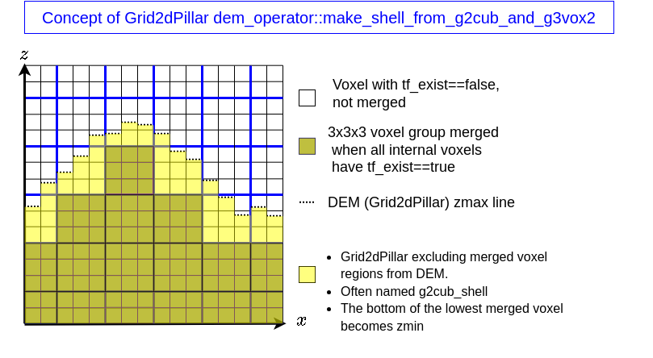
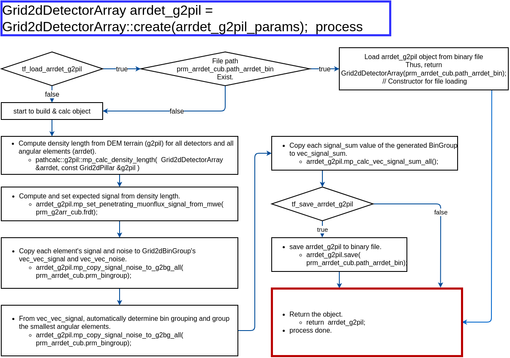

# Pipeline

MUONITH processes muon tomography data through an 8-module pipeline. Each module performs a distinct step, and the pipeline supports checkpoint/resume so that expensive computations are not repeated unnecessarily.

## Overview

```
Module 1  →  Module 2  →  Module 3  →  Module 4  →  Module 5  →  Module 6  →  Module 7  →  Module 8
  Init        Params      Geometry     Path Len     Prior        Matrix      Inversion     Error
              Loading     Build        Trace        (DL/Count)   Build       (Density      Analysis
                          (DEM→Voxel)  (Ray Trace)              (dN/dD)      Reconst.)    & Output
```


## Module I/O Summary

| Module | Name | Key Outputs | Checkpoint |
|--------|------|-------------|------------|
| 1 | Initialization | Logger, OpenMP config, random seed | — |
| 2 | Load Parameters | `app_params` (detector, grid, flux, inversion settings) | — |
| 3 | Build Geometry | `g2pil_naive`, `g3vox_input`, `g3vox_merged_input`, shell grids | — |
| 4 | Trace Path Lengths | `arrdet_g2pil_naive`, `arrdet_g3vox_input`, `vec_spmat_PL`, `shell_pl` | `tf_save/load_arrdet_g2pil`, `tf_save/load_arrdet_g3vox`, `checkpoint_trace_path_lengths` |
| 5 | Compute Prior | `prior_info_all` (`DL_prior`, expected counts per density scenario) | — |
| 6 | Build Observation Matrix | `mat_dNdD_grouped` (lower/center/upper) | `tf_save/load_bin_obs_mat_dNdD` |
| 7 | Invert Density | Reconstructed density, posterior covariance, cross-sections | — |
| 8 | Analyze Errors | Statistical / prior / leave-one-out / combined error cross-sections | — |

## Module Descriptions

### Initialization (Module 1)

- Load and validate JSON5 configuration file
- Setup logging (spdlog: stdout, stderr, file)
- Initialize random seed (priority: CLI argument > JSON5 > default 42)
- Configure OpenMP thread count

### Load Parameters (Module 2)

Parse JSON5 into structured parameter objects:

- Detector panel configurations
- Grid2dPillar parameters (DEM settings)
- Grid3dVoxel parameters (3D grid extent)
- Path length calculation settings
- Flux table paths
- Inversion parameters

### Build Geometry (Module 3)

Construct the spatial grids from terrain data.

```
DEM file (.g2zbin)
    ↓
Grid2dPillar (2D terrain grid)
    ↓
Grid3dVoxel (3D voxel grid)
    ↓
Merge voxels (optional resolution reduction)
    ↓
Shell regions (terrain above/below voxel grid)
```




**Inputs**: DEM file path, grid parameters

**Outputs**:

| Object | Description |
|--------|-------------|
| `g2pil_naive` | 2D terrain grid from DEM |
| `g3vox_input` | 3D voxel grid with initial density |
| `g3vox_merged_input` | Merged voxel grid (lower resolution) |
| `g2pil_shell_upper` | Terrain above the voxel grid |
| `g2pil_shell_lower` | Terrain below the voxel grid |

If `tf_build_g3vox = false`, the pipeline stops here and outputs 2D cross-sections only.

### Trace Path Lengths (Module 4)

Construct the detector array and compute path lengths through the geometry.

```
DetectorPanelArray (from detector JSON5 files)
    ↓
Ray trace through Grid2dPillar → PL, DL per element
    ↓
Ray trace through Grid3dVoxel → sparse path-length matrices
    ↓
Compute signal/noise statistics from flux tables
```




**Inputs**: Detector parameters, geometry (Build Geometry, Module 3), flux tables

**Outputs**:

| Object | Description |
|--------|-------------|
| `arrdet_g2pil_naive` | Detector array linked to 2D terrain |
| `arrdet_g3vox_input` | Detector array linked to 3D voxels |
| `vec_spmat_PL` | Sparse path-length matrices (one per detector) |
| `shell_pl` | Density-independent shell path lengths (`upper`, `lower`, `lateral`), flat `VectorXf` per component |

Trace Path Lengths (Module 4) is purely **density-independent** — it computes geometric path lengths only. Density-dependent prior quantities (`DL_prior`, expected counts, shell contributions) are built in Compute Prior (Module 5).

This module is typically the most time-consuming step due to ray tracing through the 3D voxel grid. Several save/load knobs can avoid recomputation:

- `tf_save_arrdet_g3vox` / `tf_load_arrdet_g3vox` — per-detector path-length artifacts
- `--end-stage 4` followed by `--resume <checkpoint_dir>` — stops after Trace Path Lengths (Module 4) and writes a `checkpoint_trace_path_lengths` bundle that later runs reuse to skip Modules 1–4 entirely (raytrace is detected as already completed and skipped)

### Compute Prior (Module 5)

Combine the density-independent Trace Path Lengths (Module 4) outputs with prior density assumptions to produce the prior muon-count prediction.

**Inputs**:

- Sparse path-length matrices `vec_spmat_PL`
- Shell path lengths `shell_pl` (upper / lower / lateral)
- Flux tables, detector array
- `density_quad = [prior, shell_upper, shell_lower, shell_lateral]` — per-shell prior densities from `NAGAINV_PARAMETERS` (falls back to `uniform_prior_density` when shell-specific values are omitted)

**Outputs**: Prior density-length (`DL_prior`), prior expected counts per density scenario (`prior_info_all`).

### Build Observation Matrix (Module 6)

Convert path-length matrices into muon count sensitivity matrices by linearizing the nonlinear flux response $N_i = g_i(X_i)$ around the prior density length $X_{0,i}$ — i.e. Eq. (18) of [Nagahara et al. (2022)](../concepts/ray-tracing.md#nagahara2022):

$$A_{ij} \;=\; \frac{\partial N_i}{\partial \rho_j} \;=\; L_{ij}\, \frac{dN_i}{dX_i}\!\left(X_{0,i}\right)$$

where $L_{ij}$ is the geometric path length of ray $i$ through voxel $j$ (from Trace Path Lengths, Module 4) and $dN_i/dX_i$ is the muon-count derivative with respect to density length, evaluated at $X_{0,i}$ via the flux table (weighted by $dF/dR$, $\cos\theta_z$, detector area, solid angle, and exposure time). See [Ray Tracing — From Path Length to Observation Equation](../concepts/ray-tracing.md#from-path-length-to-observation-equation) for the full derivation.

**Inputs**: Sparse path-length matrices, flux tables, detector array

**Outputs**: Observation matrices `mat_dNdD_grouped` (one each for lower/center/upper prior)

### Invert Density (Module 7)

Perform MAP-based density reconstruction.

$$\mathbf{C}_{\rho'} = \left(\mathbf{A}^T \mathbf{C}_N^{-1} \mathbf{A} + \mathbf{C}_\rho^{-1}\right)^{-1}$$

$$\delta\vec{\rho} = \mathbf{C}_{\rho'} \, \mathbf{A}^T \mathbf{C}_N^{-1} \left(\vec{N}_{\text{obs}} - \vec{N}_0\right)$$

**Inputs**: Observation matrix, observed/prior muon counts, regularization parameters

**Outputs**:

| Field | Description |
|-------|-------------|
| Reconstructed density | $\vec{\rho}' = \vec{\rho}_0 + \delta\vec{\rho}$ |
| Posterior uncertainty | $\sqrt{\text{diag}(\mathbf{C}_{\rho'})}$ |
| Delta prior | $\vec{\rho}' - \vec{\rho}_0$ |
| Cross-section files | 2D density maps at specified z-elevations |

Multiple inversion configurations (different `sigma_rho`, `corr_length`, etc.) can be defined in the `NAGAINV_PARAMETERS` array and executed sequentially.

See [3D Inversion](../concepts/inversion.md) for the mathematical details.

### Analyze Errors and Output (Module 8)

Perform systematic error analysis and generate final outputs.

1. **Leave-one-out analysis**: Re-run inversion with each detector systematically removed to assess detector contribution sensitivity
2. **Error components**: Statistical error, prior error (lower/center/upper bounds), leave-one-out sensitivity
3. **Combined error**: Root-sum-square of all error sources
4. **Output**: Cross-section files for all error components

## Execution Control

### Running the Pipeline

```bash
# Run all modules (1 through 8, single run)
muonith.exe -j prm_muonith.json5

# Run parameter sweep (set tf_exec=true in NAGAINV_PARAM_SWEEP section)
muonith.exe -j prm_muonith.json5
```

To stop the pipeline at a specific module, use `end_stage` in the JSON5 config
or the `--end-stage` CLI flag (CLI takes precedence):

```json5
// In the top-level section of prm_muonith.json5
// Valid values: 3, 4, 5, 6, 7, 8 (default: 8 = all modules)
"end_stage": 6
```

```bash
# Or via CLI flag
muonith.exe -j prm_muonith.json5 --end-stage 6
```

### Checkpoint and Resume

Intermediate results (detector arrays, path-length matrices, observation matrices) can be saved to binary files via `tf_save_*` flags in `PATH_LENGTH_PARAMETERS`. On subsequent runs, these can be loaded via `tf_load_*` flags to skip expensive computations.

A coarser checkpoint is also available at the Trace Path Lengths (Module 4) boundary: running with `--end-stage 4` writes a `checkpoint_trace_path_lengths` bundle (detector arrays, `vec_spmat_PL`, `shell_pl`, and a copy of the JSON5 configuration as `app_params.json`). A later run can start from that bundle with:

```bash
muonith.exe -j prm_muonith.json5 --resume path/to/checkpoint_trace_path_lengths
```

When a valid `checkpoint_trace_path_lengths` is passed, the sweep driver detects "raytrace already completed" and skips Modules 1–4 entirely, resuming from Compute Prior (Module 5) onward.

During a parameter sweep the driver also writes finer-grained checkpoints automatically: `checkpoint_build_geometry` (saved after Modules 1–3) and per-sweep-point `checkpoint_build_observation_matrix_p{prior}_u{upper}_l{lower}_lat{lateral}` bundles, named by the four shell-density indices. These let later sweep points reuse the Module 5/6 prior when they share the same shell-density combination.

This is particularly useful when:

- Changing only inversion parameters (Invert Density, Module 7) — geometry and path lengths don't need recomputation
- Running parameter sweeps across `sigma_rho` and `corr_length` values
- Switching between different `uniform_prior_density` / shell-density combinations (Compute Prior, Module 5, onward is cheap)

## Parameter Sweep

For systematic exploration of inversion parameters, use the `NAGAINV_PARAM_SWEEP` section:

```json5
"NAGAINV_PARAM_SWEEP": {
  "tf_exec": true,
  "base_index": 0,
  "vec_sigma_rho": [200, 300, 400],
  "vec_corr_length": [50, 70, 100],
  // Each element: scalar (all shells equal) or [prior, upper, lower, lateral].
  // Scalar and Quad can be mixed in the same array.
  "vec_uniform_prior_density": [1500, 2000, [2000, 500, 2500, 1800]],
  "link_diag_to_sigma": true,             // true = sigma_rho_diag follows sigma_rho
  // "vec_sigma_rho_diag": [200, 300],    // Required when link_diag_to_sigma=false
  "module8_mode": "none",                 // "none" | "all" | "last" | "selected"
  "module8_indices": []                   // Sweep indices for module8_mode="selected"
}
```

This generates all combinations of the specified parameter values and runs Invert Density (Module 7) for each combination. Analyze Errors (Module 8) execution is controlled by `module8_mode`.

## Dependency Graph

The following table shows which modules must be re-executed when a parameter changes:

| Parameter changed | Re-run from |
|-------------------|-------------|
| Detector position/orientation | Trace Path Lengths (Module 4) |
| DEM file / grid extent | Build Geometry (Module 3) |
| Voxel resolution (merge) | Build Geometry (Module 3) |
| `sigma_rho`, `corr_length` | Invert Density (Module 7) only |
| `uniform_prior_density` | Compute Prior (Module 5) |
| Flux table | Compute Prior (Module 5) |
