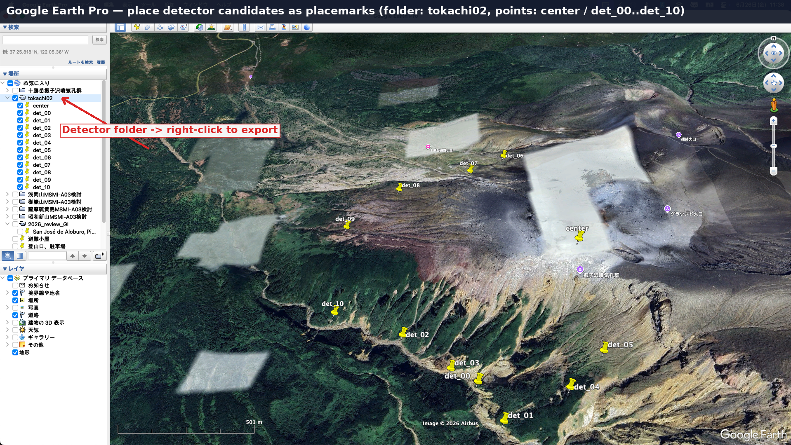
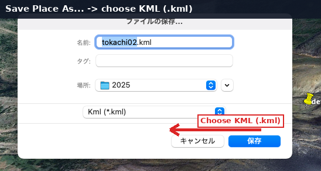
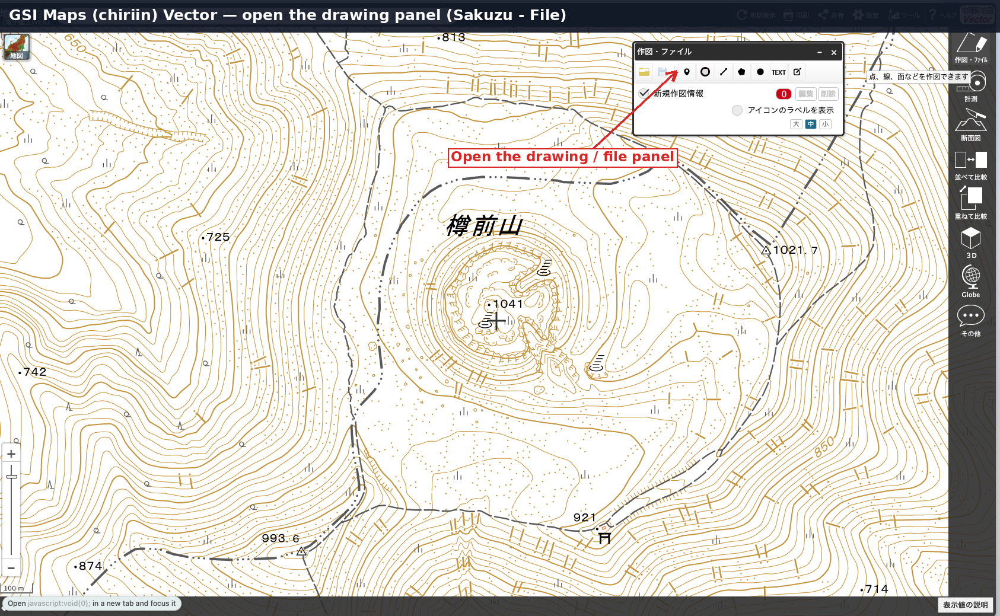
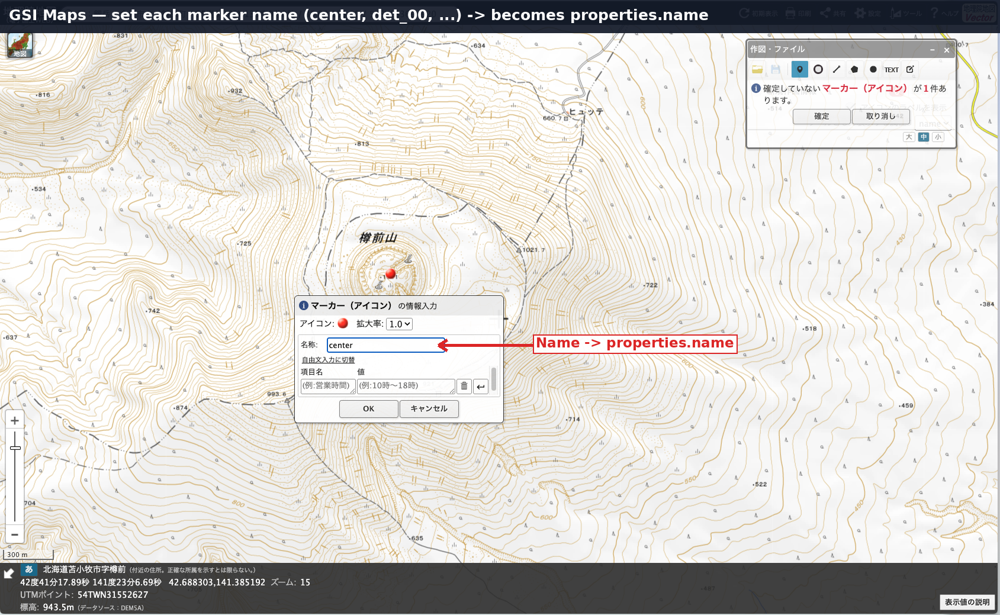
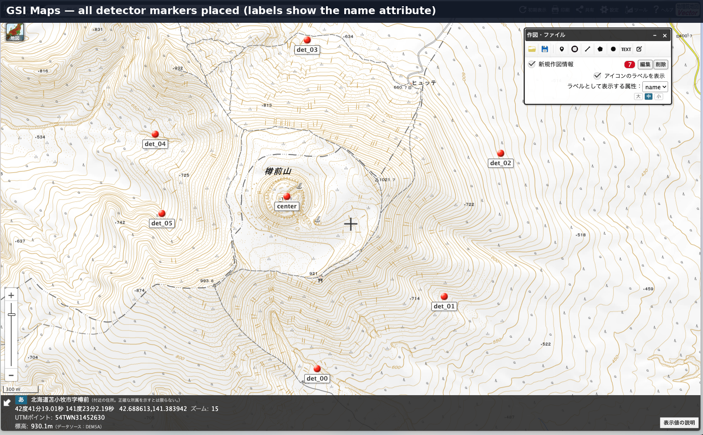
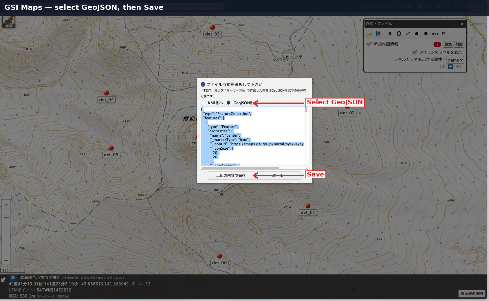

# Placing Detectors from a Map

This guide shows how to pick detector positions on a map with a GUI tool,
export them as **KML** or **GeoJSON**, and turn them into the detector input
that [`setup_station.sh`](../reference/scripts.md#overview) consumes.

The conversion scripts (`kml_to_csv.py`, `geojson_to_csv.py`,
`mk_detjson5_from_template.py`) are already documented in
[Scripts](../reference/scripts.md). This page covers the **upstream GUI step**:
how to create the KML/GeoJSON file in the first place.

!!! note "Where this fits"
    The full station workflow is: **place points on a map → export KML/GeoJSON
    → convert to CSV → fill the detector JSON5 → run `setup_station.sh`**.
    Skip this page if your site uses a custom orthogonal coordinate system with
    `"skip_detparams": true` (see [Scripts](../reference/scripts.md#init_work_sitepy)),
    since tracked runcards are reused instead.

## Two routes

| Tool | Export format | Use when |
|------|---------------|----------|
| Google Earth Pro | KML (`.kml`) | 3D terrain view, satellite imagery |
| GSI Maps (地理院地図) Vector | GeoJSON (`.geojson`) | Japanese base maps, no Google Earth, contour view |

Both produce a list of named points. Name each point consistently
(`center`, `det_00`, `det_01`, …); the name is carried into the detector
table, so keeping it identical across tools lets you reuse the same
downstream commands.

## Route A — Google Earth Pro (KML)

### 1. Place the detector candidates

Add a folder (here `tokachi02`) and drop a placemark for each detector
position, plus one for the target center. Name the placemarks `center`,
`det_00`, `det_01`, …

{ width="760" }

*Detector candidates placed as placemarks on the terrain. The left panel
holds the `tokachi02` folder with `center` and `det_00`–`det_10`.*

### 2. Export the folder as KML

Right-click the folder in the **Places** panel → **Save Place As…**
(名前を付けて場所を保存). In the save dialog, choose **KML** (`.kml`) as the
format — not KMZ, which is a zipped variant.

{ width="520" }

*Choose `Kml (*.kml)` so the file can be read directly by `kml_to_csv.py`.*

!!! tip "KMZ instead of KML?"
    KMZ is a compressed KML archive. If you only have a `.kmz`, unzip it and
    use the `doc.kml` inside, or re-export as `.kml`.

### 3. Convert KML → CSV

```bash
python3 scripts/kml_to_csv.py --kml_in tokachi02.kml --EPSG <EPSG>
```

Pick the projected `<EPSG>` for your site (see
[Coordinate System](../concepts/coordinate-system.md)). KML placemarks carry
longitude/latitude; elevation can be filled from the GSI elevation API or a
GeoTIFF (`--fill_elevation_from_gsi`, `--dem`). Full options are in
[Scripts](../reference/scripts.md#kml_to_csvpy).

## Route B — GSI Maps (地理院地図) Vector (GeoJSON)

### 1. Open the drawing panel

On [GSI Maps Vector](https://maps.gsi.go.jp/vector/), open
**作図・ファイル** (Drawing / File) from the top-right toolbar.

{ width="760" }

*The drawing panel lets you add points, lines, and polygons on the GSI base map.*

### 2. Place and name each marker

Select the marker (point) tool and click on the map to drop a marker.
Enter the name (`center`, `det_00`, …) in the marker dialog; this becomes the
`properties.name` field in the exported GeoJSON.

{ width="760" }

*Each marker name is written to `properties.name`, which the converter reads.*

Repeat for every detector position.

{ width="760" }

*All detector markers placed, with labels showing the `name` attribute.*

### 3. Save as GeoJSON

Click the save (disk) icon in the panel, select **GeoJSON** as the format,
then save.

{ width="760" }

*Select GeoJSON, then save. The output is a `FeatureCollection` of `Point`
features following the GSI
[geojson-with-style spec](https://github.com/gsi-cyberjapan/geojson-with-style-spec).*

!!! note "GeoJSON coordinate order and elevation"
    GeoJSON stores coordinates as `[longitude, latitude]` (same order as KML).
    Markers carry no elevation, so `geojson_to_csv.py` fills it from the GSI
    elevation API or a GeoTIFF.

### 4. Convert GeoJSON → CSV

```bash
python3 scripts/geojson_to_csv.py --geojson_in tokachi02.geojson --EPSG <EPSG>
```

Shares the elevation-fill logic with `kml_to_csv.py`
(`--fill_elevation_from_gsi`, `--dem_tif`, `--dem_only`). See
[Scripts](../reference/scripts.md#geojson_to_csvpy).

## From CSV to a runnable station

Once you have the CSV (from either route), the remaining steps are the same:

1. **Fill the detector JSON5** from a template:

    ```bash
    python3 scripts/mk_detjson5_from_template.py --template template-det.json5 --csv tokachi02_table.csv
    ```

2. **Place the exported file and the DEM** under `data/<station>/`, and point
   `param_sites/<station>.json5` at them (`detector_input`, DEM path).

3. **Run the station setup**:

    ```bash
    bash setup_station.sh <station> --run
    ```

See [Scripts](../reference/scripts.md#mk_detjson5_from_templatepy) and
[Input Data](input-data.md) for the detector parameter format, and
[Quick Start](../getting-started/quickstart.md) for an end-to-end run.
